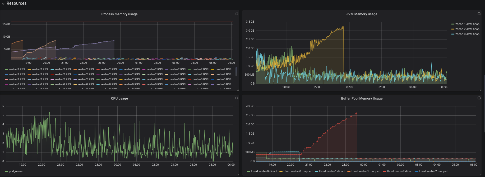

# Chaos Day Summary

In order to make our chaos experiments more realistic we have setup a new gke cluster, which is similar to the Camunda Cloud gke cluster.
It allows us to test and experiment with Zeebe clusters which have the same configuration as Zeebe clusters in the Camunda cloud.

As part of the chaos day I run the same benchmark we normally run in our gke with our configuration against the Camunda Cloud Zeebe clusters.

## Configurations of Zeebe Clusters

| Name | Our Default | Prod S | Prod M | Prod L |
|------|-------------|--------|--------|--------|
|Partitions|  3      |   1    |   4    |  8     |
|Nodes|       3       |   3    |   3    |   6    |
|Replication| 3     |   3     |   3   |    3   |
|SnapshotPeriod| 15 | 5 | 5 | 5 |
|CPU_THREADS| 4 | 1 | 4 | 4 |
|IO_THREADS| 4 | 2 | 4 | 4 |
|CPU LIMIT| 5 | 1 | 4 | 4 |
|CPU REQUEST| 5 | 200m | 200m | 200m |
|RAM LIMIT| 12Gi | 2Gi | 8Gi | 8Gi |
|RAM REQUEST| 12Gi | 250Mi | 250Mi | 250Mi|
|Gateway|Standalone|Embedded|Embedded|Embedded|

## Benchmarks

| Name | Our Default | Prod S | Prod M | Prod L |
|------|-------------|--------|--------|--------|
|General|||||
|Resources|||||
|Latency|||||
|Latency|||||
|Working|||||

In general we can see that the clusters haven't survived long. This is also visible in our Camunda Cloud status page.

I think it is kind of related with the preemtable nodes, high load, long restarts and that pods are restarted after 15 minutes, when there are not getting ready.
One of the reasons why restarting takes so long is fixed now with https://github.com/zeebe-io/zeebe/pull/5189 so I hope that this gets better. But currently it is an issue, since you start replicating a snapshot and reprocess on start up. If this takes longer then 15 min the pod will be restarted because of this configuration: `Liveness:   http-get http://:9600/ready delay=900s timeout=1s period=15s #success=1 #failure=3` after restarting the pod you haven't gained any value you just need to start again the complete procedure. In k8 we can see a high restart count of the pods.

### Throughput

If we take a look at the Working part we can see that we scale based on the partition count (or prod cluster sizes) in Camunda Cloud. For Prod S we reach in avg ~24 workflow instance creation/completions per second. For Prod M we reach in avg ~46 workflow instance creation/completions per second. For Prod L we reach in avg ~99 workflow instance creations and completions. To be fair I run the benchmark on these cluster sizes only with three workers, which have 8 threads an activation count of 120 and they completing an job after 150 ms delay, and an starter which starts 100 workflow instances per second. Normally we use in our benchmarks 12 workers and start 300 workflow instances per second. I tried that with the Prod L cluster, but this failed quite fast after increasing the load. Here we probably need to investigate further. If we take a look at our cluster setup then we reach in avg ~147 workflow instance creations/completions per second.

### Latency

If take a look at the latency we can see that in Prod M cluster the latency seems to be a bit problematic, where in Prod S and L it seems similar. In our default cluster we get the best latency. Might be worth to take a look as well.

### Other Observations

During the benchmark observations I saw that some metrics are missing.

For example the Gateway metrics are not shown:

Furthermore I saw that all container related and pvc related metrics are missing. I was not able to check the IO metrics nor the CPU metrics and other.

If we want to run more tests and chaos experiments we need to fix these missing metrics before.

## Running automated Chaos experiments

In order to run automated chaos experiments in our new gke. I had to create a new serviceaccount and rolebindings, such that our Jenkins can access the new Kubernetes cluster and our experiments can delete and create new resources.

## Participants

 * @zelldon
