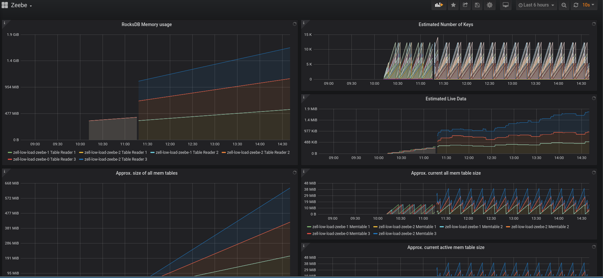
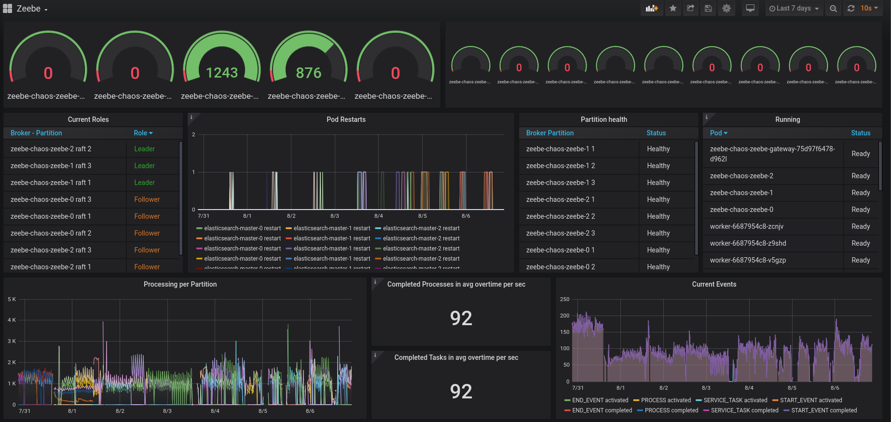

# Chaos Day Summary

 * Run a benchmark with low load
 * Investigate last benchmark failures

## Chaos Experiment

 We currently seem to have issues with RocksDB, which sometimes generates a lot of SST files during the Broker lifetime. This causes to fail the snapshot replication at some point.
 This is especially problematic after pod's get restarted, since a follower normally need either to be catched up with the log or the leader will send a snapshot to the follower.
 If the snapshot contains a lot of files this get's problematic. In order to understand this better we would like to find out how we can reproduce it. We expected this happens only on low load,
 the assumption is that RocksDB will not trigger the compaction so often, because we are not reaching a certain threshold. See the related issue [#4887](https://github.com/zeebe-io/zeebe/issues/4887) .

### Expected

 When creating workflow instances and completing them directly afterwards we normally expect that there is nothing left and nothing should accumulate together. If we do it on low load, which means 1 workflow instance creation and completion per second then we expect the same. Furthermore we expect that the used resources are lower then on higher load.

### Actual

 We have setup our default benchmark with three partition, three nodes and replication factor three. We starting one workflow instance at a time. We running one worker, which completes the related workflow.

In the general overview we can see that we start and complete one workflow per second.

The resource consumption looks ok.

But the RocksDB used size and snapshot files seem to be increasing.

 

I will let the benchmark run a bit longer and I think we need to investigate this issue further.

## Investigation Last Benchmark

Every week I create a benchmark on the chaos day and let it run until the next chaos day. Since I had not much time for trying out other experiments today and I saw that the old benchmark has problems I decided to investigated why the processing went down. I collected here my observations and use this more as a summary, since until now it is not clear what is the issue.

In the general overview we can see that the processing is in avg under 100 workflow instances per second, normally we would expect something around 130. We can also see that the processing in general is not that stable.

If we take a look at the partitions separatly we can see that the partition two died quite early.

**Partition 1 last 7 days**

**Partition 2 last 7 days**

**Partition 3 last 7 days**

We can see that the processing seem to be stopped for the partition two and never comes back. This seem to happen on the 31-07-2020 ~ 2 pm.
With the resource panel we can also see that at this time a node preemption happen, since all pod seem to be rescheduled. This can be seen based on the different colors of the graphs.

In the log we can see that all brokers are getting closed.

Interesting is that we see the day after, an continously growing disk usage, which never gets reduced.

Currently I don't understand what was the issue and why it never comes back. I created an issue to further investigate that [#5127](https://github.com/zeebe-io/zeebe/issues/5127) . I will keep the old benchmark running and will setup a separe one in order to reproduce this.

## Participants

 * @zelldon
