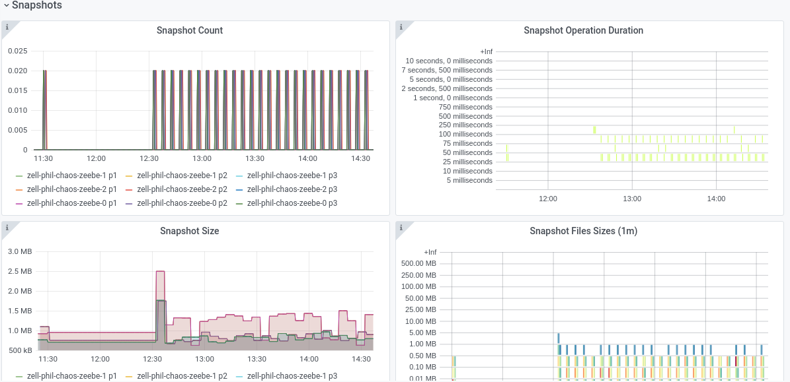
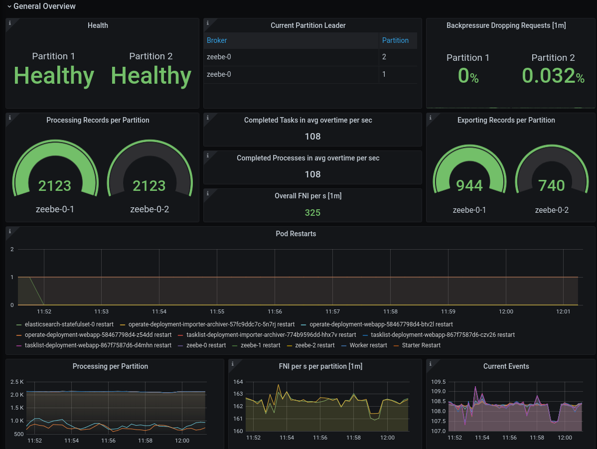
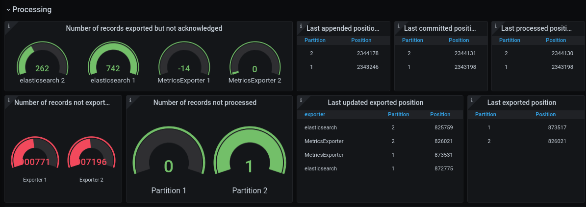
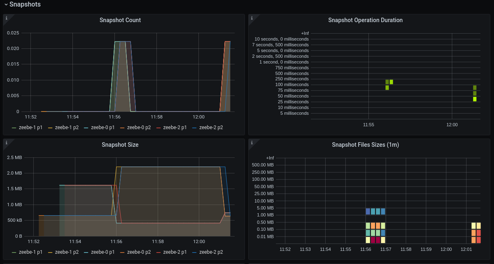

# Chaos Day Summary

[Recently we run a Game day](https://confluence.camunda.com/display/ZEEBE/Game+Day+18.05.2021) where a lot of messages with high TTL have been stored in the state. This was based on an earlier incident, which we had seen in production. One suggested approach to resolve that incident was to increase the time, such that all messages are removed from the state. This and the fact that summer and winter time shifts can cause in other systems evil bugs, we wanted to find out how our system can handle time shifts. [Phil](https://github.com/saig0) joined me as participant and observer. There was a related issue which covers this topic as well, [zeebe-chaos#3](https://github.com/zeebe-io/zeebe-chaos/issues/3).

**TL;DR;** Zeebe is able to handle time shifts back and forth, without observable issues. Operate seems to dislike it.

## Chaos Experiment

As part of the experiment we had to define what we expect, if we change the time. In order to keep it simple we decided to experiment with one-hour move forward and backwards. We wanted to run the experiment first against our normal benchmark cluster and afterwards against a Production - S Cluster on INT. Furthermore, we decided to test the time shift only on leaders, for now.

### Expected

*If we move the time one-hour forward we expect:*

 * in general, timers should be triggered (snapshot, message TTL, job timeouts, timers etc.)
 * the system should operate normal, means zeebe and operate should be healthy and continue working

*If we move the time one-hour backwards we expect:*

 * timers should not be triggered, until the deadline + 1 hour is reached
 * the system should operate normal
 * with operate we were not sure whether it has issues with exported records on the same time

Before we started, with running the experiment, we had to find out how we can change the time in a docker container.

### Changing Time

***Note:** If you're not interested in how we change the time you can jump to the [next section](#experiment-on-benchmark-cluster)*

If you search for it, you find quite quickly answers in how to change the time in a docker container. For example, we found this [answer](https://serverfault.com/a/898842/283059), which was quite useful.

In order to apply this, we first need to make sure that we have the right [linux capabilities](https://man7.org/linux/man-pages/man7/capabilities.7.html) to change the system time. For that we need the `SYS_TIME` capability. In our benchmarks this is quite easy to do, we just need to change [this line](https://github.com/camunda-cloud/zeebe/blob/develop/benchmarks/setup/default/zeebe-values.yaml#L16) and add `SYS_TIME`.

```yaml
podSecurityContext:
  capabilities:
        add: ["NET_ADMIN", "SYS_TIME"]
```

After changing this, we can set the time via [`date -s`](https://man7.org/linux/man-pages/man1/date.1.html). Since we were not sure whether this really works for our java process, we started a [`jshell`](https://docs.oracle.com/javase/9/tools/jshell.htm#JSWOR-GUID-C337353B-074A-431C-993F-60C226163F00) to verify that. *Note:* the jshell is only available if you use an container image with jdk. This is available, if you build your own zeebe docker image via [zeebe/createBenchmark.sh](https://github.com/camunda-cloud/zeebe/blob/develop/createBenchmark.sh).

Changing the time:
```sh
root@zell-phil-chaos-zeebe-1:/usr/local/zeebe# date
Tue May 25 10:29:33 UTC 2021
root@zell-phil-chaos-zeebe-1:/usr/local/zeebe# date +%T -s "09:29:00"
09:29:00
root@zell-phil-chaos-zeebe-1:/usr/local/zeebe# date
Tue May 25 09:29:01 UTC 2021
root@zell-phil-chaos-zeebe-1:/usr/local/zeebe# jshell
Picked up JAVA_TOOL_OPTIONS: -XX:MaxRAMPercentage=25.0 -XX:+ExitOnOutOfMemoryError -XX:+HeapDumpOnOutOfMemoryError -XX:HeapDumpPath=/usr/local/zeebe/data -XX:ErrorFile=/usr/local/zeebe/data/zeebe_error%p.log -Xlog:gc*:file=/usr/local/zeebe/data/gc.log:time:filecount=7,filesize=8M
May 25, 2021 9:29:03 AM java.util.prefs.FileSystemPreferences$1 run
INFO: Created user preferences directory.
|  Welcome to JShell -- Version 11.0.11
|  For an introduction type: /help intro

jshell> new Date()
$1 ==> Tue May 25 09:29:08 UTC 2021
```

After we found out how we can actually change the time we moved forward and run the described chaos experiment.

### Experiment on Benchmark Cluster

As usual, we have set up a normal benchmark cluster with three nodes, three partitions and replication factor three. We run 200 PI/s and 12 workers against that cluster.

#### Move Time Forward

After setting up the cluster we had to find out who is the Leader and picked the one who is Leader for the most of the partitions.

```shell
$ k exec -it zell-phil-chaos-zeebe-0 -- zbctl status --insecure
Brokers:
  Broker 0 - zell-phil-chaos-zeebe-0.zell-phil-chaos-zeebe.zell-phil-chaos.svc.cluster.local:26501
    Version: 1.1.0-SNAPSHOT
    Partition 1 : Follower, Healthy
    Partition 2 : Leader, Healthy
    Partition 3 : Leader, Healthy
    ....
```

**On Broker 0 we increased the time by one hour.** After doing this we observed the metrics, but we haven't noticed any issues. We verified logs in stackdriver, but no errors were thrown.


We noticed, looking at the metrics, that the snapshot was triggered when we moved the time forward. This was what we actually expected. Plus also new scheduled snapshot have been triggered and created.


On the elastic exporter we can see that flushing has happened earlier than usual, because we increased the time. This was also expected.  


**Experiment succeeded** :heavy_check_mark:

#### Move Time Backwards

In order to run the experiment again, with moving the timer backwards, we set up a new benchmark cluster. This time we run the experiment on Broker 1, since he was the leader of the most partitions.

```sh
Broker 1 - zell-phil-chaos-zeebe-1.zell-phil-chaos-zeebe.zell-phil-chaos.svc.cluster.local:26501
  Version: 1.1.0-SNAPSHOT
  Partition 1 : Follower, Healthy
  Partition 2 : Leader, Healthy
  Partition 3 : Leader, Healthy
```

No general issues have been detected, as expected no longer snapshots were taken.


We have run the benchmark for a bit longer, to see whether the snapshot will be triggered later, which was indeed the case.


We could also observe how the journal segments increased until we took the next snapshot.


**Experiment succeeded** :heavy_check_mark:

### Experiment on INT

After running the experiment against our benchmark clusters we were confident to run it against a Production S cluster on INT.
We have set up a Production S cluster in our chaos cluster and run the [cloud benchmark](https://github.com/camunda-cloud/zeebe/blob/develop/benchmarks/setup/newCloudBenchmark.sh) against it. It starts starter and worker against that Production S cluster, turned out not with the same load (luckily this doesn't matter for this experiment). The starter and workers are deployed in the Zeebe Team gke cluster.

#### How to change the time on INT

On INT, it is not that simple to get the `SYS_TIME` capability, which we need to change the time. Luckily we already have experience, with getting the necessary capability we need to have.
On a previous chaos day we have added `NET_ADMIN` capability to a running zeebe container in order to experiment with network partitioning, you can read about that [here](/2021-03-23-camunda-cloud-network-partition/index.md).

The following patch adds the `SYS_TIME` cap to our linux container.
```yaml
spec:
  template:
    spec:
      containers:
        - name: "zeebe"
          securityContext:
            capabilities:
              add:
                - "SYS_TIME"
```

The following script applies the patch to our Zeebe cluster.

```shell
#!/bin/bash
set -euo pipefail

scriptPath=$( cd "$(dirname "${BASH_SOURCE[0]}")" ; pwd -P )
source utils.sh

namespace=$(getNamespace)

CLUSTERID=${namespace%-zeebe}

kubectl patch zb "$CLUSTERID" --type merge --patch='{"spec":{"controller":{"reconcileDisabled":true}}}'
kubectl patch statefulset zeebe -n "$namespace" --patch "$(cat $scriptPath/sys_time_patch.yaml)"
kubectl delete pod -l "$(getLabel)" -n "$namespace"
```

#### Move Time Forward on INT

After we patched our resources we can now change the time as before.

```shell
root@zeebe-0:/usr/local/zeebe# date
Tue May 25 09:55:33 UTC 2021
root@zeebe-0:/usr/local/zeebe# date +%T -s "10:55:00"
10:55:00
root@zeebe-0:/usr/local/zeebe# date
Tue May 25 10:55:01 UTC 2021
```

In the general section of our Grafana Dashboard everything looks fine. We can't see any issues here, except that the exporting is much less than the processing.


We took a closer look at the processing panels and saw that the exporter lag a lot behind, which causes Operate lagging behind and that fewer segments are deleted.


On moving the time forward we see as expected the snapshotting has been triggered.


Stackdriver shows no errors for the Zeebe service. But later, in operate we observed that no new data was imported after 11:50, we moved the time at 11:55 forward. In the logs we found the following exceptions, which need to be investigated further.

```shell
Exception occurred when importing data: io.camunda.operate.exceptions.PersistenceException: Update request failed for [operate-import-position-1.0.0_] and id [1-process-instance] with the message [Elasticsearch exception [type=version_conflict_engine_exception, reason=[1-process-instance]: version conflict, required seqNo [1681], primary term [1]. current document has seqNo [1688] and primary term [1]]].
```

The exception in more detail:
```java
io.camunda.operate.exceptions.PersistenceException: Update request failed for [operate-import-position-1.0.0_] and id [2-job] with the message [Elasticsearch exception [type=version_conflict_engine_exception, reason=[2-job]: version conflict, required seqNo [1765], primary term [1]. current document has seqNo [1771] and primary term [1]]].
	at io.camunda.operate.util.ElasticsearchUtil.executeUpdate(ElasticsearchUtil.java:271) ~[operate-els-schema-1.0.0.jar!/:?]
	at io.camunda.operate.zeebeimport.ImportPositionHolder.recordLatestLoadedPosition(ImportPositionHolder.java:100) ~[operate-qa-importer-1.0.0.jar!/:?]
	at io.camunda.operate.zeebeimport.ImportJob.call(ImportJob.java:86) ~[operate-qa-importer-1.0.0.jar!/:?]
	at io.camunda.operate.zeebeimport.RecordsReader.lambda$scheduleImport$1(RecordsReader.java:217) ~[operate-qa-importer-1.0.0.jar!/:?]
	at java.util.concurrent.FutureTask.run(Unknown Source) [?:?]
	at java.util.concurrent.ThreadPoolExecutor.runWorker(Unknown Source) [?:?]
	at java.util.concurrent.ThreadPoolExecutor$Worker.run(Unknown Source) [?:?]
	at java.lang.Thread.run(Unknown Source) [?:?]
Caused by: org.elasticsearch.ElasticsearchStatusException: Elasticsearch exception [type=version_conflict_engine_exception, reason=[2-job]: version conflict, required seqNo [1765], primary term [1]. current document has seqNo [1771] and primary term [1]]
	at org.elasticsearch.rest.BytesRestResponse.errorFromXContent(BytesRestResponse.java:176) ~[elasticsearch-7.12.1.jar!/:7.12.1]
	at org.elasticsearch.client.RestHighLevelClient.parseEntity(RestHighLevelClient.java:1933) ~[elasticsearch-rest-high-level-client-7.12.1.jar!/:7.12.1]
	at org.elasticsearch.client.RestHighLevelClient.parseResponseException(RestHighLevelClient.java:1910) ~[elasticsearch-rest-high-level-client-7.12.1.jar!/:7.12.1]
	at org.elasticsearch.client.RestHighLevelClient.internalPerformRequest(RestHighLevelClient.java:1667) ~[elasticsearch-rest-high-level-client-7.12.1.jar!/:7.12.1]
	at org.elasticsearch.client.RestHighLevelClient.performRequest(RestHighLevelClient.java:1624) ~[elasticsearch-rest-high-level-client-7.12.1.jar!/:7.12.1]
	at org.elasticsearch.client.RestHighLevelClient.performRequestAndParseEntity(RestHighLevelClient.java:1594) ~[elasticsearch-rest-high-level-client-7.12.1.jar!/:7.12.1]
	at org.elasticsearch.client.RestHighLevelClient.update(RestHighLevelClient.java:1061) ~[elasticsearch-rest-high-level-client-7.12.1.jar!/:7.12.1]
	at io.camunda.operate.util.ElasticsearchUtil.executeUpdate(ElasticsearchUtil.java:266) ~[operate-els-schema-1.0.0.jar!/:?]
	... 7 more
	Suppressed: org.elasticsearch.client.ResponseException: method [POST], host [http://elasticsearch:9200], URI [/operate-import-position-1.0.0_/_update/2-job?refresh=true&timeout=1m], status line [HTTP/1.1 409 Conflict]
{"error":{"root_cause":[{"type":"version_conflict_engine_exception","reason":"[2-job]: version conflict, required seqNo [1765], primary term [1]. current document has seqNo [1771] and primary term [1]","index_uuid":"7jsKYxw7RxWQhba-UIG5Wg","shard":"0","index":"operate-import-position-1.0.0_"}],"type":"version_conflict_engine_exception","reason":"[2-job]: version conflict, required seqNo [1765], primary term [1]. current document has seqNo [1771] and primary term [1]","index_uuid":"7jsKYxw7RxWQhba-UIG5Wg","shard":"0","index":"operate-import-position-1.0.0_"},"status":409}
		at org.elasticsearch.client.RestClient.convertResponse(RestClient.java:326) ~[elasticsearch-rest-client-7.12.1.jar!/:7.12.1]
		at org.elasticsearch.client.RestClient.performRequest(RestClient.java:296) ~[elasticsearch-rest-client-7.12.1.jar!/:7.12.1]
		at org.elasticsearch.client.RestClient.performRequest(RestClient.java:270) ~[elasticsearch-rest-client-7.12.1.jar!/:7.12.1]
		at org.elasticsearch.client.RestHighLevelClient.internalPerformRequest(RestHighLevelClient.java:1654) ~[elasticsearch-rest-high-level-client-7.12.1.jar!/:7.12.1]
		at org.elasticsearch.client.RestHighLevelClient.performRequest(RestHighLevelClient.java:1624) ~[elasticsearch-rest-high-level-client-7.12.1.jar!/:7.12.1]
		at org.elasticsearch.client.RestHighLevelClient.performRequestAndParseEntity(RestHighLevelClient.java:1594) ~[elasticsearch-rest-high-level-client-7.12.1.jar!/:7.12.1]
		at org.elasticsearch.client.RestHighLevelClient.update(RestHighLevelClient.java:1061) ~[elasticsearch-rest-high-level-client-7.12.1.jar!/:7.12.1]
		at io.camunda.operate.util.ElasticsearchUtil.executeUpdate(ElasticsearchUtil.java:266) ~[operate-els-schema-1.0.0.jar!/:?]
		at io.camunda.operate.zeebeimport.ImportPositionHolder.recordLatestLoadedPosition(ImportPositionHolder.java:100) ~[operate-qa-importer-1.0.0.jar!/:?]
		at io.camunda.operate.zeebeimport.ImportJob.call(ImportJob.java:86) ~[operate-qa-importer-1.0.0.jar!/:?]
		at io.camunda.operate.zeebeimport.RecordsReader.lambda$scheduleImport$1(RecordsReader.java:217) ~[operate-qa-importer-1.0.0.jar!/:?]
		at java.util.concurrent.FutureTask.run(Unknown Source) [?:?]
		at java.util.concurrent.ThreadPoolExecutor.runWorker(Unknown Source) [?:?]
		at java.util.concurrent.ThreadPoolExecutor$Worker.run(Unknown Source) [?:?]
		at java.lang.Thread.run(Unknown Source) [?:?]
```

**Experiment failed** :x: 

Operate was not operating normal, the exceptions were not expected.

It seems that changing the time on INT, causes some unexpected problems for Operate. We need to investigate that further and resolve them before we can continue here and make that an automated test. Furthermore, we need to investigate how problematic it is that our exporting lags behind, which is related to [zeebe#6747](https://github.com/camunda-cloud/zeebe/issues/6747), and how we can resolve that.

In general, we saw that Zeebe has no real issues with time shifts and that timers can be triggered by changing the underlying system time. Still we should make sure that our containers are running on UTC time nodes (which we do), such that we avoid issues with daylight saving time.

<sup>*Written by: {{page.author}}*</sup>
