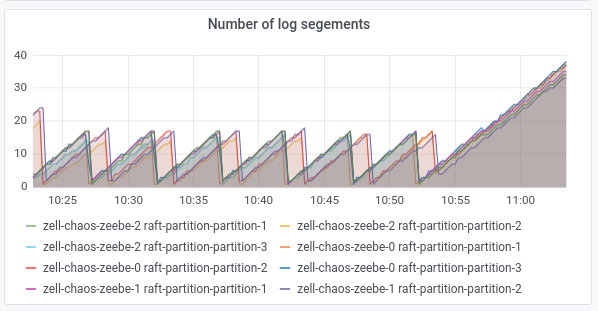
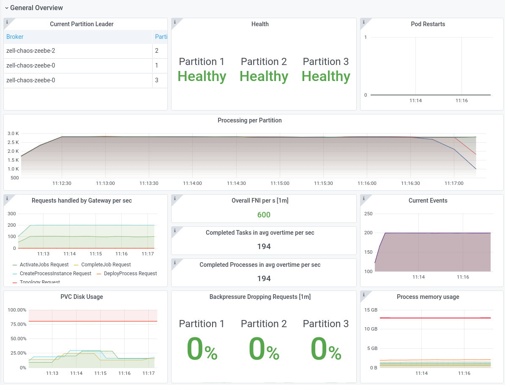
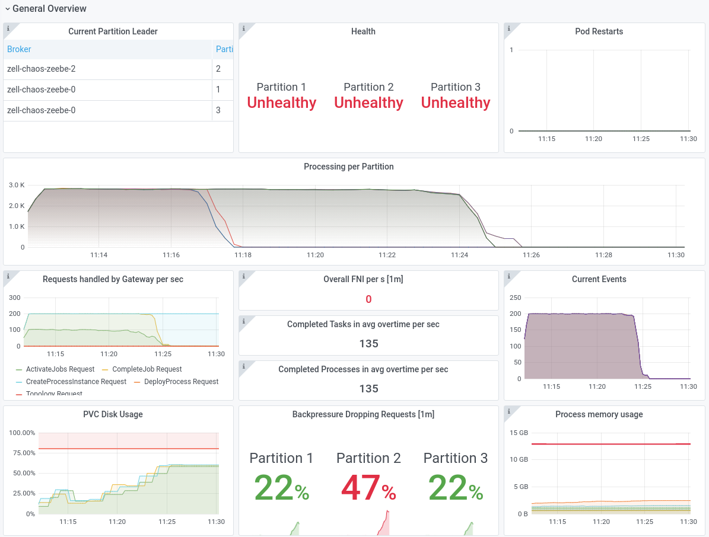
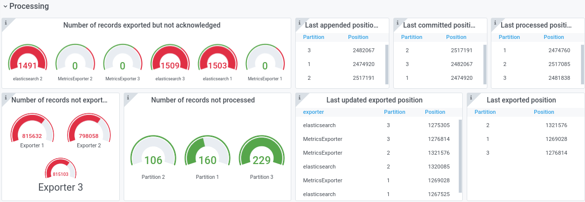
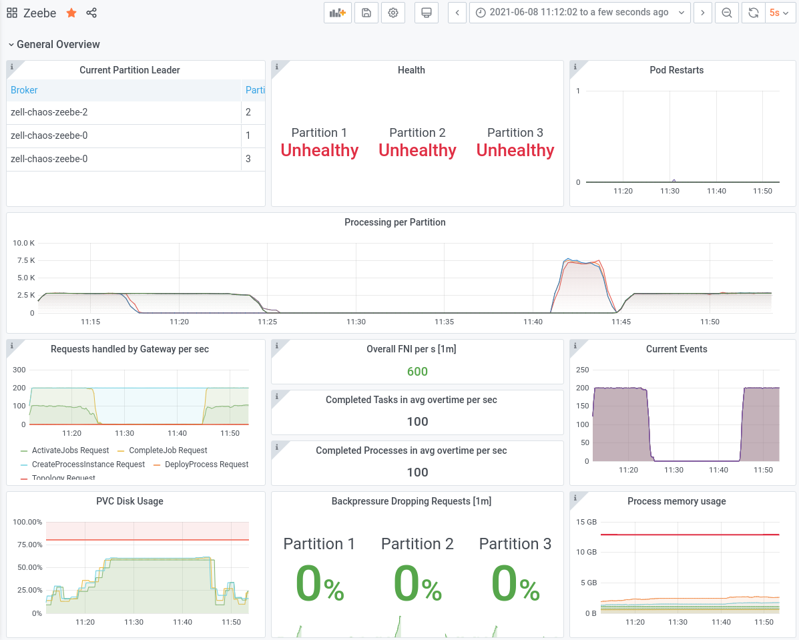
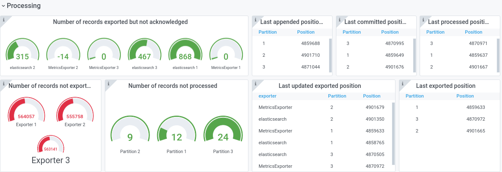

# Chaos Day Summary

On this chaos day we wanted to experiment with OOD recovery and ELS connection issues. This is related to the following issues from our hypothesis backlog: [zeebe-chaos#32](https://github.com/zeebe-io/zeebe-chaos/issues/32) and [zeebe-chaos#14](https://github.com/zeebe-io/zeebe-chaos/issues/14). This time [@Nico](https://github.com/korthout) joined me.

**TL;DR** The experiment was successful :muscle: and we found several things in the dashboard which we can improve :)

## Chaos Experiment 

With this experiment we want to verify that Zeebe can recover after OOD, which was caused by not exporting to ELS. For that we want to disconnect Zeebe and ELS first and see how it behaves. Afterwards we connect the services again and expect a recovery of the system.

As usual, we have set up a normal benchmark cluster with three nodes, three partitions and replication factor three. We run 200 PI/s and 12 workers against that cluster.

### Expected

We expect the following properties:

 * at the beginning the system is stable (we can start instances without issues)
 * after disconnecting ELS we start to fill the disk, since we can't export (which means we can't compact)
 * after reaching the disk limits, Zeebe doesn't accept any commands anymore
 * after connecting ELS, Zeebe should start to export again (compacting should be possible again)
 * after come below the limit, Zeebe should accept commands again


#### Network disconnect to ELS

In order to disconnect the Brokers with ELS, we wanted to reuse one of our network disconnect scripts, e.g. [disconnect-leaders.sh](https://github.com/zeebe-io/zeebe-chaos/blob/master/chaos-experiments/scripts/disconnect-leaders.sh). This resolves the IP's of the brokers and creates an unreachable route via the `ip` tool at the given brokers.

We copied that and adjusted it to our needs:

<!--  -->
```shell
#!/bin/bash
set -exuo pipefail

source utils.sh

partition=1
namespace=$(getNamespace)
elasticName="elasticsearch-master"

broker0=$(getBroker 0)
broker2=$(getBroker 2)
broker1=$(getBroker 1)

elastic0Ip=$(kubectl get pod "$elasticName-0" -n "$namespace" --template="{{.status.podIP}}")
elastic1Ip=$(kubectl get pod "$elasticName-1" -n "$namespace" --template="{{.status.podIP}}")
elastic2Ip=$(kubectl get pod "$elasticName-2" -n "$namespace" --template="{{.status.podIP}}")


# we put all into one function because we need to make sure that even after preemption the 
# dependency is installed
function disconnect() {
 toChangedPod="$1"
 targetIp="$2"

 # update to have access to ip
 kubectl exec -n "$namespace" "$toChangedPod" -- apt update
 kubectl exec -n "$namespace" "$toChangedPod" -- apt install -y iproute2
 kubectl exec "$toChangedPod" -n "$namespace" -- ip route add unreachable "$targetIp"

}

retryUntilSuccess disconnect "$broker0" "$elastic0Ip"
retryUntilSuccess disconnect "$broker0" "$elastic1Ip"
retryUntilSuccess disconnect "$broker0" "$elastic2Ip"


retryUntilSuccess disconnect "$broker1" "$elastic0Ip"
retryUntilSuccess disconnect "$broker1" "$elastic1Ip"
retryUntilSuccess disconnect "$broker1" "$elastic2Ip"

retryUntilSuccess disconnect "$broker2" "$elastic0Ip"
retryUntilSuccess disconnect "$broker2" "$elastic1Ip"
retryUntilSuccess disconnect "$broker2" "$elastic2Ip"
```
<!--  -->

*Small note in order to run this against the benchmark cluster you need to set the following environment variables:*

```shell
export NAMESPACE=$(kubens -c) # the namespace where the resources are located
export CHAOS_SETUP=helm # indicates that the installation is done via helm, necessary since we use different labels in the helm charts and in CC.
```

<!--  -->
Running the script above didn't work as expected. We still saw records being exported. The issue was that we need to use the service IP instead of the IP's of the elastic search pods. The Broker uses only the service to connect with ELS. In order to get the IP we can use this `kubectl get services elasticsearch-master --template "{{.spec.clusterIP}}"`. 


The service will take care of the request routing, which means we just need to block one IP. This helps to simplify the disconnect script.

```shell
#!/bin/bash
set -exuo pipefail

source utils.sh

partition=1
namespace=$(getNamespace)
elasticName="elasticsearch-master"

broker0=$(getBroker 0)
broker2=$(getBroker 2)
broker1=$(getBroker 1)

elasticServiceIp=$(kubectl get services elasticsearch-master --template "{{.spec.clusterIP}}")

# we put all into one function because we need to make sure that even after preemption the 
# dependency is installed
function disconnect() {
 toChangedPod="$1"
 targetIp="$2"

 # update to have access to ip
 kubectl exec -n "$namespace" "$toChangedPod" -- apt update
 kubectl exec -n "$namespace" "$toChangedPod" -- apt install -y iproute2
 kubectl exec "$toChangedPod" -n "$namespace" -- ip route add unreachable "$targetIp"

}

retryUntilSuccess disconnect "$broker0" "$elasticServiceIp"
retryUntilSuccess disconnect "$broker1" "$elasticServiceIp"
retryUntilSuccess disconnect "$broker2" "$elasticServiceIp"
```
<!--  -->

### Actual

In this section we will describe how we experienced the chaos experiment and what we observed. 

#### First Try
We run the disconnect script and were able to observe that the exporting stopped. 


As expected we were no longer able to compact, which cause an increasing of log segments.



We realized that our current disk size might be too big (it would take a while until we fill it), so we decided to setup a new benchmark with smaller size and different watermarks.

```yaml
 # ...
    env:
    - name: ZEEBE_BROKER_DATA_DISKUSAGECOMMANDWATERMARK
      value: "0.6"
    - name: ZEEBE_BROKER_DATA_DISKUSAGEREPLICATIONWATERMARK
      value: "0.8"


# PVC
pvcAccessMode: ["ReadWriteOnce"]
pvcSize: 16Gi
pvcStorageClassName: ssd
```

We thought that we might have different performance, because of such a smaller disk size, but this was not the case. We were able to reach the same level, might be worth to think about reducing the disk sizes more in our benchmarks.


#### Second Try


##### Disconnecting

After running our disconnect script we can immediately see that the exporting is stopping.



Interesting is the elastic section where we see one of our new panels in actions which shows the failure rate. There are two dots, which show the 100% failure rate.


After reaching our disk watermark we can see that the processing stops, and we no longer accept commands.



The cluster turns to unhealthy, which is expected.

Interesting is that we have no metrics at all on the gateway side after reaching the watermark.


We were able to verify that snapshots are still taken, but no compaction.


No segments are deleted during this time.


If we take a look at the processing section we can see that the exporters lag way behind, which of course makes sense.



##### Connecting

Luckily we were able to reuse on of our already written reconnect scripts for this experiment, see [connect-leaders.sh](https://github.com/zeebe-io/zeebe-chaos/blob/master/chaos-experiments/scripts/connect-leaders.sh).

After removing the ip route (connecting the Brokers with ELS again) we can see that it immediately starts to export again.


When we went under the disk watermarks the processing started again and we accepted new commands.

### Result



**The experiment was successful, our system was able to recover after an elastic network outage and handled it properly.** :white_check_mark: :muscle:

We noted several issues with the Dashboard, during the chaos experiment observation. For example the Brokers, which went OOD, never went back to the `Healthy` state again.


Furthermore, the not exported panel seems to be broken, depending on the selected time frame.



There have been also other issues with the panels and sections which we should take a look at. I have listed them below.

### Possible Improvements

We observed several issues with the grafana dashboard which I wrote down here. I will create issues or PR's to resolve them.

#### General Metric Section

If we take a look at the screenshot where we reach our disk watermarks, and the processing stops, the backpressure metrics are not correctly updated. We would expect that the backpressure shows 100%, since all requests are rejected.


After the cluster actually becomes healthy again (it accepts new commands) it is not shown as healthy in the panels. The metrics seems not to be updated.

Another possible improvement would be to make it more visible that the exporting stopped. One idea is to split the processing into exporting and processing, so having two graphs might help.

#### Processing Section

Depending on the time frame the panel `Number of records not exported`, seems to show quite high values.


If we take a look at other metrics, this doesn't make any sense. If we had such a backlog we wouldn't expect to compact to one segment for example. Furthemore the tables on the right side show numbers which are quite close to each other.

#### Elastic Metrics Section

We probably can improve the failure panel, such that it shows a graph, and the limit is not set to 130%.


#### GRPC Metric Section

The panel `gRPC requests` should have an dec ordering on the tooltip and should be renamed to `Total gRPC requests` it was a bit confusing to us.

#### Throughput Section

The StreamProcessor vs Exporter panel has no data.

#### Snapshot Section

We saw that snapshots are created, but the Snapshot replication panel show no data. It seem to be broken (again?).

#### Resources Section

The JVM panel has the legend on the right side, which makes it hard to see the metrics if you have multiple windows open on one screen.


