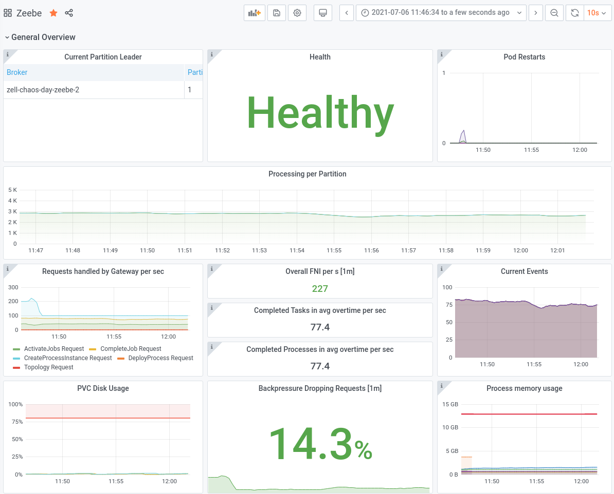
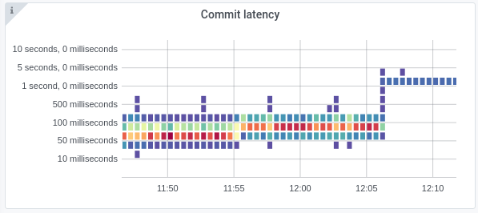
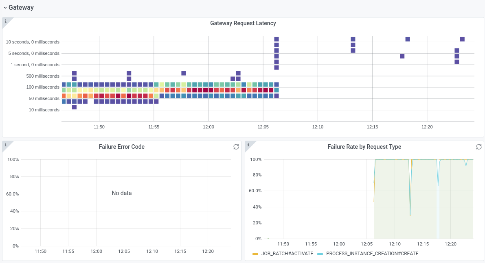
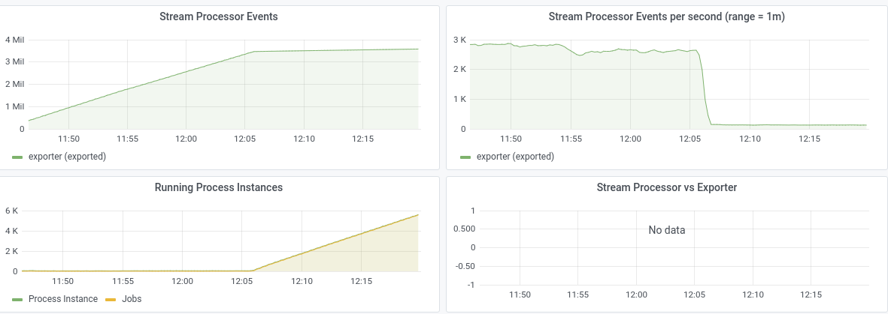
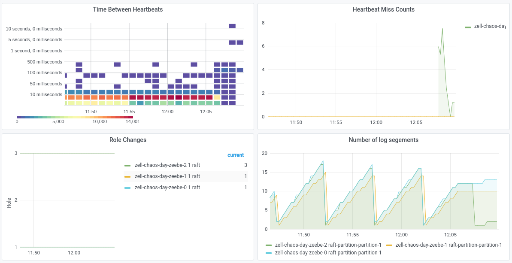
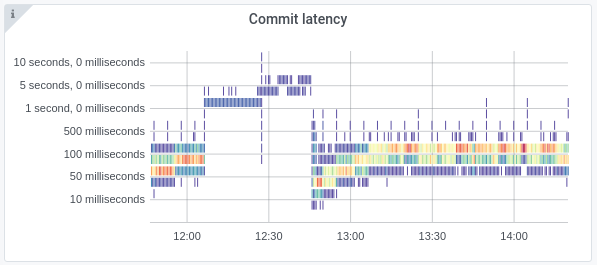

# Chaos Day Summary


On a previous [Chaos Day](/2020-10-06-toxi-proxy/index.md) we played around with [ToxiProxy](https://github.com/Shopify/toxiproxy) , which allows injecting failures on the network level. For example dropping packages, causing latency etc.

Last week [@Deepthi](https://github.com/deepthidevaki) mentioned to me that we can do similar things with [tc](https://man7.org/linux/man-pages/man8/tc.8.html), which is a built-in linux command. Today I wanted to experiment with latency between leader and followers using `tc`.

**TL;DR;** The experiment failed; With adding 100ms network delay to the Leader we broke the complete processing throughput. :boom:

## Chaos Experiment

We want to experiment with network latency and what kind of effect has a slow network on the cluster. 

### Hypothesis

We expect that we can handle certain network latency, due to our heartbeat and election time timeouts. After, reaching the deadlines we expect fail overs and followers which are lagging behind.

This means under a certain threshold we should be able to still process user commands, with slightly delay but without real issues. After reaching the deadline and the fail overs, it should be possible to continue, since we will add only to one node the delay.

### Experiment

#### TC

TC is a built in linux command, the manpage summarizes it as `tc - show / manipulate traffic control settings`.

In order to [add delay to a network interface](https://netbeez.net/blog/how-to-use-the-linux-traffic-control/), we can run the following:

```shell
tc qdisc add dev eth0 root netem delay 200ms
```

More details ([taken from the blog post](https://netbeez.net/blog/how-to-use-the-linux-traffic-control/)):
```
qdisc: modify the scheduler (aka queuing discipline)
add: add a new rule
dev eth0: rules will be applied on device eth0
root: modify the outbound traffic scheduler (aka known as the egress qdisc)
netem: use the network emulator to emulate a WAN property
delay: the network property that is modified
200ms: introduce delay of 200 ms
```

Adding this kind of rule means that we add a delay to all outgoing connections, which are going over this network interface.

#### Actual

In order to reduce the blast radius we will run the experiment with one partition on a three broker cluster (replication factor 3).

##### Steady State

 As we can see in the benchmark we are able to reach in avg. ~77 process instance creation and completions per second.



The process instance execution time (from start to end) is under 1 second.


The commit latency is about 100 ms.


We can see that one of the followers is a bit lagging behind, but not too far.


##### 100 ms

In the first iteration of the experiment we added a 100 ms delay to the leaders outgoing traffic. 

```sh
[zell zell-chaos-day/ cluster: zeebe-cluster ns:zell-chaos-day]$ k exec -it zell-chaos-day-zeebe-gateway-579c76978f-npz2k -- zbctl status --insecure
Cluster size: 3
Partitions count: 1
Replication factor: 3
Gateway version: 1.1.0-SNAPSHOT
Brokers:
  Broker 0 - zell-chaos-day-zeebe-0.zell-chaos-day-zeebe.zell-chaos-day.svc.cluster.local:26501
    Version: 1.1.0-SNAPSHOT
    Partition 1 : Follower, Healthy  Broker 1 - zell-chaos-day-zeebe-1.zell-chaos-day-zeebe.zell-chaos-day.svc.cluster.local:26501
    Version: 1.1.0-SNAPSHOT
    Partition 1 : Follower, Healthy  Broker 2 - zell-chaos-day-zeebe-2.zell-chaos-day-zeebe.zell-chaos-day.svc.cluster.local:26501
    Version: 1.1.0-SNAPSHOT
    Partition 1 : Leader, Healthy
```

Based on the `zbctl` output, or the grafana dashboard we can find out who is the leader. Note that the output of `zbctl` looks still a bit broken, related issue [#6692](https://github.com/camunda-cloud/zeebe/issues/6692).

With the following commands we can add the delay of 100 ms to the leaders outgoing traffic.
```sh
[zell zell-chaos-day/ cluster: zeebe-cluster ns:zell-chaos-day]$ k exec -it zell-chaos-day-zeebe-2 -- bash
root@zell-chaos-day-zeebe-2:/usr/local/zeebe# tc qdisc add dev eth0 root netem delay 100ms
root@zell-chaos-day-zeebe-2:/usr/local/zeebe# tc -s qdisc
qdisc noqueue 0: dev lo root refcnt 2 
 Sent 0 bytes 0 pkt (dropped 0, overlimits 0 requeues 0) 
 backlog 0b 0p requeues 0
qdisc netem 8001: dev eth0 root refcnt 2 limit 1000 delay 100.0ms
 Sent 11635496 bytes 10086 pkt (dropped 0, overlimits 0 requeues 0) 
 backlog 339773b 77p requeues 0
```

Almost immediately we see a drop in our general section of the Grafana Dashboard.


The backpressure increased significantly. As expected the commit latency increased.



The processing latency as well.


It was unexpected that the throughput breaks down so much. We can see in the send request that a lot of the requests are ended with timeouts or with resource exhausted.




Interesting is that no worker is able to activate nor complete any job. This cause increasing of the running process instances, so the state is growing.



Taking a look at the raft metrics we see that this already caused some heartbeat misses, but no leader change.




The follower is now lagging far more behind. We can see in the logs that the Leader tries to send `InstallRequests`, but these are also timing out.

```shell
RaftServer{raft-partition-partition-1} - InstallRequest{currentTerm=1, leader=2, index=1173627, term=1, version=1, chunkId=HeapByteBuffer{position=0, remaining=10, limit=10, capacity=10, mark=java.nio.HeapByteBuffer[pos=0 lim=10 cap=10], hash=1744147670}, nextChunkId=HeapByteBuffer{position=0, remaining=7, limit=7, capacity=7, mark=java.nio.HeapByteBuffer[pos=0 lim=7 cap=7], hash=1283029304}, data=HeapByteBuffer{position=0, remaining=10626817, limit=10626817, capacity=10626817, mark=java.nio.HeapByteBuffer[pos=0 lim=10626817 cap=10626817], hash=1083445787}, initial=false, complete=false} to 1 failed: java.util.concurrent.CompletionException: java.util.concurrent.TimeoutException: Request ProtocolRequest{id=489616, subject=raft-partition-partition-1-install, sender=zell-chaos-day-zeebe-2.zell-chaos-day-zeebe.zell-chaos-day.svc.cluster.local:26502, payload=byte[]{length=10647731, hash=1655826849}} to zell-chaos-day-zeebe-1.zell-chaos-day-zeebe.zell-chaos-day.svc.cluster.local:26502 timed out in PT5S"
```

The follower is starting regularly elections, but is not able to overturn the existing leader.


In general, in the Gateway logs we can see the start of the delay injection quite good. 

```shell
D 2021-07-06T10:05:51.263195Z Received REACHABILITY_CHANGED for broker 2, do nothing.
D 2021-07-06T10:05:53.264480Z Received REACHABILITY_CHANGED for broker 1, do nothing.
D 2021-07-06T10:05:54.184981Z Received REACHABILITY_CHANGED for broker 2, do nothing.
D 2021-07-06T10:05:54.213904Z Received REACHABILITY_CHANGED for broker 1, do nothing.
D 2021-07-06T10:05:54.361408Z Received REACHABILITY_CHANGED for broker 0, do nothing.
D 2021-07-06T10:05:54.986270Z Received REACHABILITY_CHANGED for broker 0, do nothing.
D 2021-07-06T10:05:56.617134Z Received REACHABILITY_CHANGED for broker 2, do nothing.
D 2021-07-06T10:05:57.072707Z Expected to handle gRPC request, but request timed out between gateway and broker
D 2021-07-06T10:05:57.126207Z Expected to handle gRPC request, but request timed out between gateway and broker
D 2021-07-06T10:05:57.157683Z Expected to handle gRPC request, but request timed out between gateway and broker
```

Similar logs we see on the broker side.

In general, we can say the experiment failed. The cluster was not able to run our normal workload. It seem to behave quite bad, but there were no leader change at all.

##### 250 ms

In order to verify whether 250 ms, will cause a leader election we reconfigured the delay. It looked quite similar, performance wise, but the heartbeats for one of the followers increased. Still it was not enough to cause a leader change.

After several minutes (~30) of running this configuration we were able to observe that one of the other followers missed heartbeats as well. This finally caused a leader change.


The throughput came back, it was similar to what is was before.


The processing execution latency was higher than usual.


Similar to the commit latency, interesting to see such an affect caused by a follower with network issues.



### Result

As written before the experiment failed, the hypothesis was not met. We were not able to add latency to the network, which is much lower than our deadlines (heartbeat timeout is 2.5 seconds), without causing any harm to our processing throughput/latency.

Still we had some interesting observations we can use for our next experiments and insight which we need to consider on setting up Zeebe in environment where the network might be unreliable/slow.
