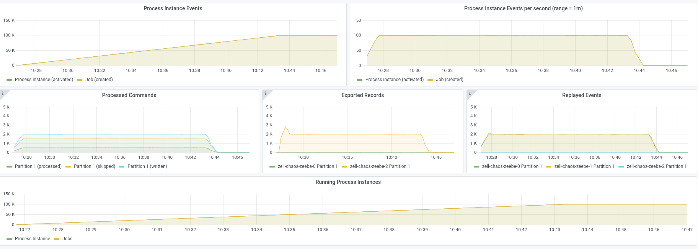
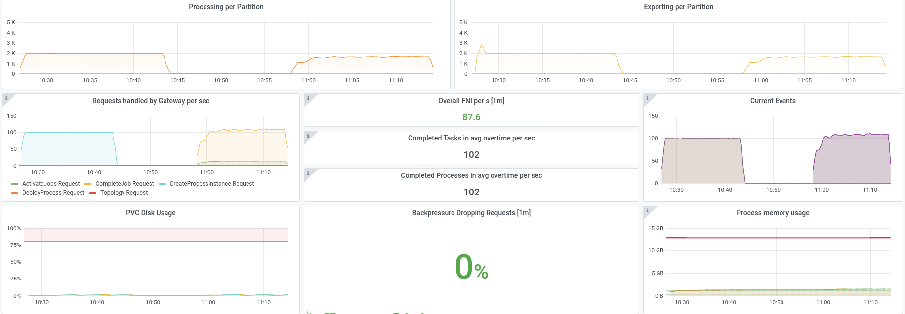
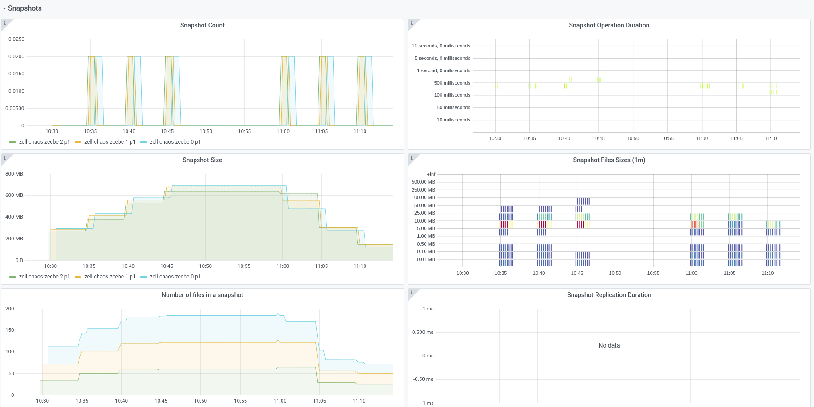
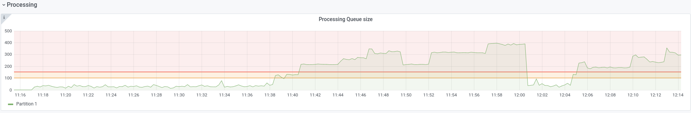

# Chaos Day Summary

In this chaos day we wanted to prove the hypothesis that the throughput should not significantly change even if we have bigger state, see [zeebe-chaos#64](https://github.com/zeebe-io/zeebe-chaos/issues/64)

This came up due observations from the [last chaos day](/2021-10-05-recovery-time/index.md). We already had a bigger investigation here [zeebe#7955](https://github.com/camunda-cloud/zeebe/issues/7955). 

**TL;DR;** We were not able to prove the hypothesis. Bigger state, more than 100k+ process instances in the state, seems to have an big impact on the processing throughput.

<!--truncate-->

## Chaos Experiment

Similar to the [last chaos day](/2021-10-05-recovery-time/index.md) we set up three brokers, with one partition and replication factor three. 

As first part of the experiment we start some amount of instances, afterwards we want to complete them with our workers. Based on the [last chaos day](/2021-10-05-recovery-time/index.md) we know what we can complete ~100 process instances with one worker and a capacity of `12`. An example worker configuration can be found [here](https://github.com/camunda-cloud/zeebe/blob/develop/benchmarks/setup/default/worker.yaml)

We changed the following:

```sh
$ diff default/worker.yaml zell-chaos/worker.yaml 
11c11
<   replicas: 12
---
>   replicas: 1
26c26
<               -Dapp.worker.capacity=120
---
>               -Dapp.worker.capacity=12
```

### Experiment One

As first experiment we start with creating `100.000` instances, afterwards we start the worker.

In order to do that easily we can configure the [starter](https://github.com/camunda-cloud/zeebe/blob/develop/benchmarks/setup/default/starter.yaml) and reduce the rate to `100` and set the duration limit to `1000`. This means it will run for `1000` second and start each second `100` instances (which makes `100.000`).

```shell
$ diff default/starter.yaml zell-chaos/starter.yaml 
24,26c24,26
<               -Dapp.starter.rate=200
<               -Dapp.starter.durationLimit=0
---
>               -Dapp.starter.rate=100
>               -Dapp.starter.durationLimit=1000
```

#### Expected

We expected that we can create `100.000` instances and can complete them with a rate of `~100`, as we have seen in other experiments.

#### Actual

We were able to create all instances without any issues.



We were able to complete all instances without any issues and the throughput was ~100 completion per second.



We can see that the snapshot was at some point ~650 MB big.




### Experiment Two

As second experiment we wanted to increase the state by factor `10`, which means `1.000.000` instances in the state and then start the worker.

In order to do that we changed the following in the starter configuration:

```shell
$ diff default/starter.yaml zell-chaos/starter.yaml 
24,26c24,26
<               -Dapp.starter.rate=200
<               -Dapp.starter.durationLimit=0
---
>               -Dapp.starter.rate=100
>               -Dapp.starter.durationLimit=10000
```

#### Expected

We expect that we can create `1.000.000` instances and can complete them with a rate of `~100`, as we have seen in other experiments.

#### Actual

We were **not** able to create all instances without issues.


We see that at some point the throughput drops and backpressure seem to kick in. When this happens the state is only a bit bigger than in the previous experiment


The running instances seem to be around ~170K at this time.


We can see that the processing queue increased at the same time and reached a critical point (over 150 records in the backlog).



The overall latency seems to increase after this time (which makes sense)


We haven't started the workers for this experiment, since the throughput already break before.

### Experiment Three

In order to make sure that this is related to the state we run an experiment with the [simpleStarter](https://github.com/camunda-cloud/zeebe/blob/develop/benchmarks/setup/default/simpleStarter.yaml). This starter starts a process, which contains only a start and end event.

We let this starter run for more than one day and haven't experienced any issues on this one.


## Result

As written above the throughput seem to break, after we reach a certain state size.

It might be just a trigger to get the system into stumblling, which means: after one thing takes a bit longer the processing queue gets longer and the processor is not able to catch up any more. This causes then backpressure to kick in etc.

I think we need to further investigate this.