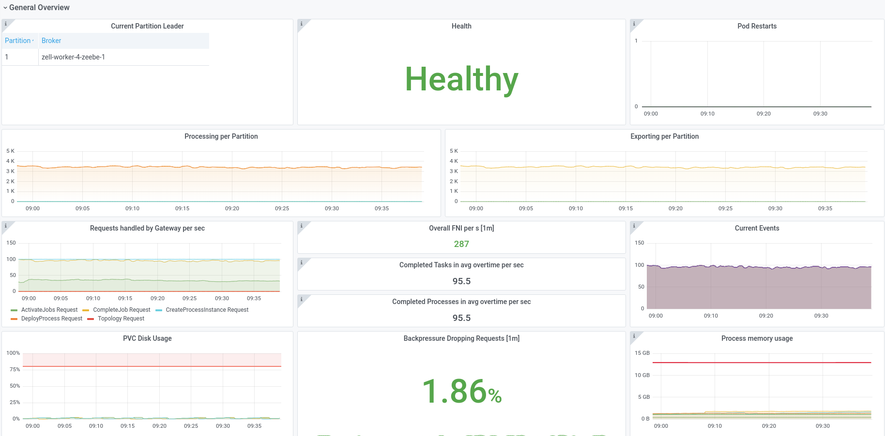
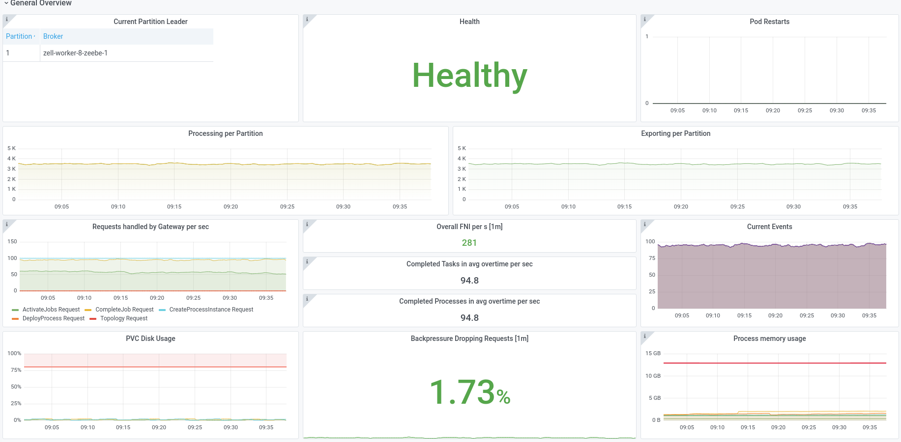
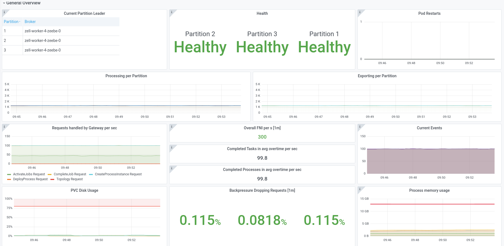
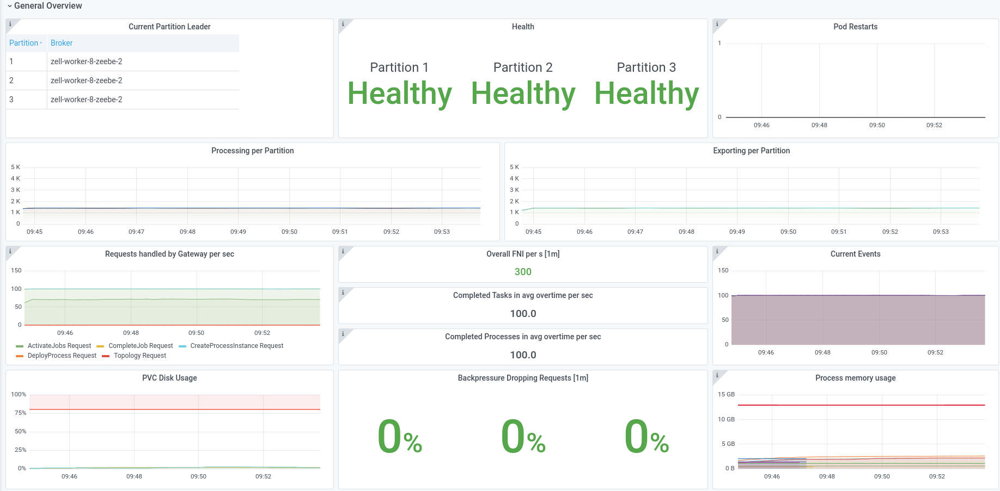
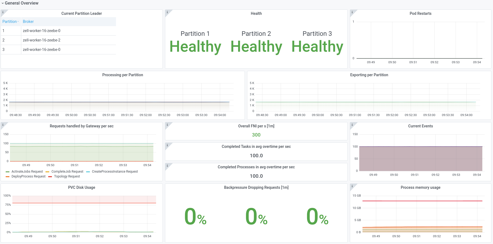
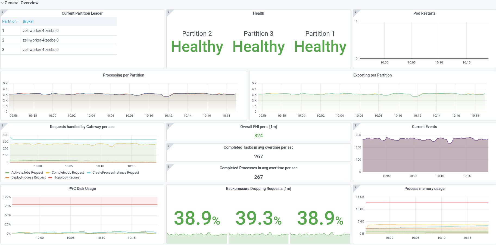
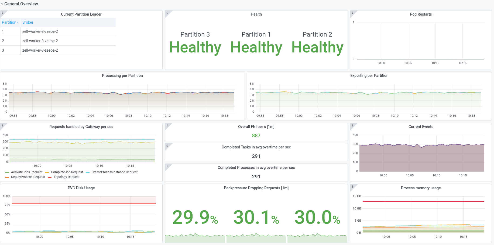

# Chaos Day Summary

In this chaos day we wanted to experiment with the worker count, since we saw recently that it might affect the performance (throughput) negatively if there are more workers deployed. This is related to [#7955](https://github.com/camunda-cloud/zeebe/issues/7955) and [8244](https://github.com/camunda-cloud/zeebe/issues/8244).

We wanted to prove that even if we have more workers deployed that the throughput of the process instance execution should not have an negative impact.

**TL;DR;** We were not able to prove our hypothesis. Scaling of workers can have a negative impact on performance.

<!--truncate-->

## First Chaos Experiment

We run the first experiment with one partition, three brokers, one standalone gateway and one starter which creates 100 PI/s. In the experiment we deployed in different benchmarks 4, 8 and 16 workers.

### Expected

The workers should be able to complete all created instances and if the workers are scaled the throughput should remain.

### Actual

#### 4 Worker

#### 8 Worker

#### 16 Worker

##### Result 

What we can see is that if we increase the worker number it will decrease the throughput, this could be explained with: we sent more activation requests / commands which need to be handled by the Brokers.

## Second Chaos Experiment

We will repeat first experiment with some changes, to the partition count. We will now use three partitions.

### Expected

The workers should be able to complete all created instances and if the workers are scaled the throughput should remain.

### Actual

#### 4 Worker

#### 8 Worker

#### 16 Worker

##### Result 

In this experiment we can see that all benchmarks reach almost the same throughput, since we not really stressing the system and have enough resources to work with. There is no backpressure at all. In the next experiment we will increase the load.

## Third Chaos Experiment

We will repeat second experiment with some changes to the instance creation count. We will now start 300 process instances per second, with one starter.

### Expected

The workers should be able to complete most of the instances, we would expect that with more workers we would be able to complete more instances and have no negative impact on the system.

### Actual

#### 4 Worker

#### 8 Worker

#### 16 Worker

##### Result 

Between eight and four worker we see the expected difference that more worker increases the throughput and we are able to complete more instances in a second. The result of 16 workers is completely unexpected, we observed that after short time frame the completion throughput completely drops, and only process instances are created. 

We were able to reproduce this behavior, which shows the weakness again.

We were not able to prove our hypothesis, that scaling workers has no negative impact on performance.

## Further Analysis

We will create a separate bug issue to document our findings and reference it here.