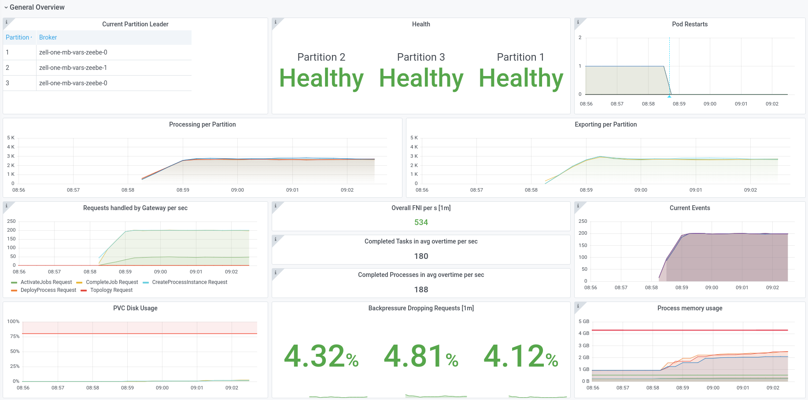
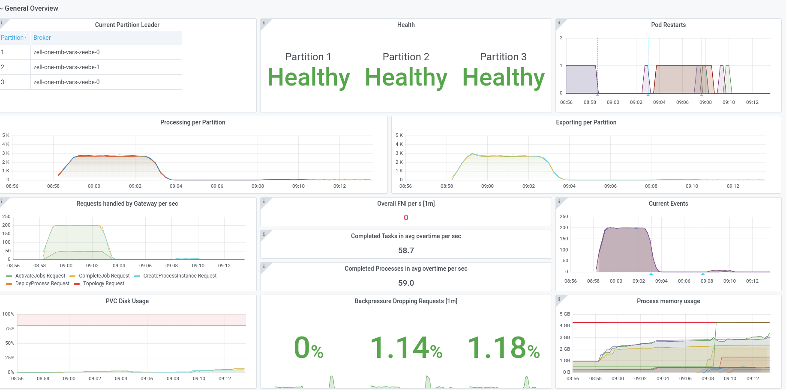

# Chaos Day Summary

New Year;:tada:New Chaos:monkey:

This time I wanted to experiment with "big" variables. Zeebe supports a `maxMessageSize` of 4 MB, which is quite big. In general, it should be clear that using big variables will cause performance issues, but today I also want to find out whether the system can handle big variables (~1 MB) at all. 

**TL;DR;** Our Chaos experiment failed! Zeebe and Camunda Cloud is not able to handle (per default) big variables (~1 MB) without issues.

<!--truncate-->

## Chaos Experiment

Normally we run our benchmarks with ~32 KB payload size. This time we want to try out a payload size of ~1 MB and verify whether the system can handle such payload sizes. The payload we use can be found [here](pathname://big_payload.json). 

The benchmark setup, is similar to default Zeebe benchmarks you can find [here](https://github.com/camunda-cloud/zeebe/tree/develop/benchmarks/setup/default). To make it work and fair we updated the starter and worker resources for both, base and the chaos cluster.

```diff
diff --git a/benchmarks/setup/default/starter.yaml b/benchmarks/setup/default/starter.yaml
index 78c6e81dbb..d0404d4d3e 100644
--- a/benchmarks/setup/default/starter.yaml
+++ b/benchmarks/setup/default/starter.yaml
@@ -30,11 +30,11 @@ spec:
             value: "warn"
         resources:
           limits:
-            cpu: 250m
-            memory: 256Mi
+            cpu: 1G
+            memory: 2Gi
           requests:
-            cpu: 250m
-            memory: 256Mi
+            cpu: 1G
+            memory: 2Gi
 ---
 apiVersion: v1
 kind: Service
diff --git a/benchmarks/setup/default/worker.yaml b/benchmarks/setup/default/worker.yaml
index cd6f5ffeb6..05b195291f 100644
--- a/benchmarks/setup/default/worker.yaml
+++ b/benchmarks/setup/default/worker.yaml
@@ -31,11 +31,11 @@ spec:
             value: "warn"
         resources:
           limits:
-            cpu: 500m
-            memory: 256Mi
+            cpu: 1G
+            memory: 1Gi
           requests:
-            cpu: 500m
-            memory: 256Mi
+            cpu: 1G
+            memory: 1Gi
```

### Expected

It is expected that the performance will drop, we formulate the following hypothesis.

**Hypothesis: With a bigger payload size of e.g. 1 MB, Zeebe should be still able to handle process instances, maybe under a degraded performance, but in general the availability must not suffer from such a payload size.**


### Actual

#### Base

We started a base benchmark with ~32 KB to verify how it looks like normally.


#### Small Payload

In order to verify how Zeebe handles different payload, we first started with a small payload ~130 bytes, which is part of the Starter application (called `small_payload.json`). 



We can see that the system handles such payload without any issues, and we can reach ~190 process instances per second (PI/s).

#### Big Payload

After running with a small payload, we changed the payload to a size of ~1 MB. This immediately broke the standalone gateways.


The gateways went out of memory (OOM) in a loop. No processing was made in this time.

##### Increasing Resources

In order to continue the experiment and to verify how Zeebe itself can handle it, we increased the gateway resources.

```diff
diff --git a/benchmarks/setup/default/zeebe-values.yaml b/benchmarks/setup/default/zeebe-values.yaml
index 371ba538dc..7a11c10366 100644
--- a/benchmarks/setup/default/zeebe-values.yaml
+++ b/benchmarks/setup/default/zeebe-values.yaml
@@ -38,10 +38,10 @@ gateway:
   resources:
     limits:
       cpu: 1
-      memory: 512Mi
+      memory: 4Gi
     requests:
       cpu: 1
-      memory: 512Mi
+      memory: 4Gi
```

But this doesn't help. The gateway went no longer OOM, but it was still not able to handle the payload.



We can see that in a short period of time some events have been processed (small spike in the "Current Events" panel), but this stopped quite fast again. In the gateway logs there are endless warnings:

```
Warning 2022-01-20 10:09:32.644 CET zeebe-cluster-helm "Stream Error"
Warning 2022-01-20 10:09:56.847 CET zeebe-cluster-helm "Stream Error"
```

With an underlying exception: `io.netty.handler.codec.http2.Http2Exception$StreamException: Stream closed before write could take place` 

<details>
<summary>Stacktrace</summary>
```
io.netty.handler.codec.http2.Http2Exception$StreamException: Stream closed before write could take place
	at io.netty.handler.codec.http2.Http2Exception.streamError(Http2Exception.java:172) ~[netty-codec-http2-4.1.73.Final.jar:4.1.73.Final]
	at io.netty.handler.codec.http2.DefaultHttp2RemoteFlowController$FlowState.cancel(DefaultHttp2RemoteFlowController.java:481) [netty-codec-http2-4.1.73.Final.jar:4.1.73.Final]
	at io.netty.handler.codec.http2.DefaultHttp2RemoteFlowController$1.onStreamClosed(DefaultHttp2RemoteFlowController.java:105) [netty-codec-http2-4.1.73.Final.jar:4.1.73.Final]
	at io.netty.handler.codec.http2.DefaultHttp2Connection.notifyClosed(DefaultHttp2Connection.java:357) [netty-codec-http2-4.1.73.Final.jar:4.1.73.Final]
	at io.netty.handler.codec.http2.DefaultHttp2Connection$ActiveStreams.removeFromActiveStreams(DefaultHttp2Connection.java:1007) [netty-codec-http2-4.1.73.Final.jar:4.1.73.Final]
	at io.netty.handler.codec.http2.DefaultHttp2Connection$ActiveStreams.deactivate(DefaultHttp2Connection.java:963) [netty-codec-http2-4.1.73.Final.jar:4.1.73.Final]
	at io.netty.handler.codec.http2.DefaultHttp2Connection$DefaultStream.close(DefaultHttp2Connection.java:515) [netty-codec-http2-4.1.73.Final.jar:4.1.73.Final]
	at io.netty.handler.codec.http2.DefaultHttp2Connection$DefaultStream.close(DefaultHttp2Connection.java:521) [netty-codec-http2-4.1.73.Final.jar:4.1.73.Final]
	at io.netty.handler.codec.http2.Http2ConnectionHandler.closeStream(Http2ConnectionHandler.java:613) [netty-codec-http2-4.1.73.Final.jar:4.1.73.Final]
	at io.netty.handler.codec.http2.DefaultHttp2ConnectionDecoder$FrameReadListener.onRstStreamRead(DefaultHttp2ConnectionDecoder.java:444) [netty-codec-http2-4.1.73.Final.jar:4.1.73.Final]
	at io.netty.handler.codec.http2.Http2InboundFrameLogger$1.onRstStreamRead(Http2InboundFrameLogger.java:80) [netty-codec-http2-4.1.73.Final.jar:4.1.73.Final]
	at io.netty.handler.codec.http2.DefaultHttp2FrameReader.readRstStreamFrame(DefaultHttp2FrameReader.java:509) [netty-codec-http2-4.1.73.Final.jar:4.1.73.Final]
	at io.netty.handler.codec.http2.DefaultHttp2FrameReader.processPayloadState(DefaultHttp2FrameReader.java:259) [netty-codec-http2-4.1.73.Final.jar:4.1.73.Final]
	at io.netty.handler.codec.http2.DefaultHttp2FrameReader.readFrame(DefaultHttp2FrameReader.java:159) [netty-codec-http2-4.1.73.Final.jar:4.1.73.Final]
	at io.netty.handler.codec.http2.Http2InboundFrameLogger.readFrame(Http2InboundFrameLogger.java:41) [netty-codec-http2-4.1.73.Final.jar:4.1.73.Final]
	at io.netty.handler.codec.http2.DefaultHttp2ConnectionDecoder.decodeFrame(DefaultHttp2ConnectionDecoder.java:173) [netty-codec-http2-4.1.73.Final.jar:4.1.73.Final]
	at io.netty.handler.codec.http2.Http2ConnectionHandler$FrameDecoder.decode(Http2ConnectionHandler.java:378) [netty-codec-http2-4.1.73.Final.jar:4.1.73.Final]
	at io.netty.handler.codec.http2.Http2ConnectionHandler.decode(Http2ConnectionHandler.java:438) [netty-codec-http2-4.1.73.Final.jar:4.1.73.Final]
	at io.netty.handler.codec.ByteToMessageDecoder.decodeRemovalReentryProtection(ByteToMessageDecoder.java:510) [netty-codec-4.1.73.Final.jar:4.1.73.Final]
	at io.netty.handler.codec.ByteToMessageDecoder.callDecode(ByteToMessageDecoder.java:449) [netty-codec-4.1.73.Final.jar:4.1.73.Final]
	at io.netty.handler.codec.ByteToMessageDecoder.channelRead(ByteToMessageDecoder.java:279) [netty-codec-4.1.73.Final.jar:4.1.73.Final]
	at io.netty.channel.AbstractChannelHandlerContext.invokeChannelRead(AbstractChannelHandlerContext.java:379) [netty-transport-4.1.73.Final.jar:4.1.73.Final]
	at io.netty.channel.AbstractChannelHandlerContext.invokeChannelRead(AbstractChannelHandlerContext.java:365) [netty-transport-4.1.73.Final.jar:4.1.73.Final]
	at io.netty.channel.AbstractChannelHandlerContext.fireChannelRead(AbstractChannelHandlerContext.java:357) [netty-transport-4.1.73.Final.jar:4.1.73.Final]
	at io.netty.channel.DefaultChannelPipeline$HeadContext.channelRead(DefaultChannelPipeline.java:1410) [netty-transport-4.1.73.Final.jar:4.1.73.Final]
	at io.netty.channel.AbstractChannelHandlerContext.invokeChannelRead(AbstractChannelHandlerContext.java:379) [netty-transport-4.1.73.Final.jar:4.1.73.Final]
	at io.netty.channel.AbstractChannelHandlerContext.invokeChannelRead(AbstractChannelHandlerContext.java:365) [netty-transport-4.1.73.Final.jar:4.1.73.Final]
	at io.netty.channel.DefaultChannelPipeline.fireChannelRead(DefaultChannelPipeline.java:919) [netty-transport-4.1.73.Final.jar:4.1.73.Final]
	at io.netty.channel.epoll.AbstractEpollStreamChannel$EpollStreamUnsafe.epollInReady(AbstractEpollStreamChannel.java:795) [netty-transport-classes-epoll-4.1.73.Final.jar:4.1.73.Final]
	at io.netty.channel.epoll.EpollEventLoop.processReady(EpollEventLoop.java:480) [netty-transport-classes-epoll-4.1.73.Final.jar:4.1.73.Final]
	at io.netty.channel.epoll.EpollEventLoop.run(EpollEventLoop.java:378) [netty-transport-classes-epoll-4.1.73.Final.jar:4.1.73.Final]
	at io.netty.util.concurrent.SingleThreadEventExecutor$4.run(SingleThreadEventExecutor.java:986) [netty-common-4.1.73.Final.jar:4.1.73.Final]
	at io.netty.util.internal.ThreadExecutorMap$2.run(ThreadExecutorMap.java:74) [netty-common-4.1.73.Final.jar:4.1.73.Final]
	at io.netty.util.concurrent.FastThreadLocalRunnable.run(FastThreadLocalRunnable.java:30) [netty-common-4.1.73.Final.jar:4.1.73.Final]
	at java.lang.Thread.run(Unknown Source)
```
</details>

On the client side we can see that the Zeebe cluster seems to be unavailable.

### Camunda Cloud

We wanted to verify how Camunda Cloud and our standard Cluster plan (GA Hardware Plan) handles such a payload. But the result was the same.


The processing stopped quite fast due to OOM of the gateway. We can see that operate is also not able to handle such load.


In our console overview we see that all services (exception Zeebe) went unhealthy


### Result

> *Hypothesis: With a bigger payload size of e.g. 1 MB Zeebe, should be still able to handle process instances, maybe under a degraded performance but in general the availability must not suffer from such a payload size.*

**We were not able to validate our hypothesis, which means our chaos experiment failed!** :boom:

### Found Bugs

We opened the following bug issues:

 * Gateway can't handle bigger payload sizes [#8621](https://github.com/camunda-cloud/zeebe/issues/8621)

# Outtakes

Interesting issues I run into when doing the chaos experiment, could be count as TIL events and mentioning them might help others.

## Message pack is not valid

When I first generated the JSON payload, it was an array on root level, which is not supported by Zeebe. 

I spent sometime to understand why I see no progress in processing. Taking a look at the gateway logs we can see:

`"Expected to handle gRPC request, but messagepack property was invalid: io.camunda.zeebe.msgpack.MsgpackPropertyException: Property 'variables' is invalid: Expected document to be a root level object, but was 'ARRAY'"`

On the client side (if the logging is turned on, starter needs info logging) we see:

`INVALID_ARGUMENT: Property 'variables' is invalid: Expected document to be a root level object, but was 'ARRAY'`


## Configure the Starter payload

In order to use different JSON payload for the starter we support a configuration on the starter application (`-Dapp.starter.payloadPath`). I had a lot of *"fun"* to find out the right syntax:

 * -Dapp.starter.payloadPath="bpmn/small_payload.json" - *DOESN'T WORK*
 * -Dapp.starter.payloadPath="/bpmn/small_payload.json" - *DOESN'T WORK*
 * -Dapp.starter.payloadPath=/bpmn/small_payload.json - *DOESN'T WORK*
 * -Dapp.starter.payloadPath=bpmn/big_payload.json - *WORKS*


So be aware don't use `"` and no `/` in front, otherwise you might get a `java.io.FileNotFoundException: "bpmn/small_payload.json" (No such file or directory)` in your starter deployment and wonder why you see no progress.