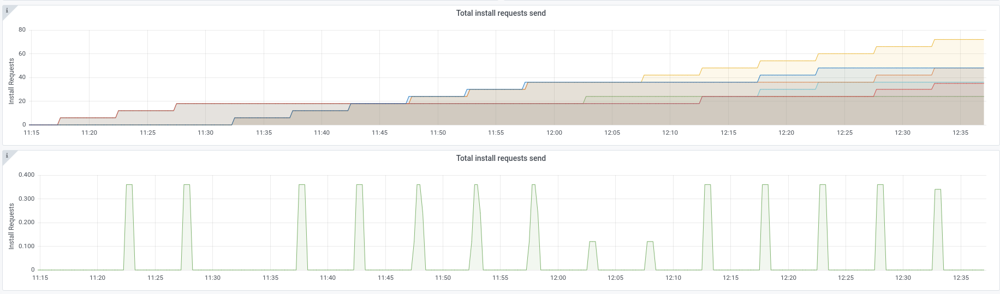
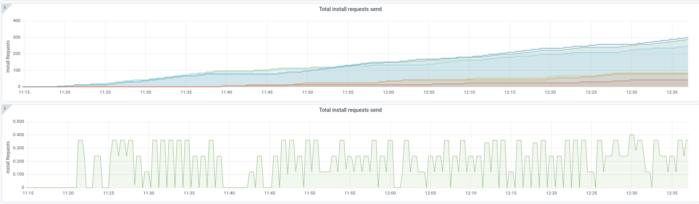
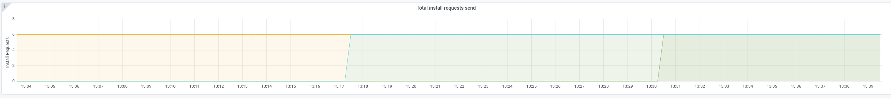

# Chaos Day Summary

Today we wanted to experiment with the snapshot interval and verify that a high snapshot frequency will not impact our availability ([#21](https://github.com/zeebe-io/zeebe-chaos/issues/21)).


**TL;DR;** The chaos experiment succeeded :muscle: We were able to prove our hypothesis.

<!--truncate-->

## Chaos Experiment

### Snapshot Interval

As we can see in the [docs](https://docs.camunda.io/docs/self-managed/zeebe-deployment/operations/resource-planning/#snapshots) a snapshot is defined as:

> A snapshot is a projection of all events that represent the current running state of the processes running on the partition. It contains all active data, for example, deployed processes, active process instances, and not yet completed jobs.

Per default snapshots are taken every 5 minutes, by leaders and followers. If a follower is lagging behind (with replication) the leader will, after reaching a certain threshold, prefer to send the follower a snapshot instead of replicating X amount of records. We recently observed that this currently happens quite often, see [#8565](https://github.com/camunda-cloud/zeebe/issues/8565).

The snapshot interval can be changed via an environment variable: `ZEEBE_BROKER_DATA_SNAPSHOTPERIOD`

### Expected

We expect that even if the snapshot interval is low (so the frequency of taking snapshot is high) we not run into any availability issues and the cluster should still be healthy. Lower snapshot interval might impact the performance, since taking a snapshot can take some time but other than that it shouldn't have any effect.

### Actual

As usual, we run again two benchmarks to compare them. One base which has the [default benchmark configuration](https://github.com/camunda-cloud/zeebe/tree/develop/benchmarks/setup/default) and one with a changed snapshot interval.

For the second benchmark we set the snapshot interval to one minute. Like this:
```
env:
  ...
    - name: ZEEBE_BROKER_DATA_SNAPSHOTPERIOD
    value: "1m"
```

Throughput wise we can see a small difference, but this might be more related that on the base benchmark one node is leader for all partitions.


| Base | Chaos |
|------|-------|
|  |  |


In general the cluster with the small snapshot interval shows no negative effect. What we can see is that the install request rate increased. It seems to be currently have no affect, but it is likely that if more partitions are added it might become an issue.


| Base | Chaos |
|------|-------|
|  |  |

Further investigation needs to be done as part of [#8565](https://github.com/camunda-cloud/zeebe/issues/8565).


#### Smaller intervals

The smallest interval which Zeebe supports is `1m == 1 minute`. If we configure for example `1s`

```
env:
  ...
    - name: ZEEBE_BROKER_DATA_SNAPSHOTPERIOD
    value: "1s"
```

We see the following exception in the log and the broker fails to start.

```
java.lang.IllegalArgumentException: Snapshot period PT1S needs to be larger then or equals to one minute.
```

#### Bigger intervals

In order to verify how Zeebe reacts on a bigger snapshot interval we have set the interval to 30 minutes.

```
env:
  ...
    - name: ZEEBE_BROKER_DATA_SNAPSHOTPERIOD
    value: "30m"
```
In general, it looked good. What we can see is that one node was restarted in between and took a while to come back. 


This is expected due to the high snapshot interval, but interesting to observe. The leader had no snapshot yet produced, which means it had to replicate all events to the restarted follower. Only if the follower catches up on all partitions its bootstrap process is complete, and it can mark itself as ready. As we see it can take a while if there is no snapshot available, since new records are incoming all the time. 

After the leader of partition two took a snapshot and the leader sent this snapshot to the follower, the follower were able to become ready.

Even with a big snapshot interval we can see that as soon as a new snapshot is taken it is sent to the followers, which is suboptimal.



An important thing to keep in mind when playing around with snapshots is the logstream/journal size. The journal is only compacted after taking a snapshot, if we take snapshot less frequent this means we clean up less frequent. The log can grow much bigger with big snapshot intervals.


### Result

The chaos experiment succeeded :tada: We verified that a smaller snapshot interval has no negative impact on the cluster availability, at least for a small amount of partitions. 

## Found Bugs

 * Existing issue regarding the install requests [#8565](https://github.com/camunda-cloud/zeebe/issues/8565)


