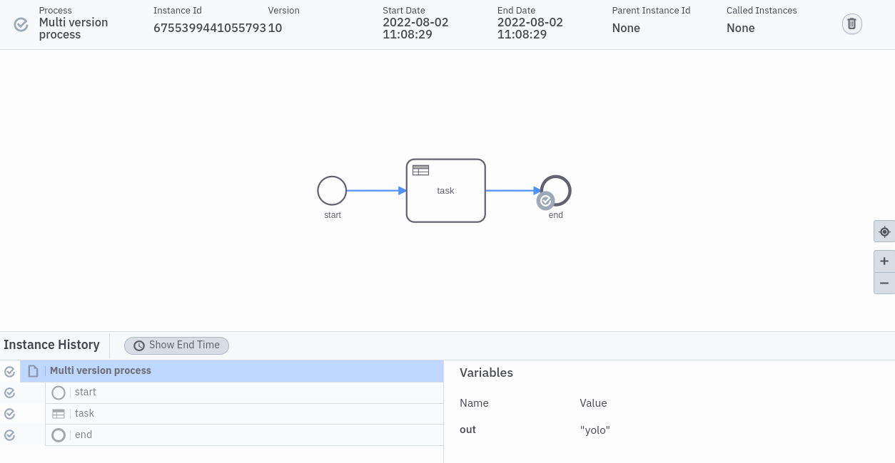

# Chaos Day Summary


We encountered recently a severe bug https://github.com/camunda/zeebe/issues/9877 where I was wondering why we haven't spotted it earlier, since we have chaos experiments for it. I realized two things:

 1) The experiments only checks for parts of it (BPMN resource only). The production code has changed, a new feature have been added (DMN) but the experiments / tests haven't been adjusted.
 2) More importantly we disabled the automated execution of the deployment distribution experiment because it was flaky due to missing standalone gateway in Camunda Cloud SaaS [zeebe-io/zeebe-chaos#61](https://github.com/zeebe-io/zeebe-chaos/issues/61). This is no longer the case.

In this chaos day I want to bring the automation of this chaos experiment back to live. If I have still time I want to enhance the experiment. 

**TL;DR;** 

<!--truncate-->

## Chaos Experiment

In short, we will disconnect certain Leaders and deploy multiple process versions, after connecting the leaders again we expect that the deployments are distributed, and we can create instances of the last version on all partitions. For more details about the original experiment you can read https://zeebe-io.github.io/zeebe-chaos/2021/01/26/deployments/

First we will run the existing experiment against the latest minor version, to verify whether the experiment still works. Afterwards we will run it against SNAPSHOT. As the next step we will add DMN resources and try again with a version where the experiment should fail, and later we will go back to SNAPSHOT.

### Expected

After disconnecting, deploying and connecting the leaders again we expect that the deployment distribution will redistribute the deployments, and we can create a process instance of the last version.

### Actual

#### Setup

As a first step I created a new Production S cluster, which has three partition, three nodes (brokers) and two standalone gateways. The Zeebe version was set to 8.0.4 (latest minor).

It was a while since I used the chaos toolkit which is the reason I had to reinstall it again, which is quite simple https://chaostoolkit.org/reference/usage/install/

run:

```sh
python3 -m venv ~/.venvs/chaostk
source  ~/.venvs/chaostk/bin/activate
pip install -U chaostoolkit
chaos --version
```

#### Executing chaos toolkit

As mentioned the deployment distribution was not enabled for Production S clusters, which is currently the only configuration we test. We have to use the experiment that is defined under [production-l/deployment-distribution](https://github.com/zeebe-io/zeebe-chaos/tree/master/chaos-workers/chaos-experiments/camunda-cloud/production-l/deployment-distribution), which is the same.

```sh
 chaos run production-l/deployment-distribution/experiment.json 
[2022-08-02 09:35:25 INFO] Validating the experiment's syntax
[2022-08-02 09:35:25 INFO] Experiment looks valid
[2022-08-02 09:35:25 INFO] Running experiment: Zeebe deployment distribution
[2022-08-02 09:35:25 INFO] Steady-state strategy: default
[2022-08-02 09:35:25 INFO] Rollbacks strategy: default
[2022-08-02 09:35:25 INFO] Steady state hypothesis: Zeebe is alive
[2022-08-02 09:35:25 INFO] Probe: All pods should be ready
[2022-08-02 09:35:25 INFO] Steady state hypothesis is met!
[2022-08-02 09:35:25 INFO] Playing your experiment's method now...
[2022-08-02 09:35:25 INFO] Action: Enable net_admin capabilities
[2022-08-02 09:35:26 WARNING] This process returned a non-zero exit code. This may indicate some error and not what you expected. Please have a look at the logs.
[2022-08-02 09:35:26 INFO] Pausing after activity for 180s...
[2022-08-02 09:38:26 INFO] Probe: All pods should be ready
[2022-08-02 09:38:33 INFO] Action: Create network partition between leaders
[2022-08-02 09:38:34 WARNING] This process returned a non-zero exit code. This may indicate some error and not what you expected. Please have a look at the logs.
[2022-08-02 09:38:34 INFO] Action: Deploy different deployment versions.
[2022-08-02 09:38:40 INFO] Action: Delete network partition
[2022-08-02 09:38:42 INFO] Probe: Create process instance of latest version on partition one
[2022-08-02 09:38:43 INFO] Probe: Create process instance of latest version on partition two
[2022-08-02 09:38:44 INFO] Probe: Create process instance of latest version on partition three
[2022-08-02 09:38:44 INFO] Steady state hypothesis: Zeebe is alive
[2022-08-02 09:38:44 INFO] Probe: All pods should be ready
[2022-08-02 09:38:45 INFO] Steady state hypothesis is met!
[2022-08-02 09:38:45 INFO] Let's rollback...
[2022-08-02 09:38:45 INFO] No declared rollbacks, let's move on.
[2022-08-02 09:38:45 INFO] Experiment ended with status: completed
```

Based from the tool output it looks like it succeed to make sure it really worked, we will take a look at the logs in stackdriver.

In the following logs we can see that deployment distribution is failing for partition 3 and is retried, which is expected and what we wanted.
```
2022-08-02 09:38:53.114 CEST zeebe Failed to receive deployment response for partition 3 (on topic 'deployment-response-2251799813685347-3'). Retrying
2022-08-02 09:38:53.115 CEST zeebe Deployment DISTRIBUTE command for deployment 2251799813685347 was written on partition 3
2022-08-02 09:38:53.157 CEST zeebe Received new exporter state {elasticsearch=228, MetricsExporter=228} 
2022-08-02 09:38:53.157 CEST zeebe Received new exporter state {elasticsearch=228, MetricsExporter=228}
2022-08-02 09:38:53.241 CEST zeebe Received new exporter state {elasticsearch=232, MetricsExporter=232}
2022-08-02 09:38:53.241 CEST zeebe Received new exporter state {elasticsearch=232, MetricsExporter=232}
2022-08-02 09:38:53.464 CEST zeebe Failed to receive deployment response for partition 3 (on topic 'deployment-response-2251799813685351-3'). Retrying
2022-08-02 09:38:53.466 CEST zeebe Deployment DISTRIBUTE command for deployment 2251799813685351 was written on partition 3
2022-08-02 09:38:54.216 CEST zeebe Failed to receive deployment response for partition 3 (on topic 'deployment-response-2251799813685353-3'). Retrying
2022-08-02 09:38:54.218 CEST zeebe Deployment DISTRIBUTE command for deployment 2251799813685353 was written on partition 3
2022-08-02 09:38:54.224 CEST zeebe Failed to receive deployment response for partition 3 (on topic 'deployment-response-2251799813685355-3'). Retrying
2022-08-02 09:38:54.225 CEST zeebe Deployment DISTRIBUTE command for deployment 2251799813685355 was written on partition 3
2022-08-02 09:38:55.055 CEST zeebe Failed to receive deployment response for partition 3 (on topic 'deployment-response-2251799813685359-3'). Retrying
2022-08-02 09:38:55.057 CEST zeebe Deployment DISTRIBUTE command for deployment 2251799813685359 was written on partition 3
2022-08-02 09:38:55.689 CEST zeebe Received new exporter state {elasticsearch=299, MetricsExporter=299}
2022-08-02 09:38:55.690 CEST zeebe Received new exporter state {elasticsearch=299, MetricsExporter=299}
2022-08-02 09:38:56.089 CEST zeebe Failed to receive deployment response for partition 3 (on topic 'deployment-response-2251799813685357-3'). Retrying
2022-08-02 09:38:56.090 CEST zeebe Deployment DISTRIBUTE command for deployment 2251799813685357 was written on partition 3
2022-08-02 09:38:56.272 CEST zeebe Failed to receive deployment response for partition 3 (on topic 'deployment-response-2251799813685363-3'). Retrying
2022-08-02 09:38:56.273 CEST zeebe Deployment DISTRIBUTE command for deployment 2251799813685363 was written on partition 3
2022-08-02 09:38:56.920 CEST zeebe Failed to receive deployment response for partition 3 (on topic 'deployment-response-2251799813685361-3'). Retrying
2022-08-02 09:38:56.922 CEST zeebe Deployment DISTRIBUTE command for deployment 2251799813685361 was written on partition 3
2022-08-02 09:39:08.369 CEST zeebe Received new exporter state {elasticsearch=252, MetricsExporter=252}
```

This is great, because it means the experiment was successful executed and our deployment distribution is failure tolerant.


#### Enhancement

As described earlier the current experiment only deploys a BPMN process model it looks like this:


In order to make DMN part of the experiment we change the service task to a [Business Rule task](https://docs.camunda.io/docs/components/modeler/bpmn/business-rule-tasks/). 


The decision is really simply and just defines a static input and returns that as output.


When we run our experiment and create process instances on all partitions the DMN needs to be available otherwise the execution would fail. Currently, we can't specify a specific version of the DMN in the Business Rule Task (always the latest will be executed). Because of that, we will not deploy different DMN model versions, since it is currently not that easy to verify whether the right version was chosen. 

After adjusting the model and adjusting the script, we run the experiment again.

```
$ chaos run production-l/deployment-distribution/experiment.json 
[2022-08-02 11:05:12 INFO] Validating the experiment's syntax
[2022-08-02 11:05:12 INFO] Experiment looks valid
[2022-08-02 11:05:12 INFO] Running experiment: Zeebe deployment distribution
[2022-08-02 11:05:12 INFO] Steady-state strategy: default
[2022-08-02 11:05:12 INFO] Rollbacks strategy: default
[2022-08-02 11:05:12 INFO] Steady state hypothesis: Zeebe is alive
[2022-08-02 11:05:12 INFO] Probe: All pods should be ready
[2022-08-02 11:05:13 INFO] Steady state hypothesis is met!
[2022-08-02 11:05:13 INFO] Playing your experiment's method now...
[2022-08-02 11:05:13 INFO] Action: Enable net_admin capabilities
[2022-08-02 11:05:13 WARNING] This process returned a non-zero exit code. This may indicate some error and not what you expected. Please have a look at the logs.
[2022-08-02 11:05:13 INFO] Pausing after activity for 180s...
[2022-08-02 11:08:14 INFO] Probe: All pods should be ready
[2022-08-02 11:08:14 INFO] Action: Create network partition between leaders
[2022-08-02 11:08:16 WARNING] This process returned a non-zero exit code. This may indicate some error and not what you expected. Please have a look at the logs.
[2022-08-02 11:08:16 INFO] Action: Deploy different deployment versions.
[2022-08-02 11:08:25 INFO] Action: Delete network partition
[2022-08-02 11:08:27 INFO] Probe: Create process instance of latest version on partition one
[2022-08-02 11:08:27 INFO] Probe: Create process instance of latest version on partition two
[2022-08-02 11:08:28 INFO] Probe: Create process instance of latest version on partition three
[2022-08-02 11:08:29 INFO] Steady state hypothesis: Zeebe is alive
[2022-08-02 11:08:29 INFO] Probe: All pods should be ready
[2022-08-02 11:08:29 INFO] Steady state hypothesis is met!
[2022-08-02 11:08:29 INFO] Let's rollback...
[2022-08-02 11:08:29 INFO] No declared rollbacks, let's move on.
[2022-08-02 11:08:29 INFO] Experiment ended with status: completed
```

It succeeded as well.


We can see in operate that the process instances have been completed, the business rule task have been executed and the decisions as well.




We can adjust the experiment further to await the result of the process execution.

## Further Work

Based on today's outcome we can enable again the Deployment Distribution experiment for Production-S, such that is executed by Zeebe Testbench (our automation tooling). We can close [zeebe-io/zeebe-chaos#61](https://github.com/zeebe-io/zeebe-chaos/issues/61)

We should adjust our Chaos Worker implementation such that we also deploy DMN resources as we did in today's Chaos Day, since the scripts we changed aren't used in the automation.

The experiment didn't reproduce the bug in https://github.com/camunda/zeebe/issues/9877, since the DMN resource has to be distributed before the network partition is created and the distribution should be retried. This means the experiment to reproduce the bug is a bit more complex, but I think with today's changes we already did a good step in the right direction, and we can improve based on that.

## Found Bugs

*none*
