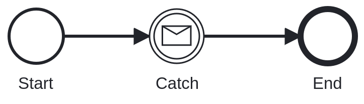
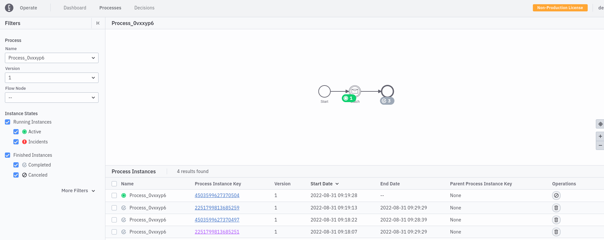

# Chaos Day Summary

In the last weeks, we made several changes in our core components, we introduce some new abstractions, and changed how we communicate between partitions.

Due to these changes, we thought it might make sense to run some more chaos experiments in that direction and area since our benchmarks also recently found some interesting edge cases.

Today we experimented with Message Correlation and what happens when a network partition disturbs the correlation process.

**TL;DR;** The experiment was partially successful (after retry), we were able to publish messages during a network partition that have been correlated after the network partition. We need to verify whether we can also publish messages before a network partition and during the partition create the related instances.

<!--truncate-->

## Chaos Experiment

The experiment is related to our previously described [deployment distribution experiment](../2022-08-02-deployment-distribution).

When a user/client publishes a message, the message will be sent to a certain partition, based on the correlation key. There is some calculation going on related to the hashcode and the partition count.
This calculation is deterministic in order to find later the message again if we reach a message catch event.

A message can specify a time-to-live (TTL), [which allows buffering that message](https://docs.camunda.io/docs/components/concepts/messages/#message-buffering). If later a process instance is created and the TTL is not exceeded the message can be still correlated. The creation of process instances
happens round-robin on the existing/available partitions (this is controlled by the gateway). When a process instance is created and reaches a message catch event it will be based on the correlation key search for a message on the expected partition. _Actually this happens based on subscriptions, for more details see the [docs](https://docs.camunda.io/docs/components/concepts/messages/#message-subscriptions) or the [ZEP-4](https://github.com/zeebe-io/enhancements/blob/master/ZEP004-wf-stream-processing.md#message-intermediate-catch-event)._ If the message still exists (TTL didn't expire) and this message [wasn't already correlated to the same process definition](https://docs.camunda.io/docs/components/concepts/messages/#message-cardinality) then it will be correlated.

Since both partitions can be on different leader nodes this requires some network communication, which can be interrupted/disturbed.

### Expected

We expect that if the network between the partition where the message was published and where the process instance was created is interrupted that no message correlation happens. But after the network recovers, we expect further that the message will be correlated and the process instance can continue.

### Actual

As a setup, I installed our benchmarks, with Operate enabled.
This allows us to also view the details in Operate.

```shell
$ diff zeebe-values.yaml ../default/zeebe-values.yaml 
5,8d4
<   identity:
<     auth:
<       enabled: false
< 
28c24
<   containerSecurityContext:
---
>   podSecurityContext:
139c135
<   enabled: true
---
>   enabled: false
```

During the experiment, it turned out that the `podSecurityContext` is outdated.

#### Experiment Description

Since we want to automate this experiment soon, or later I thought it would be a good idea to use the [create process instance with result](https://docs.camunda.io/docs/components/concepts/process-instance-creation/#create-and-await-results). We would start the following process:



Before we start the process we need to publish the message to a certain partition and create a network partition between two partitions. After that, we can create the PI and verify that the message correlation shouldn't happen. Afterward, we would delete the network partition and verify that the process instance is completed.

#### Details

To make the experiment easier to reproduce and allow us to experiment in different directions later as well I extend our new chaos cli (zbchaos), which I created during the last hack days. I will write a separate blog post about this tool soon.

##### Message Publish

I added a new feature ([PR #166](https://github.com/zeebe-io/zeebe-chaos/pull/166)) that allows us to publish a message to a specific partition:

```sh
$ ./zbchaos publish message -v --partitionId 3
Connecting to zell-chaos
Successfully created port forwarding tunnel
Send message 'msg', with correaltion key '2' (ASCII: 50) 
Message was sent and returned key 6755399441055796, which corresponds to partition: 3
```

##### Extend Steady-state verification

For the steady-state verification, multiple enhancements have been added.

1. Previously the `zbchaos` didn't allow us to create instances of specific models, which is now added as new feature ([PR #167](https://github.com/zeebe-io/zeebe-chaos/pull/167)).
2. In order to await the process instance completion a new flag was added `--awaitResult`, which allows us to await the PI completeness.
3. To make sure that our message can be correlated we have to set the right correlationKey/value. This means we need to create instances with certain variables, which is now possible as well (`--variables`).

```shell
./zbchaos verify steady-state -h
Verifies the steady state of the Zeebe system.
A process model will be deployed and process instances are created until the required partition is reached.

Usage:
  zbchaos verify steady-state [flags]

Flags:
      --awaitResult               Specify whether the completion of the created process instance should be awaited.
  -h, --help                      help for steady-state
      --partitionId int           Specify the id of the partition (default 1)
      --processModelPath string   Specify the path to a BPMN process model, which should be deployed and an instance should be created of.
      --variables string          Specify the variables for the process instance. Expect json string.

Global Flags:
  -v, --verbose   verbose output

```

#### Execution of the Experiment

```shell
$./zbchaos verify readiness -v
Connecting to zell-chaos
All Zeebe nodes are running.
```

After checking the readiness we can check what the current topology is:
```shell
$ ./zbchaos topology
Node      |Partition 1         |Partition 2         |Partition 3
0         |LEADER (HEALTHY)    |FOLLOWER (HEALTHY)  |FOLLOWER (HEALTHY)
1         |FOLLOWER (HEALTHY)  |LEADER (HEALTHY)    |FOLLOWER (HEALTHY)
2         |FOLLOWER (HEALTHY)  |FOLLOWER (HEALTHY)  |LEADER (HEALTHY)
```
We can see that the leaders are well distributed. I pick partition 3 as our message publish partition, and partition 1 as our partition for the process instance. Since we can't control really the round-robin mechanism, we need to create multiple messages and multiple process instances (for each partition). During our experiment, we will only look at the instance on partition one.

```shell
$ ./zbchaos publish message -v --partitionId 3
Connecting to zell-chaos
Successfully created port forwarding tunnel
Send message 'msg', with correaltion key '2' (ASCII: 50) 
Message was sent and returned key 6755399441055745, which corresponds to partition: 3
[zell go-chaos/ cluster: zeebe-cluster ns:zell-chaos]$ ./zbchaos publish message -v --partitionId 3
Connecting to zell-chaos
Successfully created port forwarding tunnel
Send message 'msg', with correaltion key '2' (ASCII: 50) 
Message was sent and returned key 6755399441055746, which corresponds to partition: 3
[zell go-chaos/ cluster: zeebe-cluster ns:zell-chaos]$ ./zbchaos publish message -v --partitionId 3
Connecting to zell-chaos
Successfully created port forwarding tunnel
Send message 'msg', with correaltion key '2' (ASCII: 50) 
Message was sent and returned key 6755399441055747, which corresponds to partition: 3
```

Creating the network partition:

```shell
./zbchaos disconnect brokers --broker1PartitionId 3 --broker1Role LEADER --broker2PartitionId 1 --broker2Role LEADER -v
...
Successfully created port forwarding tunnel
Found Broker zell-chaos-zeebe-2 as LEADER for partition 3.
Found Broker zell-chaos-zeebe-0 as LEADER for partition 1.
Execute ["apt" "-qq" "update"] on pod zell-chaos-zeebe-2
...
Disconnect zell-chaos-zeebe-2 from zell-chaos-zeebe-0
...
Disconnect zell-chaos-zeebe-0 from zell-chaos-zeebe-2
```

Creating the process instance and await the result:

```shell
$ ./zbchaos verify steady-state --awaitResult --partitionId 1 --processModelPath ../msg-catch.bpmn --variables '{"key":"2"}'


```

Unfortunately, I missed the verbose flag so we can't really see the output. But if failed later with:

```shell
Encountered an error during process instance creation. Error: rpc error: code = DeadlineExceeded desc = Time out between gateway and broker: Request ProtocolRequest{id=422, subject=command-api-1, sender=10.0.20.4:26502, payload=byte[]{length=153, hash=1559826040}} to zell-chaos-zeebe-2.zell-chaos-zeebe.zell-chaos.svc:26501 timed out in PT15S
Encountered an error during process instance creation. Error: rpc error: code = DeadlineExceeded desc = Time out between gateway and broker: Request ProtocolRequest{id=441, subject=command-api-2, sender=10.0.20.4:26502, payload=byte[]{length=153, hash=-1786651527}} to zell-chaos-zeebe-1.zell-chaos-zeebe.zell-chaos.svc:26501 timed out in PT15S
Encountered an error during process instance creation. Error: rpc error: code = NotFound desc = Command 'CREATE_WITH_AWAITING_RESULT' rejected with code 'NOT_FOUND': Expected to find process definition with key '2251799813685249', but none found
panic: Expected to create process instance on partition 1, but timed out after 30s.

goroutine 1 [running]:
github.com/zeebe-io/zeebe-chaos/go-chaos/cmd.glob..func10(0x247f740?, {0x1758c60?, 0x7?, 0x7?})
	/home/zell/goPath/src/github.com/zeebe-io/zeebe-chaos/go-chaos/cmd/verify.go:97 +0x1c5
github.com/spf13/cobra.(*Command).execute(0x247f740, {0xc000426540, 0x7, 0x7})
	/home/zell/goPath/pkg/mod/github.com/spf13/cobra@v1.5.0/command.go:876 +0x67b
github.com/spf13/cobra.(*Command).ExecuteC(0x24808c0)
	/home/zell/goPath/pkg/mod/github.com/spf13/cobra@v1.5.0/command.go:990 +0x3bd
github.com/spf13/cobra.(*Command).Execute(...)
	/home/zell/goPath/pkg/mod/github.com/spf13/cobra@v1.5.0/command.go:918
github.com/zeebe-io/zeebe-chaos/go-chaos/cmd.Execute()
	/home/zell/goPath/src/github.com/zeebe-io/zeebe-chaos/go-chaos/cmd/root.go:61 +0x25
main.main()
	/home/zell/goPath/src/github.com/zeebe-io/zeebe-chaos/go-chaos/main.go:8 +0x17
```
I retried it:
```shell
$ ./zbchaos verify steady-state --awaitResult --partitionId 1 --processModelPath ../msg-catch.bpmn --variables '{"key":"2"}' -v
Connecting to zell-chaos
Successfully created port forwarding tunnel
Deploy file ../msg-catch.bpmn (size: 2980 bytes).
Deployed process model ../msg-catch.bpmn successful with key 2251799813685249.
Create process instance with defition key 2251799813685249 [variables: '{"key":"2"}', awaitResult: true]
Encountered an error during process instance creation. Error: rpc error: code = DeadlineExceeded desc = Time out between gateway and broker: Request ProtocolRequest{id=509, subject=command-api-1, sender=10.0.20.4:26502, payload=byte[]{length=153, hash=1559826040}} to zell-chaos-zeebe-2.zell-chaos-zeebe.zell-chaos.svc:26501 timed out in PT15S
Create process instance with defition key 2251799813685249 [variables: '{"key":"2"}', awaitResult: true]
Encountered an error during process instance creation. Error: rpc error: code = DeadlineExceeded desc = Time out between gateway and broker: Request ProtocolRequest{id=530, subject=command-api-2, sender=10.0.20.4:26502, payload=byte[]{length=153, hash=-1786651527}} to zell-chaos-zeebe-1.zell-chaos-zeebe.zell-chaos.svc:26501 timed out in PT14.999S
Create process instance with defition key 2251799813685249 [variables: '{"key":"2"}', awaitResult: true]
Encountered an error during process instance creation. Error: rpc error: code = NotFound desc = Command 'CREATE_WITH_AWAITING_RESULT' rejected with code 'NOT_FOUND': Expected to find process definition with key '2251799813685249', but none found
panic: Expected to create process instance on partition 1, but timed out after 30s.

goroutine 1 [running]:
github.com/zeebe-io/zeebe-chaos/go-chaos/cmd.glob..func10(0x247f740?, {0x1758c60?, 0x8?, 0x8?})
	/home/zell/goPath/src/github.com/zeebe-io/zeebe-chaos/go-chaos/cmd/verify.go:97 +0x1c5
github.com/spf13/cobra.(*Command).execute(0x247f740, {0xc00007e500, 0x8, 0x8})
	/home/zell/goPath/pkg/mod/github.com/spf13/cobra@v1.5.0/command.go:876 +0x67b
github.com/spf13/cobra.(*Command).ExecuteC(0x24808c0)
	/home/zell/goPath/pkg/mod/github.com/spf13/cobra@v1.5.0/command.go:990 +0x3bd
github.com/spf13/cobra.(*Command).Execute(...)
	/home/zell/goPath/pkg/mod/github.com/spf13/cobra@v1.5.0/command.go:918
github.com/zeebe-io/zeebe-chaos/go-chaos/cmd.Execute()
	/home/zell/goPath/src/github.com/zeebe-io/zeebe-chaos/go-chaos/cmd/root.go:61 +0x25
main.main()
	/home/zell/goPath/src/github.com/zeebe-io/zeebe-chaos/go-chaos/main.go:8 +0x17
```

And got a similar exception. Taking a look at Operate we can see that process instances are created. It is likely that the await timed out since the message hasn't been correlated but the returned error is a bit unclear. Interesting is that on partition two the message is also not correlated.


Removing the network partition:

```shell
$ ./zbchaos connect brokers -v
Connecting to zell-chaos
Execute ["sh" "-c" "command -v ip"] on pod zell-chaos-zeebe-0
/usr/sbin/ip
Execute ["sh" "-c" "ip route | grep -m 1 unreachable"] on pod zell-chaos-zeebe-0
Execute ["sh" "-c" "ip route del unreachable 10.0.17.8"] on pod zell-chaos-zeebe-0
Connected zell-chaos-zeebe-0 again, removed unreachable routes.
Execute ["sh" "-c" "command -v ip"] on pod zell-chaos-zeebe-1
Error on connection Broker: zell-chaos-zeebe-1. Error: Execution exited with exit code 127 (Command not found). It is likely that the broker was not disconnected or restarted in between.
Execute ["sh" "-c" "command -v ip"] on pod zell-chaos-zeebe-2
Error on connection Broker: zell-chaos-zeebe-2. Error: Execution exited with exit code 127 (Command not found). It is likely that the broker was not disconnected or restarted in between.
``` 

It looks like the Broker-2 was restarted in between, which is really the case if we check the `kubectl get pods`
```
[zell go-chaos/ cluster: zeebe-cluster ns:zell-chaos]$ kgpo
NAME                                        READY   STATUS      RESTARTS   AGE
camunda-platform-curator-27698835-pwdjh     0/1     Completed   0          9m20s
elasticsearch-master-0                      1/1     Running     0          12m
elasticsearch-master-1                      1/1     Running     0          12m
elasticsearch-master-2                      1/1     Running     0          12m
zell-chaos-operate-64bbc6794d-vqtnc         1/1     Running     0          12m
zell-chaos-zeebe-0                          1/1     Running     0          12m
zell-chaos-zeebe-1                          1/1     Running     0          12m
zell-chaos-zeebe-2                          1/1     Running     0          2m48s
zell-chaos-zeebe-gateway-795f87fd64-c9mf4   1/1     Running     0          12m
zell-chaos-zeebe-gateway-795f87fd64-h5d9c   1/1     Running     0          12m
zell-chaos-zeebe-gateway-795f87fd64-nlr5v   1/1     Running     0          12m
```

The topology has also completely changed.

```shell
$ ./zbchaos topology
Node      |Partition 1         |Partition 2         |Partition 3
0         |FOLLOWER (HEALTHY)  |FOLLOWER (HEALTHY)  |LEADER (HEALTHY)
1         |LEADER (HEALTHY)    |FOLLOWER (HEALTHY)  |FOLLOWER (HEALTHY)
2         |FOLLOWER (HEALTHY)  |LEADER (HEALTHY)    |FOLLOWER (HEALTHY)
```

After connecting again the instances haven't been executed. My guess is that the TTL was already reached.

##### Rerun

I will disconnect again partitions one and three and publish a message to partition three. Afterward I will connect them again and see whether the message is correlated.

```shell
./zbchaos disconnect brokers --broker1PartitionId 3 --broker1Role LEADER --broker2PartitionId 1 --broker2Role LEADER -v
./zbchaos publish message -v --partitionId 3
./zbchaos publish message -v --partitionId 3
./zbchaos publish message -v --partitionId 3
./zbchaos connect brokers -v
```

Take a look at Operate again:



We can see that the experiment was successful, and the message has been correlated even if they are published during a network partition. :tada:

## Found Bugs

* I learned that the go zeebe client, doesn't set a default TTL which was interesting to find out (and somehow unexpected).
* The zbchaos uses always the same port for connecting to the kubernetes and zeebe cluster, which makes it impossible to run multiple commands. We should use random ports to make this possible.
