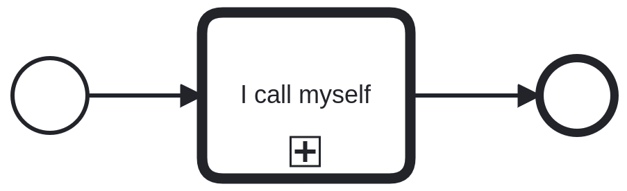
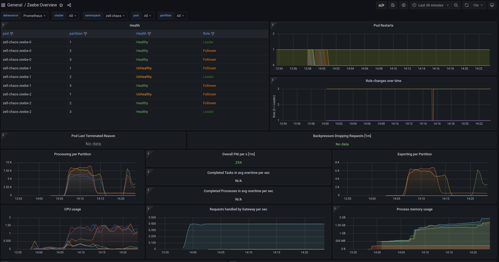
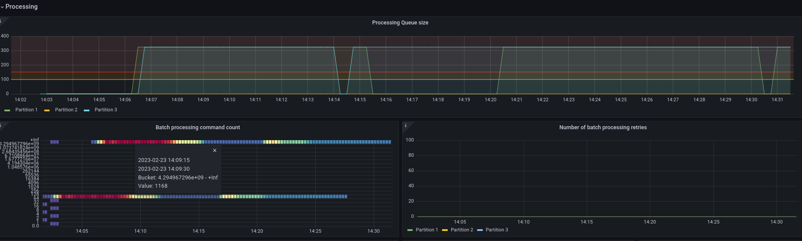

# Chaos Day Summary

Long time no see. Happy to do my first chaos day this year. In the last week have implemented interesting features, which I would like to experiment with.
[Batch processing](https://github.com/camunda/zeebe/issues/11416) was one of them.

**TL;DR;** Chaos experiment failed. :boom: Batch processing doesn't seem to respect the configured limit, which causes issues with processing and influences the health of the system. We found a bug :muscle:

<!--truncate-->

## Chaos Experiment

In today's chaos experiment, we want to experiment with [Batch processing](https://github.com/camunda/zeebe/issues/11416) and how it can handle error conditions, like deploying an endless recursive process model.



### Expected

When we deploy such a process model and create an instance of it, we expect that the execution is done endlessly. In normal process models with batch processing, the execution of a process instance is done until a wait state is reached. In this process model, there exists no wait state. To handle such cases, we have implemented a batch limit, which can be configured via [maxCommandsInBatch](https://github.com/camunda/zeebe/blob/main/dist/src/main/config/broker.standalone.yaml.template#L695). This configuration is by default set to 100 commands. Meaning the stream processor will process 100 commands until it stops, to make room for other things.

We expect that our limit handling steps in during the execution and we can execute also other instances or, cancel the problematic process instance. Furthermore, we expect to stay healthy, we should be able to update our health check continuously.

### Actual

Before we can start with our experiment we need to start our benchmark Zeebe cluster. This has become easier now since I have written the last post. Previously we had to use the scripts and Makefile in the [zeebe/benchmark sub-directory](https://github.com/camunda/zeebe/tree/main/benchmarks/setup).

We have now provided new [Benchmark Helm charts](https://github.com/zeebe-io/benchmark-helm), based on our Camunda Platform Helm charts. They allow us to deploy a new zeebe benchmark setup via:

```shell
kubectl create namespace zell-chaos # create a new namespace
kubens zell-chaos  # change context to a new namespace
# deploy zeebe benchmark cluster - without starter and worker
helm install zell-chaos \
    zeebe-benchmark/zeebe-benchmark \
    --set starter.replicas=0 \
    --set worker.replicas=0
```


To deploy the model we can use [zbchaos v1.0.0](https://github.com/zeebe-io/zeebe-chaos/releases/tag/zbchaos-v1.0.0).


```shell
$ zbchaos deploy process --processModelPath call.bpmn 
{1 LEADER -1 call.bpmn 10  msg false 1 LEADER -1 2 LEADER -1 1677157340943 false false true false false 30 false -1 benchmark 30  }
Deployed given process model call.bpmn, under key 2251799813685249!
```

*Note: Looks like we have some left-over debug logs, which we should remove.*

To create an instance we can use:

```shell
$ zbchaos verify instance-creation --bpmnProcessId super
{1 LEADER -1  10  msg false 1 LEADER -1 2 LEADER -1 1677157569058 false false true false false 30 false -1 super 30  }
The steady state was successfully verified!
```

After creating the instance we can observe the behavior of the Zeebe via [grafana](https://grafana.dev.zeebe.io/).

We can see that the processing starts immediately quite high and is continuously going on. 


**We have two instances running, one on partition three and one on partition one.**

_One interesting fact is that the topology request rate is also up to 0.400 per second, so potentially every 2.5 seconds we send a topology request to the gateway. But there is no application deployed that does this. [I have recently found out again](https://github.com/camunda/zeebe/pull/11599#discussion_r1109846523), that we have the Zeebe client usage in the gateway to request the topology. Might be worth investigating whether this is an issue._

After observing this cluster for a while we can see that after around five minutes the cluster fails. The processing for the partitions breaks down to 1/10 of what was processed before. A bit later it looks like it tries to come back but, failed again.



_We can see in the metrics that in between also the balancing was triggered. A feature we have as part of our Benchmark Helm charts._

The logs (at stack driver) doesn't give us many insights, [except that we see that nodes becoming unhealthy](https://console.cloud.google.com/logs/query;query=resource.type%3D%22k8s_container%22%0Aresource.labels.project_id%3D%22zeebe-io%22%0Aresource.labels.location%3D%22europe-west1-b%22%0Aresource.labels.cluster_name%3D%22zeebe-cluster%22%0Aresource.labels.namespace_name%3D%22zell-chaos%22%0Alabels.k8s-pod%2Fapp%3D%22camunda-platform%22%0Alabels.k8s-pod%2Fapp_kubernetes_io%2Fcomponent%3D%22zeebe-broker%22%0Alabels.k8s-pod%2Fapp_kubernetes_io%2Finstance%3D%22zell-chaos%22%0Alabels.k8s-pod%2Fapp_kubernetes_io%2Fmanaged-by%3D%22Helm%22%0Alabels.k8s-pod%2Fapp_kubernetes_io%2Fname%3D%22zeebe%22%0Alabels.k8s-pod%2Fapp_kubernetes_io%2Fpart-of%3D%22camunda-platform%22;timeRange=2023-02-23T12:17:49.128812Z%2F2023-02-23T14:18:59.101Z;pinnedLogId=2023-02-23T13:13:40.945376476Z%2Fdr4gxdklsxtgx6h6;cursorTimestamp=2023-02-23T13:13:40.945376476Z?project=zeebe-io). Similar information we can see in the metrics, that followers are unhealthy.

```shell
Partition-1 failed, marking it as unhealthy: Broker-2{status=HEALTHY}
Detected 'UNHEALTHY' components. The current health status of components: [Partition-2{status=HEALTHY}, Partition-1{status=UNHEALTHY, issue=HealthIssue[message=null, throwable=null, cause=Broker-2-StreamProcessor-1{status=UNHEALTHY, issue=HealthIssue[message=actor appears blocked, throwable=null, cause=null]}]}, Partition-3{status=HEALTHY}]
```

Interesting insights we can get in our new Batch processing metrics. We see that at the beginning we use our limit of 100 commands per batch, but soon as we start with the recursion we use an enormous high batch processing command count.



The new sequence metric shows similar results, so there must be a problem with not respecting the limit.


With this, I mark this chaos experiment as failed. We need to investigate this further and fix the related issue.:boom:

## Found Bugs

* zbchaos logs debug message on normal usage
* Every 2.5 seconds we send a topology request, which is shown in the metrics
* Batch processing doesn't respect the limit
