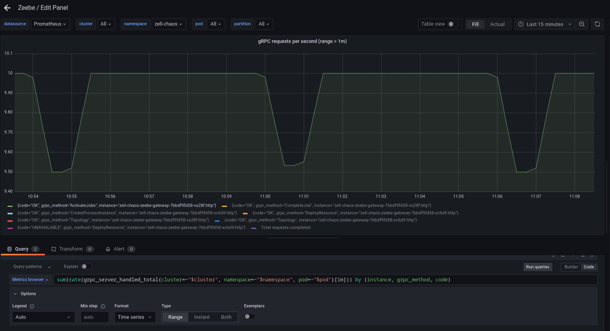
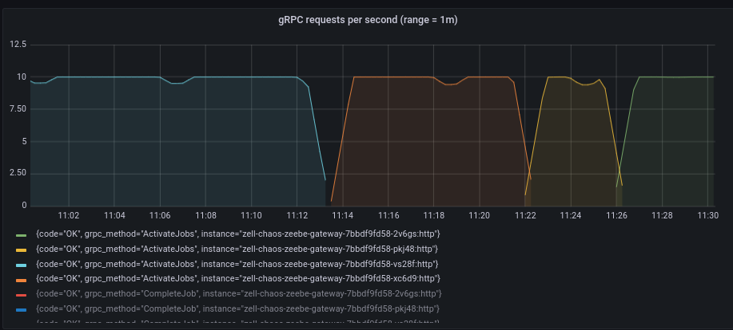
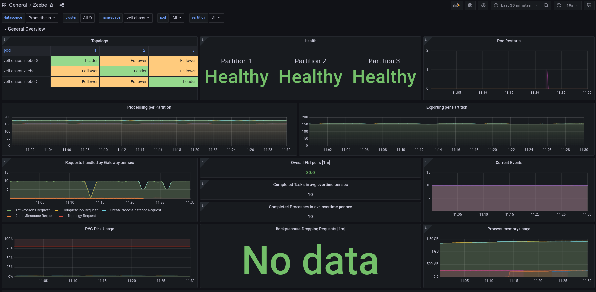
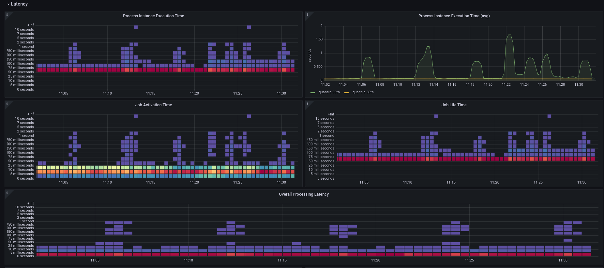
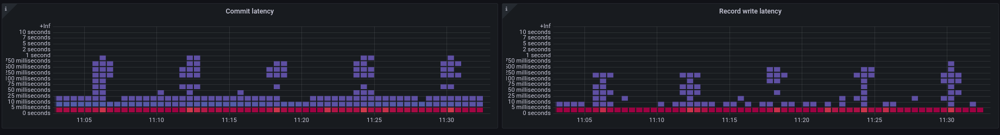
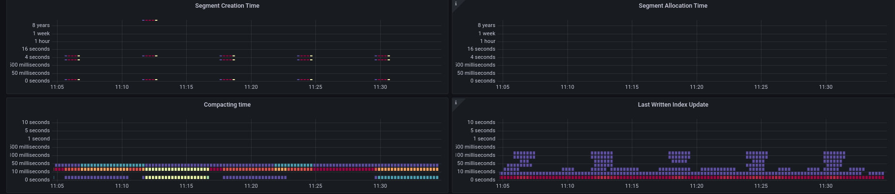

# Chaos Day Summary

In today chaos day we wanted to experiment with the gateway and resiliency of workers.

We have seen in the recent weeks some issues within our benchmarks when gateways have been restarted,
see [zeebe#11975](https://github.com/camunda/zeebe/issues/11975).

We did a similar experiment [in the past](../2022-02-15-Standalone-Gateway-in-CCSaaS/index.md),
today we want to focus on self-managed ([benchmarks with our helm charts](https://helm.camunda.io/)).
Ideally we can automate this as well soon.

Today [Nicolas](https://github.com/npepinpe) joined me on the chaos day :tada: 

**TL;DR;** We were able to show that the workers (clients) can reconnect after a gateway is shutdown :white_check_mark:
Furthermore, we have discovered a potential performance issue on lower load, which impacts process execution latency ([zeebe#12311](https://github.com/camunda/zeebe/issues/12311)). 

<!--truncate-->

## Chaos Experiment

We will use our [Zeebe benchmark helm charts](https://github.com/zeebe-io/benchmark-helm) to setup the test cluster, and
our helper scripts [here](https://github.com/camunda/zeebe/tree/main/benchmarks/setup).

### Setup:

We will run with default benchmark configuration, which means:

 * three brokers
 * three partitions
 * replication count three
 * two gateways

We will run the benchmark with low load, 10 process instance per second created and completed. For that
we deploy one starter and worker. This reduces the blast radius, and allows us to observe more easily how the workers
behave when a gateway is restarted.

During the experiment we will use our [grafana dashboard](https://github.com/camunda/zeebe/tree/main/monitor/grafana) to
observe to which gateway the worker will connect and which gateway we need to stop/restart.


```shell
LAST DEPLOYED: Thu Apr  6 10:21:27 2023
NAMESPACE: zell-chaos
STATUS: deployed
REVISION: 1
NOTES:
# Zeebe Benchmark

Installed Zeebe cluster with:

 * 3 Brokers
 * 2 Gateways

The benchmark is running with:

 * Starter replicas=1
 * Worker replicas=1
 * Publisher replicas=0
 * Timer replicas=0
```

### Expected


When we terminate a gateway to which the worker has connected to, **we expect** that the worker connects to the different
replica and starts completing jobs again.

The performance drop is expected to be not significant, or at least should recover fast.

### Actual

We will run the experiment in two ways, first via terminating the gateway (using [zbchaos](https://github.com/zeebe-io/zeebe-chaos/releases/tag/zbchaos-v1.0.0))
and later via scaling down the gateway deployment to one replica. 

We want to verify whether this makes any difference, since terminating will cause kubernetes to recreate immediately the pod.

#### Termination

Before we start the experiment we check our current deployed state:
```shell
$ kgpo
NAME                                        READY   STATUS      RESTARTS   AGE
camunda-platform-curator-28012860-zk72q     0/1     Completed   0          7m24s
elasticsearch-master-0                      1/1     Running     0          45m
elasticsearch-master-1                      1/1     Running     0          45m
elasticsearch-master-2                      1/1     Running     0          45m
leader-balancer-28012860-7cwmd              0/1     Completed   0          7m25s
starter-cb69c447f-l2zbh                     1/1     Running     0          45m
worker-cb7f7c469-qvqqv                      1/1     Running     0          45m
zell-chaos-zeebe-0                          1/1     Running     0          45m
zell-chaos-zeebe-1                          1/1     Running     0          45m
zell-chaos-zeebe-2                          1/1     Running     0          45m
zell-chaos-zeebe-gateway-7bbdf9fd58-vs28f   1/1     Running     0          45m
zell-chaos-zeebe-gateway-7bbdf9fd58-xc6d9   1/1     Running     0          45m

```

Via our Grafana dashboard (and the grpc metrics) we are able to track to which gateway the worker connect to:



It is `zell-chaos-zeebe-gateway-7bbdf9fd58-vs28f`.
Via zbchaos we can easily terminate the gateway (it will always take the first in the pod list).

```shell
$ zbchaos terminate gateway 
{1 LEADER -1  10  msg false 1 LEADER -1 2 LEADER -1 1680772377704 false false true false false 30 false -1 benchmark 30  }
Terminated zell-chaos-zeebe-gateway-7bbdf9fd58-vs28f
```

After terminating we can see that a new gateway pod has started.
```sh
$ kgpo
NAME                                        READY   STATUS      RESTARTS   AGE
camunda-platform-curator-28012860-zk72q     0/1     Completed   0          13m
elasticsearch-master-0                      1/1     Running     0          52m
elasticsearch-master-1                      1/1     Running     0          52m
elasticsearch-master-2                      1/1     Running     0          52m
leader-balancer-28012860-7cwmd              0/1     Completed   0          13m
starter-cb69c447f-l2zbh                     1/1     Running     0          52m
worker-cb7f7c469-qvqqv                      1/1     Running     0          52m
zell-chaos-zeebe-0                          1/1     Running     0          52m
zell-chaos-zeebe-1                          1/1     Running     0          52m
zell-chaos-zeebe-2                          1/1     Running     0          52m
zell-chaos-zeebe-gateway-7bbdf9fd58-pkj48   1/1     Running     0          33s
zell-chaos-zeebe-gateway-7bbdf9fd58-xc6d9   1/1     Running     0          52m
```

In the metrics we can see that due to the restart the throughput slightly dropped, but recovered pretty fast. The worker
were able to connect to the different gateway. :white_check_mark:


> **Note**
> 
> _In the panel `Pod Restarts` on the top right, we don't see any restarts and that is something
we should always be aware of that the _metrics are just samples of data_. If a pod, like the gateway restarts fast enough
and the metric collect interval is higher (per default we have ~30 s (?)) then you might not see a change._


#### Scale down

As described earlier we wanted to verify whether it makes a difference if we scale down the replica instead of terminating/restarting
it, which causes restarting a new pod (which might get the same IP).

For scaling down Nicolas found this annotation: `controller.kubernetes.io/pod-deletion-cost`

[That annotation allows to give hints to the schedule which pod to turn-down, because another pod might have higher cost 
to be deleted (this is of course best-effort).](https://kubernetes.io/docs/concepts/workloads/controllers/replicaset/#pod-deletion-cost)

This means we edit one pod, and gave the following annotation:

```yaml
annotations:
  controller.kubernetes.io/pod-deletion-cost:  "-1"
```

We have chosen the pod in a similar way as we have seen above, based on the grpc metrics.

Checking the running pods and editing the correct gateway:
```shell
[cqjawa 2023-04-06-gateway-termination/ cluster: zeebe-cluster ns:zell-chaos]$ kgpo
NAME                                        READY   STATUS      RESTARTS   AGE
camunda-platform-curator-28012875-tntdv     0/1     Completed   0          6m26s
elasticsearch-master-0                      1/1     Running     0          59m
elasticsearch-master-1                      1/1     Running     0          59m
elasticsearch-master-2                      1/1     Running     0          59m
leader-balancer-28012875-sctwq              0/1     Completed   0          6m26s
starter-cb69c447f-l2zbh                     1/1     Running     0          59m
worker-cb7f7c469-qvqqv                      1/1     Running     0          59m
zell-chaos-zeebe-0                          1/1     Running     0          59m
zell-chaos-zeebe-1                          1/1     Running     0          59m
zell-chaos-zeebe-2                          1/1     Running     0          59m
zell-chaos-zeebe-gateway-7bbdf9fd58-pkj48   1/1     Running     0          8m29s
zell-chaos-zeebe-gateway-7bbdf9fd58-xc6d9   1/1     Running     0          59m
```


When I did the following I was wondering why it didn't scaled down the deployment, one pod was recreated.
```shell
[cqjawa 2023-04-06-gateway-termination/ cluster: zeebe-cluster ns:zell-chaos]$ k scale replicaset zell-chaos-zeebe-gateway-7bbdf9fd58 --replicas=1
Warning: spec.template.spec.containers[0].env[16].name: duplicate name "ZEEBE_LOG_LEVEL"
replicaset.apps/zell-chaos-zeebe-gateway-7bbdf9fd58 scaled
[cqjawa 2023-04-06-gateway-termination/ cluster: zeebe-cluster ns:zell-chaos]$ kgpo
NAME                                        READY   STATUS            RESTARTS   AGE
camunda-platform-curator-28012875-tntdv     0/1     Completed         0          6m53s
elasticsearch-master-0                      1/1     Running           0          60m
elasticsearch-master-1                      1/1     Running           0          60m
elasticsearch-master-2                      1/1     Running           0          60m
leader-balancer-28012875-sctwq              0/1     Completed         0          6m53s
starter-cb69c447f-l2zbh                     1/1     Running           0          60m
worker-cb7f7c469-qvqqv                      1/1     Running           0          60m
zell-chaos-zeebe-0                          1/1     Running           0          60m
zell-chaos-zeebe-1                          1/1     Running           0          60m
zell-chaos-zeebe-2                          1/1     Running           0          60m
zell-chaos-zeebe-gateway-7bbdf9fd58-2v6gs   0/1     PodInitializing   0          7s
zell-chaos-zeebe-gateway-7bbdf9fd58-pkj48   1/1     Running           0          8m56s
```


> **Note:**
> 
> During the experiment I learned that when you have deployed a [deployment](https://kubernetes.io/docs/concepts/workloads/controllers/deployment/), you need to scale down the deployment, not the [ReplicaSet](https://kubernetes.io/docs/concepts/workloads/controllers/replicaset/).
> Otherwise your Kubernetes deployment controller will recreate the replicaset in the next reconcile loop, which means you
> will have again the same replicas as defined in the deployment.


So correct is to scale down the deployment (!), if you ever wonder.


```shell
[cqjawa 2023-04-06-gateway-termination/ cluster: zeebe-cluster ns:zell-chaos]$ k edit pod zell-chaos-zeebe-gateway-7bbdf9fd58-pkj48
pod/zell-chaos-zeebe-gateway-7bbdf9fd58-pkj48 edited
[cqjawa 2023-04-06-gateway-termination/ cluster: zeebe-cluster ns:zell-chaos]$ kgpo
NAME                                        READY   STATUS      RESTARTS   AGE
camunda-platform-curator-28012875-tntdv     0/1     Completed   0          10m
elasticsearch-master-0                      1/1     Running     0          63m
elasticsearch-master-1                      1/1     Running     0          63m
elasticsearch-master-2                      1/1     Running     0          63m
leader-balancer-28012875-sctwq              0/1     Completed   0          10m
starter-cb69c447f-l2zbh                     1/1     Running     0          63m
worker-cb7f7c469-qvqqv                      1/1     Running     0          63m
zell-chaos-zeebe-0                          1/1     Running     0          63m
zell-chaos-zeebe-1                          1/1     Running     0          63m
zell-chaos-zeebe-2                          1/1     Running     0          63m
zell-chaos-zeebe-gateway-7bbdf9fd58-2v6gs   1/1     Running     0          3m40s
zell-chaos-zeebe-gateway-7bbdf9fd58-pkj48   1/1     Running     0          12m
[cqjawa 2023-04-06-gateway-termination/ cluster: zeebe-cluster ns:zell-chaos]$ k scale deployment zell-chaos-zeebe-gateway --replicas=1
Warning: spec.template.spec.containers[0].env[16].name: duplicate name "ZEEBE_LOG_LEVEL"
deployment.apps/zell-chaos-zeebe-gateway scaled
[cqjawa 2023-04-06-gateway-termination/ cluster: zeebe-cluster ns:zell-chaos]$ kgpo
NAME                                        READY   STATUS      RESTARTS   AGE
camunda-platform-curator-28012875-tntdv     0/1     Completed   0          10m
elasticsearch-master-0                      1/1     Running     0          64m
elasticsearch-master-1                      1/1     Running     0          64m
elasticsearch-master-2                      1/1     Running     0          64m
leader-balancer-28012875-sctwq              0/1     Completed   0          10m
starter-cb69c447f-l2zbh                     1/1     Running     0          64m
worker-cb7f7c469-qvqqv                      1/1     Running     0          64m
zell-chaos-zeebe-0                          1/1     Running     0          64m
zell-chaos-zeebe-1                          1/1     Running     0          64m
zell-chaos-zeebe-2                          1/1     Running     0          64m
zell-chaos-zeebe-gateway-7bbdf9fd58-2v6gs   1/1     Running     0          4m
```

With that we have only one gateway pod left, and all traffic goes to that gateway. Based on the metrics
we can see that the workers recovered everytime, when we restarted/terminated or scaled down.





The experiment itself succeeded :muscle: :white_check_marks:


## Found Bugs
 

### Zbchaos print verbose logs

I realized that we still have [the issue with zbchaos](https://github.com/zeebe-io/zeebe-chaos/issues/323) which is printing verbose logs:

```shell
$ zbchaos terminate gateway 
{1 LEADER -1  10  msg false 1 LEADER -1 2 LEADER -1 1680772377704 false false true false false 30 false -1 benchmark 30  }
Terminated zell-chaos-zeebe-gateway-7bbdf9fd58-vs28f
```

### Segment creation impact

During checking the metrics together with Nicolas, we realized that even on low load (10 PI/s) we have high spikes
in our processing execution latency.



The spikes are going up to 1-1.5 seconds, while the avg is at 0.06s. This happens every 6 minutes.

We can see that the commit latency is as well at the same time high, which might be an issue because of high io.



We first expected that to be related to snapshotting, but snapshots are happen much more often.


Interesting is that it seems to be related to our segment creation (again), even if we have 
async segment creation in our journal built recently. We need to investigate this further within [zeebe#12311](https://github.com/camunda/zeebe/issues/12311).




