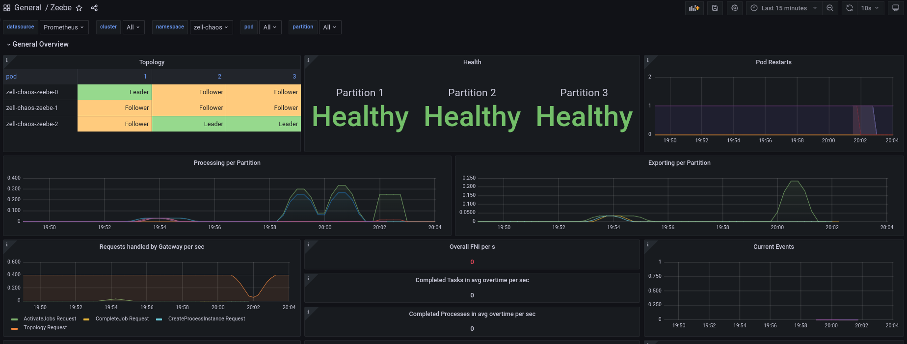
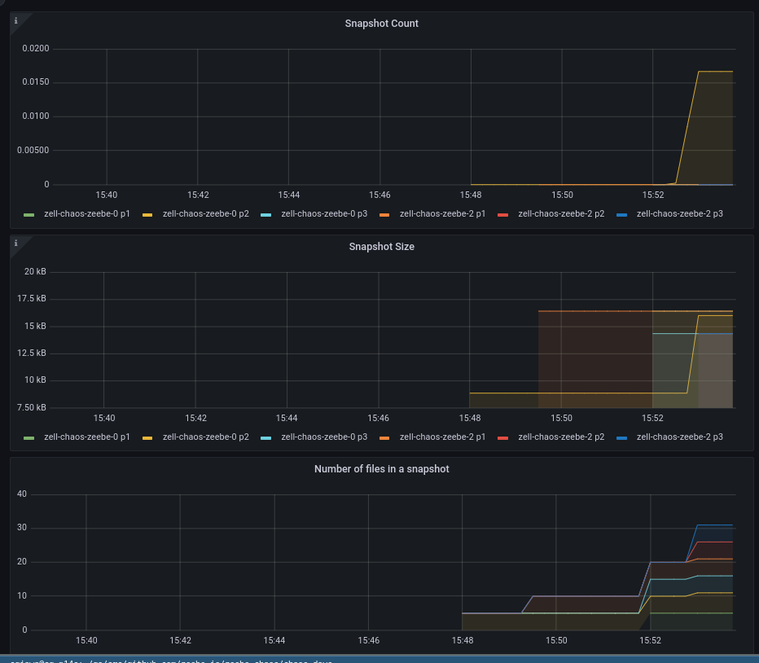

# Chaos Day Summary

In this chaos day I wanted to experiment with a new experimental feature we have released recently. The [enablement of partitioning of the SST files in RocksDB](https://github.com/camunda/zeebe/pull/12483). This is actually an experimental feature from RocksDb, which we made available now for our users as well, since we have seen great benefits in performance, especially with larger runtime data.

I wanted to experiment a bit with the SST partitioning, and find out whether it would be possible to enable and disable the flag/configuration without issues.

**TL;DR;** The first experiment was successful, it looks like we can enable and disable the partitioning without impacting the execution of one existing PI. We need to experiment a bit more with larger data sets in order to force RocksDB compaction, to be fully sure. 

<!--truncate-->

## Chaos Experiment

For our chaos experiment we setup again our [normal benchmark cluster](https://github.com/camunda/zeebe/tree/main/benchmarks/setup), this time without any clients (no workers/starters).

Setting all client replicas to zero:
```diff
$ diff default/values.yaml zell-chaos/values.yaml 
40c40
<   replicas: 3
---
>   replicas: 0
47c47
<   replicas: 1
---
>   replicas: 0
``` 

The experiment we want to do in this chaos day we look like the following:

**First part:** 

 * Verify steady state:
   * verify the readiness of the cluster 
   * deploy a process model (which contains a [simple model](https://github.com/zeebe-io/zeebe-chaos/blob/main/go-chaos/internal/bpmn/one_task.bpmn))
 * Chaos Action: 
   * start a process instance (PI), with a service task
   * enable the SST partitioning
   * restart the cluster
   * verify the readiness
   * verify that job is activateable
   * complete the job (in consequence the PI)
   
**Second part:**

* Chaos Action:
    * start a process instance (PI), with a service task
    * disable the SST partitioning
    * restart the cluster
    * verify the readiness
    * verify that job is activateable
    * complete the job (in consequence the PI)


### Expected

When operating a cluster, I can enable the SST partitioning without an impact in executing existing process instance. Existing PIs should still be executable and completable.

### Actual

As linked above I used again our [benchmark/setup](https://github.com/camunda/zeebe/tree/main/benchmarks/setup) scripts to setup a cluster.

#### First Part: Verify Steady state
In order to verify the readiness and run all actions I used the [zbchaos](https://github.com/zeebe-io/zeebe-chaos/tree/zbchaos-v1.0.0) tool.

Verifying the readiness is fairly easy with zbchaos.

```shell
$ zbchaos verify readiness -v
Connecting to zell-chaos
Running experiment in self-managed environment.
Pod zell-chaos-zeebe-0 is in phase Pending, and not ready. Wait for some seconds.
[...]
Pod zell-chaos-zeebe-0 is in phase Running, and not ready. Wait for some seconds.
Pod zell-chaos-zeebe-0 is in phase Running, and not ready. Wait for some seconds.
All Zeebe nodes are running.
```

We then deploy the mentioned simple process model:
```shell
$ zbchaos deploy process -v
Connecting to zell-chaos
Running experiment in self-managed environment.
Port forward to zell-chaos-zeebe-gateway-7bbdf9fd58-dl97j
Successfully created port forwarding tunnel
Deploy file bpmn/one_task.bpmn (size: 2526 bytes).
Deployed process model bpmn/one_task.bpmn successful with key 2251799813685249.
Deployed given process model , under key 2251799813685249!
```

#### First Part: Chaos Action

As the first step in the chaos action we create a process instance. 

```shell
$ zbchaos verify instance-creation -v
Connecting to zell-chaos
Running experiment in self-managed environment.
Port forward to zell-chaos-zeebe-gateway-7bbdf9fd58-dl97j
Successfully created port forwarding tunnel
Send create process instance command, with BPMN process ID 'benchmark' and version '-1' (-1 means latest) [variables: '', awaitResult: false]
Created process instance with key 2251799813685251 on partition 1, required partition 1.
The steady-state was successfully verified!
```

Next we enable the SST partitioning in our broker configuration, we can do this in the `values.yaml` file and run an `helm update`.

```shell
$ diff ../default/values.yaml values.yaml 
85a86
>     zeebe.broker.experimental.rocksdb.enableSstPartitioning: "true"
```

```shell
$ make update
helm upgrade --namespace zell-chaos zell-chaos zeebe-benchmark/zeebe-benchmark -f values.yaml
Release "zell-chaos" has been upgraded. Happy Helming!
NAME: zell-chaos
LAST DEPLOYED: Mon May 15 15:54:24 2023
NAMESPACE: zell-chaos
STATUS: deployed
REVISION: 2
NOTES:
# Zeebe Benchmark

Installed Zeebe cluster with:

 * 3 Brokers
 * 2 Gateways

The benchmark is running with:

 * Starter replicas=0
 * Worker replicas=0
 * Publisher replicas=0
 * Timer replicas=0
```

> **Note**
> Changing the configmap doesn't restart pods! We need to delete all Zeebe pods, in order to apply the configuration.

```shell
$ k delete pod -l app=camunda-platform
pod "zell-chaos-zeebe-0" deleted
pod "zell-chaos-zeebe-1" deleted
pod "zell-chaos-zeebe-2" deleted
pod "zell-chaos-zeebe-gateway-7bbdf9fd58-8j7d6" deleted
pod "zell-chaos-zeebe-gateway-7bbdf9fd58-dl97j" deleted
```

Next we can use `zbchaos verify readiness` again to await the readiness of the cluster.
```
All Zeebe nodes are running.
```

Taking a look at the logs of the broker we can also see that the broker configuration was correctly set:

```
   \"disableWal\" : true,\n      \"enableSstPartitioning\" : true\n    }
```

> **Note**
> Right now zbchaos can't complete an job (missing feature). We use zbctl for that, we need to port-forward to the gateway in order to send the commands.

```shell
$ k port-forward svc/zell-chaos-zeebe-gateway 26500
Forwarding from 127.0.0.1:26500 -> 26500
Forwarding from [::1]:26500 -> 26500

```

Activating the right job.
```shell
$ zbctl --insecure activate jobs benchmark-task
{
  "jobs":  [
    {
      "key":  "2251799813685256",
      "type":  "benchmark-task",
      "processInstanceKey":  "2251799813685251",
      "bpmnProcessId":  "benchmark",
      "processDefinitionVersion":  1,
      "processDefinitionKey":  "2251799813685249",
      "elementId":  "task",
      "elementInstanceKey":  "2251799813685255",
      "customHeaders":  "{}",
      "worker":  "zbctl",
      "retries":  3,
      "deadline":  "1684173544716",
      "variables":  "{}"
    }
  ]
}
```
Completing of the job and the PI.
```shell
$ zbctl complete job 2251799813685256 --insecure
Completed job with key '2251799813685256' and variables '{}'
```

#### Second Part:

Create again an process instance `$ zbchaos verify instance-creation`

```
Created process instance with key 2251799813685263 on partition 1, required partition 1.
The steady-state was successfully verified!
```

Disabling the configuration again, and running the update.
```shell
$ diff default/values.yaml zell-chaos/values.yaml 
85a86
>     zeebe.broker.experimental.rocksdb.enableSstPartitioning: "false"


$ make update 
helm upgrade --namespace zell-chaos zell-chaos zeebe-benchmark/zeebe-benchmark -f values.yaml
Release "zell-chaos" has been upgraded. Happy Helming!
NAME: zell-chaos
LAST DEPLOYED: Mon May 15 20:00:53 2023
...

$ k delete pod -l app=camunda-platform
$ zbchaos verify readiness
All Zeebe nodes are running.
```

Again the job completion worked without problems (skipping here the port-forward and activate output)

```
$ zbctl complete job 2251799813685268 --insecure
Completed job with key '2251799813685268' and variables '{}'
```

:white_check_mark: Experiment was successful. 

#### Further investigation



When running the experiment I also observed the metrics of the cluster and was not able to see any differences in the snapshot file counts, which we would expect on the SST partitioning (there should be more files).

Before the experiment:


After the experiment, we still see that for each partition we have around ~6 files.


In order to make sure whether the options have been applied correctly I investigated the RocksDB log files and option files.

In the current LOG file we can see the current options printed, which is indeed the disabled partitioner. Since this  is the default as well it is not a proof yet.

```
2023/05/15-18:01:46.223234 139711509092096 [/column_family.cc:621] --------------- Options for column family [default]:
2023/05/15-18:01:46.223237 139711509092096               Options.comparator: leveldb.BytewiseComparator
2023/05/15-18:01:46.223239 139711509092096           Options.merge_operator: None
2023/05/15-18:01:46.223241 139711509092096        Options.compaction_filter: None
2023/05/15-18:01:46.223242 139711509092096        Options.compaction_filter_factory: None
2023/05/15-18:01:46.223244 139711509092096  Options.sst_partitioner_factory: None
```

What we can see in the runtime folder of the partition is that there exist two Options files, a older one `OPTIONS-000014` and a newer one `OPTIONS-000023`.

The older one contains the expected configuration for the SST partitioning:

```shell
$ cat OPTIONS-000014 
[CFOptions "default"]
...
  sst_partitioner_factory={id=SstPartitionerFixedPrefixFactory;length=8;}
```

The most recent options file has the configuration set to null.
```shell

$ cat OPTIONS-000023
[CFOptions "default"]
...
sst_partitioner_factory=nullptr

```

We can see that the current snapshot, only copied the most recent options file:

```shell
$ ll ../snapshots/188-4-230-244
total 56
drwxr-xr-x 2 root root 4096 May 15 18:13 ./
drwxr-xr-x 3 root root 4096 May 15 18:13 ../
...
-rw-r--r-- 2 root root 7015 May 15 18:01 OPTIONS-000023
-rw-r--r-- 1 root root   92 May 15 18:13 zeebe.metadata
```

### Conclusion

We were able to toggle the SST partitioning flag without problems back and forth. We were able to make still progress on an existing process instance, which we wanted to prove.

Nevertheless, we need to prove this once more for multiple process instances (100-1000 PIs), which causes or forces compaction of the SST files. Right now I'm not 100% convinced whether this experiment was enough, but it was a good first step.
