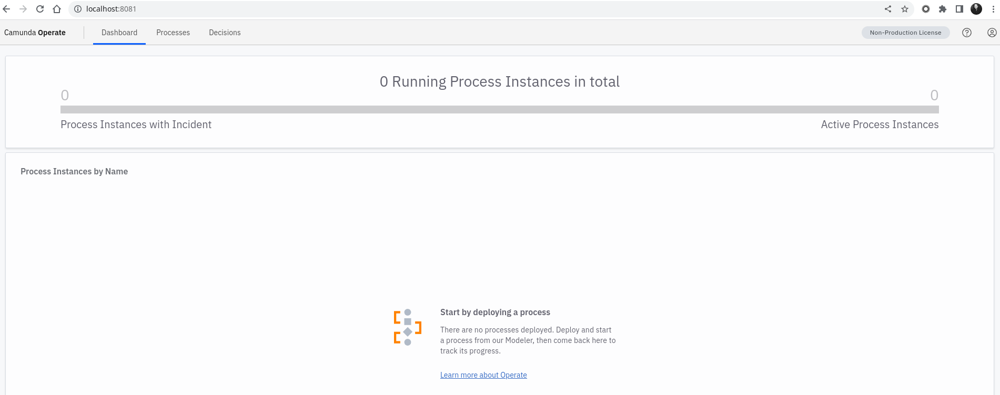
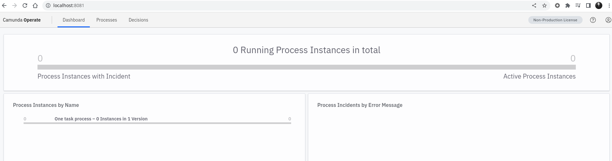
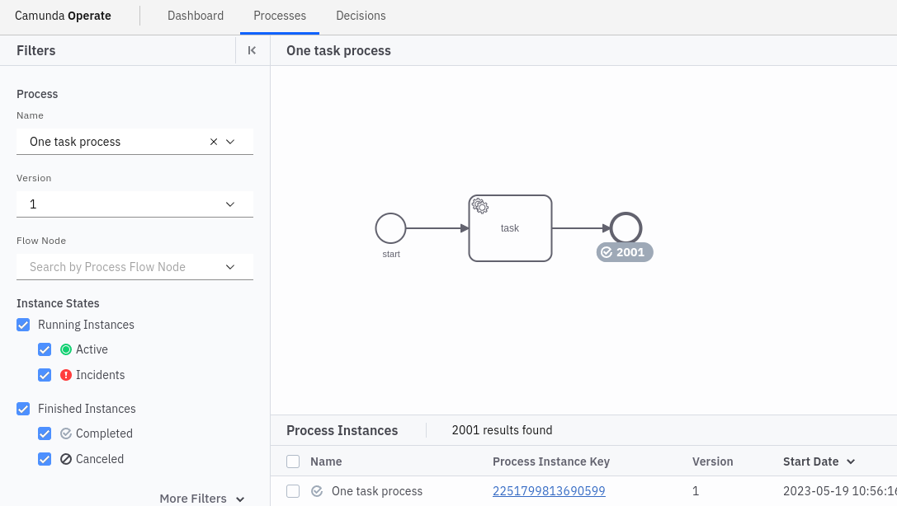
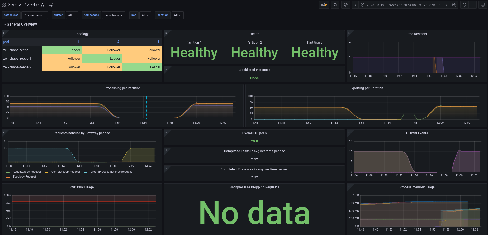
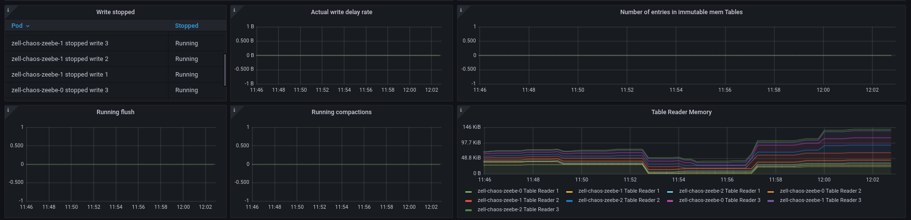

# Chaos Day Summary

Today we want to continue with the experiment from [last Chaos day](../2023-05-15-SST-Partitioning-toggle/index.md), but this time
with a bit more load. This should make sure that we trigger the compaction of RocksDB and cause the SST partitioning to happen, for real.

The reasons stay the same we want to find out whether it would be possible to enable and disable the flag/configuration without issues.

**TL;DR;** Today's, experiments succeeded :rocket. We were able to show that even with a higher number of process instances (bigger state) we can easily disable and enable the SST partitioning flag without issues. I also got a confirmation from a RocksDb contributor that our observations are correct, and that we can easily toggle this feature without issues.

<!--truncate-->

## Chaos Experiment

Similar setup to the [last Chaos day](../2023-05-15-SST-Partitioning-toggle/index.md#chaos-experiment).
Except this time we will enable Operate as well, in order to verify easily whether all instances have been completed.
Other than that we use the standard benchmark configuration, without clients.

The verification of the steady state will consist, of checking the readiness and healthiness of the cluster, via zbchaos and metrics. Furthermore, we will verify that we can access operate and that no instances are running. As defined in chaos engineering principles the process of a chaos experiment looks always the same, Verify the steady state, introduce chaos, and verify the steady state.

In our first experiment, we will enable the SST partitioning.

**First chaos action**
  * Deploy a process model (which contains a [simple model](https://github.com/zeebe-io/zeebe-chaos/blob/main/go-chaos/internal/bpmn/one_task.bpmn))
  * Start 1000 process instances (PIs), with a service task
  * Enable the SST partitioning
  * Restart the cluster, and await readiness
  * Complete the jobs (in consequence the PIs)

In our second experiment, we will disable the SST partitioning again.

**Second chaos action:**

  * Start 1000 process instances (PIs), with a service task
  * Disable the SST partitioning
  * Restart the cluster, and await readiness
  * Complete the jobs (in consequence the PIs)

### Expected

> When operating a cluster, I can enable and disable the SST partitioning without an impact on executing existing process instances. Existing PIs should still be executable and completable.

### Actual

As linked above I used again our [benchmark/setup](https://github.com/camunda/zeebe/tree/main/benchmarks/setup) scripts to set up a cluster.

```shell
$ diff ../default/values.yaml values.yaml 
40c40
<   replicas: 3
---
>   replicas: 0
47c47
<   replicas: 1
---
>   replicas: 0
85a86
>     zeebe.broker.experimental.rocksdb.enableSstPartitioning: "false"
96a98,100
>     identity:
>       auth:
>         enabled: false
326c330
<     enabled: false
---
>     enabled: true
```


#### First Experiment: Verify Steady state
To verify the readiness and run all actions I used the [zbchaos](https://github.com/zeebe-io/zeebe-chaos/tree/zbchaos-v1.0.0) tool.

```shell
$ zbchaos verify readiness
All Zeebe nodes are running.
```

Looking at the metrics shows that everything looks healthy. The only weird part is the topology panel which seems to be broken.


When requesting the topology via `zbchaos` we retrieve this:

```shell
$ zbchaos topology
{1 LEADER -1  10  msg false 1 LEADER -1 2 LEADER -1 1684476531915 false false true false false 30 false -1 benchmark 30  }
Node      |Partition 1         |Partition 2         |Partition 3
1         |FOLLOWER (HEALTHY)  |LEADER (HEALTHY)    |FOLLOWER (HEALTHY)
0         |LEADER (HEALTHY)    |FOLLOWER (HEALTHY)  |LEADER (HEALTHY)
2         |FOLLOWER (HEALTHY)  |FOLLOWER (HEALTHY)  |FOLLOWER (HEALTHY)
```

For now, we assume the dashboard has an issue and continue with the experiment.

We are able to access operate without issues, and see no instances yet.




#### First Experiment: Chaos Action

After the verification stage, we start with our chaos action, injecting chaos into the system.
The first step is to deploy the mentioned simple process model:
```shell
$ zbchaos deploy process -v
Connecting to zell-chaos
Running experiment in self-managed environment.
Port forward to zell-chaos-zeebe-gateway-7bbdf9fd58-dl97j
Successfully created port forwarding tunnel
Deploy file bpmn/one_task.bpmn (size: 2526 bytes).
Deployed process model bpmn/one_task.bpmn successful with key 2251799813685249.
Deployed given process model , under key 2251799813685249!
```

This is then as well visible in operate.


As the next step, we will create 1000 process instances of our simple process model, with one service task.
For that, we can [use a new functionality](https://github.com/zeebe-io/zeebe-chaos/tree/zell-chaos-create-count-of-instances) of `zbchaos` I built for this chaos day.

On the first try, I had smaller issues, with timeouts etc.
```shell
Send create process instance command, with BPMN process ID 'benchmark' and version '-1' (-1 means latest) [variables: '', awaitResult: false]
[299/999] Created process instance with key 6755399441056339 on partition 3.
panic: Expected to create 999 process instances, but timed out after 30s created 299 instances.
```

This is the reason why I had to retry the creations in the end the count is not exactly 1000 :)
```shell
./dist/zbchaos verify instance-count --instanceCount 697 -v --timeoutInSec 300
...
[695/697] Created process instance with key 4503599627372489 on partition 2.
Send create process instance command, with BPMN process ID 'benchmark' and version '-1' (-1 means latest) [variables: '', awaitResult: false]
[696/697] Created process instance with key 6755399441057737 on partition 3.
Send create process instance command, with BPMN process ID 'benchmark' and version '-1' (-1 means latest) [variables: '', awaitResult: false]
[697/697] Created process instance with key 2251799813687255 on partition 1.
The steady state was successfully verified!
```


Now we are coming to the interesting part. Enabling SST partitioning.

```shell
$ diff ../default/values.yaml values.yaml 
85a86
>     zeebe.broker.experimental.rocksdb.enableSstPartitioning: "true"
$ make update 
helm upgrade --namespace zell-chaos zell-chaos zeebe-benchmark/zeebe-benchmark -f values.yaml
```

> **Note**
> Changing the configmap doesn't restart pods! We need to delete all Zeebe pods, to apply the configuration.

```shell
$ k delete pod -l app=camunda-platform
pod "zell-chaos-zeebe-0" deleted
pod "zell-chaos-zeebe-1" deleted
pod "zell-chaos-zeebe-2" deleted
pod "zell-chaos-zeebe-gateway-7bbdf9fd58-8j7d6" deleted
pod "zell-chaos-zeebe-gateway-7bbdf9fd58-dl97j" deleted
```

```shell
$ zbchaos verify readiness 
All Zeebe nodes are running.
```

Now starting to complete the previously created jobs, we can use again a new feature in `zbchaos` ([which has been added during the chaos day](https://github.com/zeebe-io/zeebe-chaos/tree/zell-chaos-create-count-of-instances))
Unfortunately, I missed using the verbose flag.
```shell
$ ./dist/zbchaos verify job-completion --jobCount 1001 --timeoutInSec 1200
The steady-state was successfully verified!
```

#### First Experiment: Verify Steady state

The job completions worked without issues. The metrics are looking good, the topology panel seems to work again as well.


In operate we can see that there are no longer any running instances and all of them have been completed.




The first part of the experiment worked as expected :white_check_mark:

#### Second Experiment: Chaos Action

We are skipping the verification step, due to previous verification, we directly start with creating 1000 process instances.
```
$ ./dist/zbchaos verify instance-count --instanceCount 1000 -v --timeoutInSec 300

Send create process instance command, with BPMN process ID 'benchmark' and version '-1' (-1 means latest) [variables: '', awaitResult: false]
[1000/1000] Successful command sent, got response with key 2251799813690599 on partition 1.
The steady-state was successfully verified!
```


Disable the SST partitioning flag and update the cluster.
```shell
$ make update 
$ k delete pod -l app=camunda-platform
$ zbchaos verify readiness
All Zeebe nodes are running.
```

Complete all jobs:

```shell
$ ./dist/zbchaos verify job-completion --jobCount 1000 --timeoutInSec 1200 -v
[999/1000] Successful command sent, got response with key 6755399441061073 on partition 3.
Send job activate command, with job type 'benchmark-task'
[1000/1000] Successful command sent, got response with key 2251799813690604 on partition 1.
The steady-state was successfully verified!
```

#### Second Experiment: Verify Steady state

Again the experiment succeeded, we were able to show that even with a higher number of process instances we can easily disable and enable the SST partitioning flag.




In the snapshots at we can see that some more files are used.


But in RocksDb metrics we see no real compaction going on, which is why we will retry the same with a higher amount of data.


#### SST Partitioning and compaction

I tried to run the experiment again but with more data (~11K instances).

Even when the metrics don't show the compaction, I was able to see in the RocksDB that compacting is happening.

Around 11:56 between different loads



We see in the metrics of RocksDB that nothing



But when checking the RocksDB logs

```
$ cat data/raft-partition/partitions/1/runtime/LOG.old.1684493206724692 
...

2023/05/19-09:56:40.652111 140580419004160  Options.sst_partitioner_factory: SstPartitionerFixedPrefixFactory

...
2023/05/19-09:56:41.354244 140579153618688 (Original Log Time 2023/05/19-09:56:41.354149) EVENT_LOG_v1 {"time_micros": 1684490201354123, "job": 2, "event": "compaction_finished", "compaction_time_micros": 374078, "compaction_time_cpu_micros": 72361, "output_level": 3, "num_output_files": 14, "total_output_size": 6283132, "num_input_records": 69787, "num_output_records": 39118, "num_subcompactions": 1, "output_compression": "NoCompression", "num_single_delete_mismatches": 0, "num_single_delete_fallthrough": 0, "lsm_state": [0, 0, 0, 14]}
2023/05/19-09:56:41.354763 140579153618688 [le/delete_scheduler.cc:77] Deleted file /usr/local/zeebe/data/raft-partition/partitions/1/runtime/000045.sst immediately, rate_bytes_per_sec 0, total_trash_size 0 max_trash_db_ratio 0.250000
2023/05/19-09:56:41.354786 140579153618688 EVENT_LOG_v1 {"time_micros": 1684490201354782, "job": 2, "event": "table_file_deletion", "file_number": 45}
2023/05/19-09:56:41.355217 140579153618688 [le/delete_scheduler.cc:77] Deleted file /usr/local/zeebe/data/raft-partition/partitions/1/runtime/000044.sst immediately, rate_bytes_per_sec 0, total_trash_size 0 max_trash_db_ratio 0.250000
2023/05/19-09:56:41.355247 140579153618688 EVENT_LOG_v1 {"time_micros": 1684490201355243, "job": 2, "event": "table_file_deletion", "file_number": 44}
2023/05/19-09:56:41.355765 140579153618688 [le/delete_scheduler.cc:77] Deleted file /usr/local/zeebe/data/raft-partition/partitions/1/runtime/000043.sst immediately, rate_bytes_per_sec 0, total_trash_size 0 max_trash_db_ratio 0.250000
```
We see several lines which indicate the compaction.

## Conclusion

 We have seen that even when we toggle the SST partitioning, we are able to make progress and our stored data is not impacted. This is a great out come since it means we can easily enable such configuration on existing clusters and gains the performance benefits for larger states as we have seen in previous benchmarks.

I have posted a question related to this topic in the [RocksDb google group](https://groups.google.com/g/rocksdb/c/Ys-yZIznZwU) and I got a private answer which contains the following:

> Partitioner is just a hinter when compaction should split the file. Default compaction is also splitting by file size. So it has no functional effect and you can change configuration anytime.
>
> Partitioner does not need to be simple prefix only, but one can use more complicated strategy.

This confirms our observation and makes it much more trustworthy.


## Found Bugs

 * Grafana Topology Panel seems to be buggy from time to time
 * RocksDB compaction panel seems to show no data (might be related to a short time frame)


