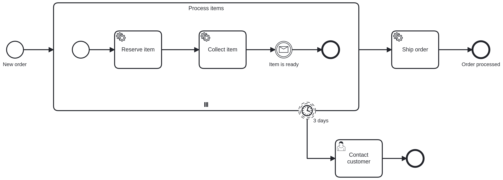
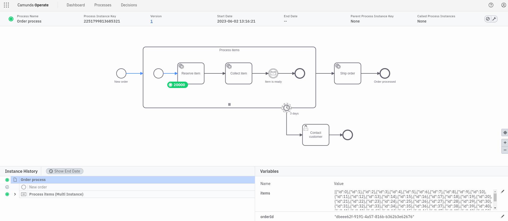
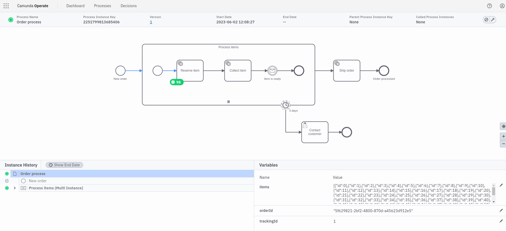
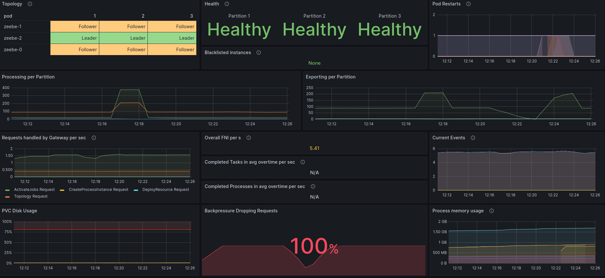

# Chaos Day Summary

New day new chaos. :skull: In today's chaos day I want to pick up a topic, which had bothered people for long time. I created a [chaos day three years ago](https://zeebe-io.github.io/zeebe-chaos/2020/07/16/big-multi-instance/) around this topic as well. 

Today, we experiment with large multi-instances again. In the recent patch release [8.2.5](https://github.com/camunda/zeebe/releases/tag/8.2.5) we fixed an issue with spawning larger multi instances. Previously if you have created a process instance with a large multi-instance it was likely that this caused to blacklist the process instance, since the multi-instance spawning running into `maxMessageSize` limitations. 

This means the process instance was stuck and was no longer executable. In operate this was not shown and caused a lot of friction or confusion to users. With the recent fix Zeebe should chunk even large collections into smaller batches in order to spawn/execute the multi-instance without any issues.

**TL;DR;** We were able to see that even large multi-instances can be executed now. :white_check_mark: At some point we experienced performance regressions (during creating new multi-instance elements) but the execution of the process instance doesn't fail anymore. One problem at a time, we will likely investigate further in order to improve the performance of such use case.

When we reached the `maxMessageSize` we got a rejection, if the input collection is too large we see some weird unexpected errors from NGINX.

<!--truncate-->

## Chaos Experiment

We do regularly game days in Camunda, and for such we also create projects to make incidents etc. reproducible. In today's chaos day I will reuse some code created by [Philipp Ossler](https://github.com/saig0), thanks for that :bow: Since we mimic in such game days customers, the process is a bit more complex than necessary for such chaos day, but I will keep it like that.



The input collection `items`, which is used in the multi-instance is generated via:

```shell
    // input size
    final var items = IntStream.range(0, size).mapToObj(i -> Map.ofEntries(
        entry("id", i)
    )).toList();
```

In the following experiment we will play around with the `size` value.

For the experiment we will use an Camunda 8 SaaS cluster with the generation `Zeebe 8.2.5` (G3-S).

### Expected

When creating a process instance with a large collection, we expect based on the recent bug fix that the multi-instance creation is batched and created without issues. 

One limiting factor might be the `maxMessageSize` with regard to the input collection, but in this case I would expect that the creation of the process instance is already rejected before.

### Actual

Between the following experiments I always recreated the clusters, in order to reduce the blast radius and better understand and isolate the impact. 

#### Starting small (20k)

In previous versions the multi-instance creation failed already quite early. For example in the game day reproducer project we had a collection defined with `20.000` items, which we are now reusing for the start.

The creation of the process instance worked without any issues. We can observe in Operate the incremental creation of sub-process instances, which is great.


We can see in the metrics that batch processing is limited by only 2-4 commands in a batch. Interesting fact, which might explain why it takes a while until all instances of the multi-instance sub-process are created. We can even see rollbacks during batch processing, visible in the "Number of batch processing retries" panel.


The processing queue seem to increase dramatically.

After a while we can see that all 20k instances are created without any bigger issues. :rocket:



It took around 10 minutes. Taking a look at the metrics again we see that in between big command batches have been created/processed, which allowed to reduce the processing queue.


In between the backpressure was quite high, but after creation of all instances the cluster is in a healthy state again. The creation of such multi-instance worked :white_check_mark:


#### Increase collection (200k)

Again, creation of such process instance was not a problem itself. We can observe the creation of the sub-process instances (multi-instance) in operate, which happens incrementally.



It takes ages until the instances are created (After 3h ~66k instances are created). Again we see here small chunks of batches, and there are also rollbacks during batch processing.


The processing of that partitions is in this case totally blocked by the multi-instance creation, we can see that on the 100% back pressure. :x:



Even after one hour not all instances are created (not even 20k), it takes longer than before the creation of 20.000 instances.


#### Make it really big (2 million)

In order to escalate this even more I increase the input collection again by factor 10 to 2 million.

After creation I see as response the following log message in my log:

```
Failed to create process instance of 'order-process'

io.camunda.zeebe.client.api.command.ClientStatusException: HTTP status code 502
invalid content-type: text/html
headers: Metadata(:status=502,date=Fri, 02 Jun 2023 11:44:57 GMT,content-type=text/html,strict-transport-security=max-age=63072000; includeSubDomains,content-length=150)
DATA-----------------------------
<html>
<head><title>502 Bad Gateway</title></head>
<body>
<center><h1>502 Bad Gateway</h1></center>
<hr><center>nginx</center>
</body>
</html>

	at io.camunda.zeebe.client.impl.ZeebeClientFutureImpl.transformExecutionException(ZeebeClientFutureImpl.java:93) ~[zeebe-client-java-8.0.5.jar:8.0.5]
	at io.camunda.zeebe.client.impl.ZeebeClientFutureImpl.join(ZeebeClientFutureImpl.java:50) ~[zeebe-client-java-8.0.5.jar:8.0.5]
	at io.camunda.cloud.gameday.ProcessApplication.createProcessInstance(ProcessApplication.java:90) ~[classes/:na]
	at io.camunda.cloud.gameday.ProcessApplication.createInstanceOfProcess(ProcessApplication.java:71) ~[classes/:na]
	at io.camunda.cloud.gameday.ProcessApplication.run(ProcessApplication.java:58) ~[classes/:na]
	at org.springframework.boot.SpringApplication.callRunner(SpringApplication.java:791) ~[spring-boot-2.5.2.jar:2.5.2]
	at org.springframework.boot.SpringApplication.callRunners(SpringApplication.java:775) ~[spring-boot-2.5.2.jar:2.5.2]
	at org.springframework.boot.SpringApplication.run(SpringApplication.java:345) ~[spring-boot-2.5.2.jar:2.5.2]
	at org.springframework.boot.SpringApplication.run(SpringApplication.java:1343) ~[spring-boot-2.5.2.jar:2.5.2]
	at org.springframework.boot.SpringApplication.run(SpringApplication.java:1332) ~[spring-boot-2.5.2.jar:2.5.2]
	at io.camunda.cloud.gameday.ProcessApplication.main(ProcessApplication.java:46) ~[classes/:na]
Caused by: java.util.concurrent.ExecutionException: io.grpc.StatusRuntimeException: UNAVAILABLE: HTTP status code 502
invalid content-type: text/html
headers: Metadata(:status=502,date=Fri, 02 Jun 2023 11:44:57 GMT,content-type=text/html,strict-transport-security=max-age=63072000; includeSubDomains,content-length=150)
DATA-----------------------------
<html>
<head><title>502 Bad Gateway</title></head>
<body>
<center><h1>502 Bad Gateway</h1></center>
<hr><center>nginx</center>
</body>
</html>

	at java.base/java.util.concurrent.CompletableFuture.reportGet(CompletableFuture.java:396) ~[na:na]
	at java.base/java.util.concurrent.CompletableFuture.get(CompletableFuture.java:2073) ~[na:na]
	at io.camunda.zeebe.client.impl.ZeebeClientFutureImpl.join(ZeebeClientFutureImpl.java:48) ~[zeebe-client-java-8.0.5.jar:8.0.5]
	... 9 common frames omitted
```


I tried to incremently decrease the input collection until it is working again, when reaching 250k I finally see a better understandable error.

```shell
2023-06-02 13:53:51.485 ERROR 29870 --- [           main] i.c.cloud.gameday.ProcessApplication     : Failed to create process instance of 'order-process'

io.camunda.zeebe.client.api.command.ClientStatusException: Command 'CREATE' rejected with code 'EXCEEDED_BATCH_RECORD_SIZE': 
	at io.camunda.zeebe.client.impl.ZeebeClientFutureImpl.transformExecutionException(ZeebeClientFutureImpl.java:93) ~[zeebe-client-java-8.0.5.jar:8.0.5]
	at io.camunda.zeebe.client.impl.ZeebeClientFutureImpl.join(ZeebeClientFutureImpl.java:50) ~[zeebe-client-java-8.0.5.jar:8.0.5]
	at io.camunda.cloud.gameday.ProcessApplication.createProcessInstance(ProcessApplication.java:90) ~[classes/:na]
	at io.camunda.cloud.gameday.ProcessApplication.createInstanceOfProcess(ProcessApplication.java:71) ~[classes/:na]
	at io.camunda.cloud.gameday.ProcessApplication.run(ProcessApplication.java:58) ~[classes/:na]
	at org.springframework.boot.SpringApplication.callRunner(SpringApplication.java:791) ~[spring-boot-2.5.2.jar:2.5.2]
	at org.springframework.boot.SpringApplication.callRunners(SpringApplication.java:775) ~[spring-boot-2.5.2.jar:2.5.2]
	at org.springframework.boot.SpringApplication.run(SpringApplication.java:345) ~[spring-boot-2.5.2.jar:2.5.2]
	at org.springframework.boot.SpringApplication.run(SpringApplication.java:1343) ~[spring-boot-2.5.2.jar:2.5.2]
	at org.springframework.boot.SpringApplication.run(SpringApplication.java:1332) ~[spring-boot-2.5.2.jar:2.5.2]
	at io.camunda.cloud.gameday.ProcessApplication.main(ProcessApplication.java:46) ~[classes/:na]
Caused by: java.util.concurrent.ExecutionException: io.grpc.StatusRuntimeException: UNKNOWN: Command 'CREATE' rejected with code 'EXCEEDED_BATCH_RECORD_SIZE': 
	at java.base/java.util.concurrent.CompletableFuture.reportGet(CompletableFuture.java:396) ~[na:na]
	at java.base/java.util.concurrent.CompletableFuture.get(CompletableFuture.java:2073) ~[na:na]
	at io.camunda.zeebe.client.impl.ZeebeClientFutureImpl.join(ZeebeClientFutureImpl.java:48) ~[zeebe-client-java-8.0.5.jar:8.0.5]
	... 9 common frames omitted
Caused by: io.grpc.StatusRuntimeException: UNKNOWN: Command 'CREATE' rejected with code 'EXCEEDED_BATCH_RECORD_SIZE': 
	at io.grpc.Status.asRuntimeException(Status.java:535) ~[grpc-api-1.45.1.jar:1.45.1]
	at io.grpc.stub.ClientCalls$StreamObserverToCallListenerAdapter.onClose(ClientCalls.java:478) ~[grpc-stub-1.45.1.jar:1.45.1]
	at io.grpc.internal.ClientCallImpl.closeObserver(ClientCallImpl.java:562) ~[grpc-core-1.45.1.jar:1.45.1]
	at io.grpc.internal.ClientCallImpl.access$300(ClientCallImpl.java:70) ~[grpc-core-1.45.1.jar:1.45.1]
	at io.grpc.internal.ClientCallImpl$ClientStreamListenerImpl$1StreamClosed.runInternal(ClientCallImpl.java:743) ~[grpc-core-1.45.1.jar:1.45.1]
	at io.grpc.internal.ClientCallImpl$ClientStreamListenerImpl$1StreamClosed.runInContext(ClientCallImpl.java:722) ~[grpc-core-1.45.1.jar:1.45.1]
	at io.grpc.internal.ContextRunnable.run(ContextRunnable.java:37) ~[grpc-core-1.45.1.jar:1.45.1]
	at io.grpc.internal.SerializingExecutor.run(SerializingExecutor.java:133) ~[grpc-core-1.45.1.jar:1.45.1]
	at java.base/java.util.concurrent.ThreadPoolExecutor.runWorker(ThreadPoolExecutor.java:1136) ~[na:na]
	at java.base/java.util.concurrent.ThreadPoolExecutor$Worker.run(ThreadPoolExecutor.java:635) ~[na:na]
	at java.base/java.lang.Thread.run(Thread.java:833) ~[na:na]

2023-06-02 13:53:51.485  INFO 29870 --- [           main] i.c.cloud.gameday.ProcessApplication     : Created process instances with large collection. [order-id: 'ba65b59b-1584-48bb-af05-3724ea15fac9']

```

### Results

As we have seen above we are able now to create much larger multi instances than before, with some drawbacks in performance, which needs to be investigated further.

When reaching a certain limit (maxMessageSize) we get a described rejection by the broker, until we reach the limit of NGINX where the description is not that optimal. Here we can and should improve further.


## Found Bugs

  * in a previous test I run into https://github.com/camunda/zeebe/issues/12918
  * Related bug regarding the input collection https://github.com/camunda/zeebe/issues/12873

