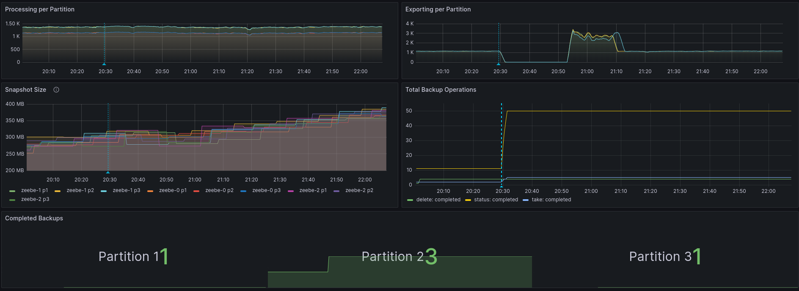
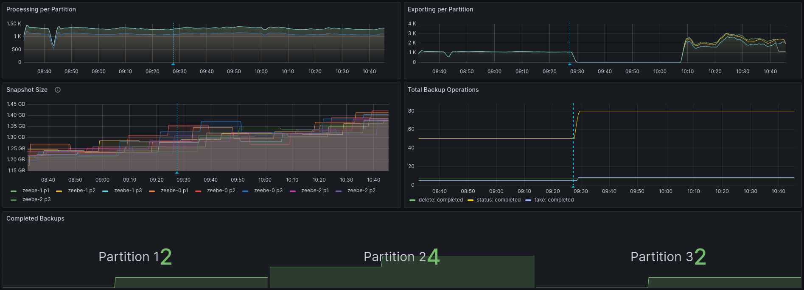

# Chaos Day Summary

Today, we want to experiment with hot backups in SaaS and a larger runtime state in Zeebe and how it impacts the ongoing processing in Zeebe (or not?). This is part of the investigation of a recently created bug issue we wanted to verify/reproduce [#14696](https://github.com/camunda/zeebe/issues/14696).

**TL;DR;** We were able to prove that hot backups are indeed not impacting overall processing throughput in Zeebe. We found that having a full Elasticsearch disk might impact or even fail your backups, which is intransparent to the user.

<!--truncate-->

## Chaos Experiment

For the experiment, we have set up a Camunda SaaS cluster (G3-M configuration), and run the [cloud benchmark](https://github.com/camunda/zeebe/tree/main/benchmarks/setup/cloud-default) workload against it. During the experiment, we will run a stable load, which will cause to increase in the runtime state. We will create/initiate in different stages backups to verify the impact on processing depending on state size.

We kept the starter rate (creation of process instance 100 PI/s) but reduced the worker capacity and replicas.

### Expected

Hot backups were built with the premise of not disrupting the processing throughput in Zeebe, which is why we define the following hypothesis:

> **Hypothesis**
>
> Creating hot backups should not impact Zeebe's _processing throughput _no_ matter how_ large the runtime state is in Zeebe.

### Actual

We created a cluster in the Camunda SaaS environment (in our internal stage).

#### Step one

We created a first backup to verify that it works without issues.

##### Result

Success on stage one creating a backup with no actual state.

#### Step two

We started a stable load as mentioned [above](#chaos-experiment). After reaching around ~100 MB runtime state at each partition we triggered a backup.

##### Result

The backup was successful and we were not able to observe any disruption in the processing throughput. We can see that during the backup is taken the exporting is paused (which is expected) and afterwards it is starting to export again. :white_check_mark:

#### Step three

At a later stage, we tried to take a backup again with around ~300MB of runtime state in Zeebe.

##### Result

Based on the output from Console the backup was successful and took around one hour.

Based on our internal metrics we can also see that there is no impact on the processing throughput

What is unclear to me is that it looks like we only took a backup of partition two. This needs to be further investigated, it might be also that the metrics are just confusing since it is resetting after the pod restarts.:bug:

#### Step four

Here we come into struggle after running the load on the cluster for quite some time we reached a runtime state size of ~1 gig. Furthermore, we filled our Elasticsearch disk tremendously.

##### Result

At this time we were no longer able to successfully create backups. Here I tried it first without interacting with the cluster. It failed after 1.5 hours, which is potentially the timeout.

The backup failed, because of elastic was full. 

I went ahead to remove some data from Elastic to keep experimenting.

#### Step five
After cleaning the Elasticsearch we retried taking a backup again. At this step, we already reached a runtime state of ~1.25G for each partition, which is quite huge.

##### Result

The backup took quite a while and failed again.

What we can see based on the times it is likely that it here timed out again. Taking a look at the metrics we see that a backup was processed in Zeebe.

It had no impact on the ongoing processing throughput.

At a later stage, we tried another backup with ~1.45G of runtime state even here we were not able to observe any issues related to the impact on processing throughput.

### Conclusion

:white_check_mark: We were able to prove that even on a large runtime state there is no observable impact on processing throughput in Zeebe. 

Furthermore, we have seen that having a large Elastic state (almost full disk) will impact taking backups and is likely to fail them. We might need to iterate here, whether we want to tune the backup strategy, give elastic more space when taking backups, or adjust watermarks, etc.

#### Follow-ups

We have to investigate the marking of failed backups, whether it is because of a timeout in the Operator or whether these backups are failed. It looks to me like they are marked as failed, even if they may succeed.

Furthermore, the completed backups seem to be misleading and are reset which causes inconsistent views.
