# Chaos Day Summary

In today's chaos day we (Nicolas and I) want to verify how job push behaves and in general, the Zeebe system when we have slow workers.

**TL;DR;** Right now it seems that even if we have a slow worker it doesn't impact the general system, and only affects the corresponding process instance, not other instances. We found no unexpected issues, everything performed pretty well. 

<!--truncate-->

## Chaos Experiment

Firstly we want to verify that job push will not overload a worker or gateway when workers are slow.

### Expected

We expect that if the workers are slowing down, the load is distributed to other workers (if available), and it is expected that the general performance (of the affected process instance) should be slowed down. We wouldn't expect any restarts/failures on the gateway or workers.

### Actual


We deployed a normal benchmark, with [default configurations](https://github.com/camunda/camunda/blob/main/benchmarks/setup/default/values.yaml).


We slowed the workers down, in the sense that we changed [the completionDelay to 1250 ms](https://github.com/zeebe-io/benchmark-helm/blob/main/charts/zeebe-benchmark/templates/worker.yaml#L30)

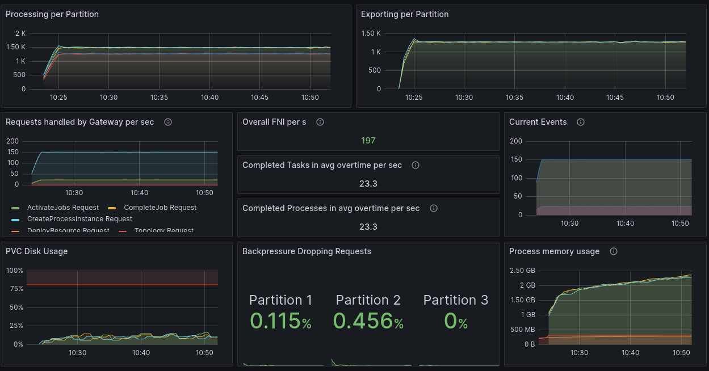

The throughput is lower than normal, as expected.

We see no significant increase in memory usage on the gateway, nor any outages because of this.

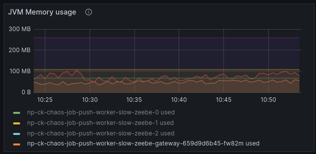

We see that a high amount of job pushes fail (due to capacity constraints now in the workers).
!Jobs are yielded back to the engine.

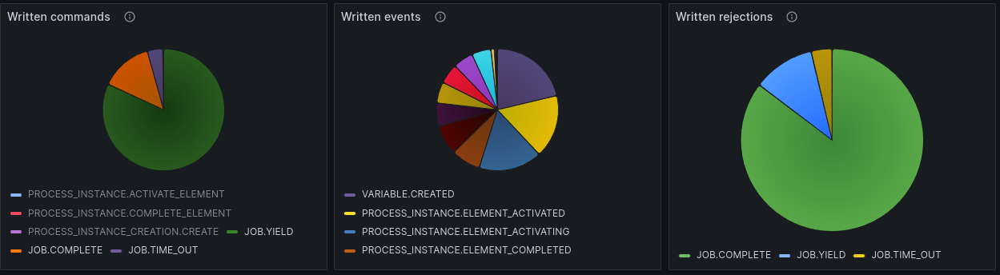


So far so good, first experiment worked as expected :white_check_mark:


## Second Chaos Experiment 

The normal scenario when something is slow is for a user to scale up. This is what we did in the next experiment, we scaled the workers to 10 replicas (from 3), to verify how the system behaves in this case.


Something to keep in mind when the completion delay is 1250ms, we [multiply the activation timeout by 6 in our workers](https://github.com/camunda/camunda/blob/7002d53a079c06ab3a94f5485f022681a41dc9ed/benchmarks/project/src/main/java/io/camunda/zeebe/Worker.java#L113). This means completionDelay: 1250 -> job timeout 7.5s

### Expected

We expect that we can reach a higher throughput.

### Actual

Scaling the workers to 10:

```sh
k scale deployment worker --replicas=10
```

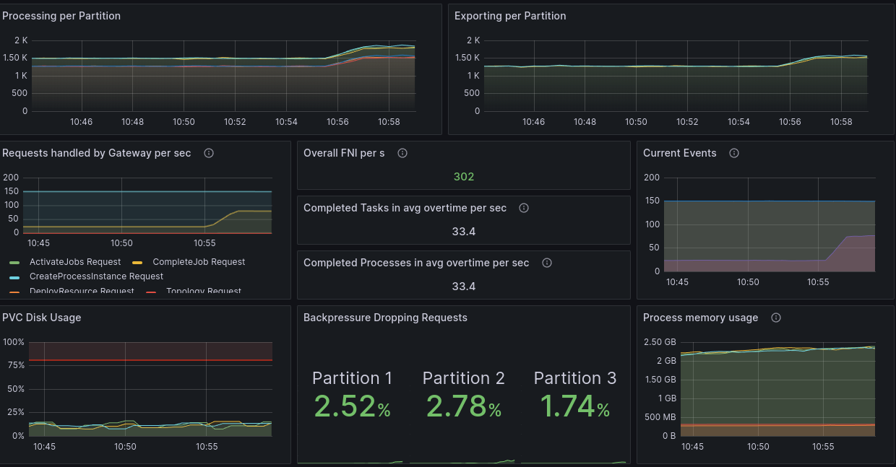

We can see that after scaling we can complete more jobs.


The gateway memory seems to be not really affected.


In the job push metrics we see less job push failures.

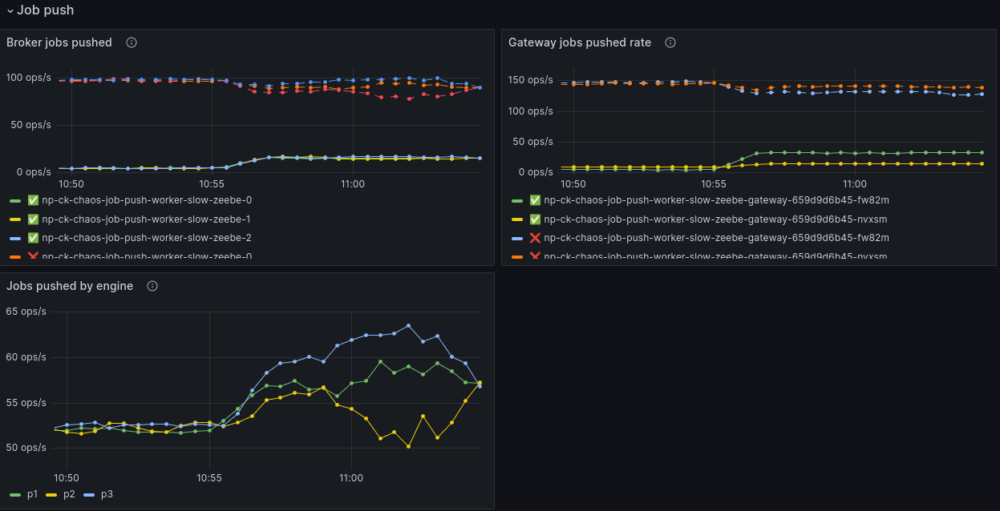

When we check the written records we can see a decrease in yield, but an increase in timeouts. The reason is that we have to try several workers before giving it back.

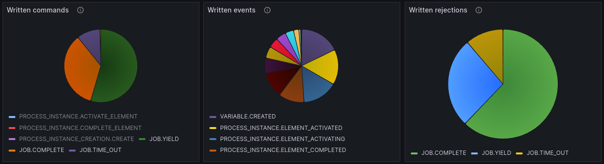
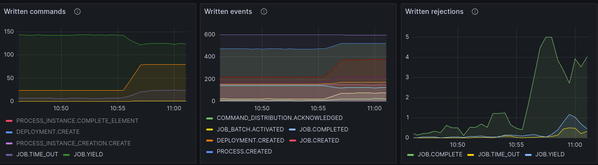


Experiment two worked as expected. :white_check_mark:

## Third Chaos Experiment 

In a real-world scenario, it will not happen if you have a slow dependency, for which for example a worker waits that you can scale and this will solve your problems. Likely you will get even slower because more pressure is put on the dependency. To mimic this scenario we experimented with increasing the completion time again. A completion delay set to 2500ms, means a job timeout of 15s.

### Expected

We expect after slowing down all workers again, that our throughput goes down again, but we should see no general error. Potentially a slight memory increase because of buffering of jobs.

This also means more yields and fewer timeouts.

### Actual

As expected again we see a drop in throughput, but it is still a bit higher than at the first experiment.

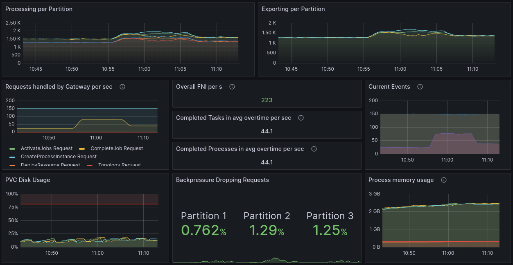

No difference at all in the memory consumption, by the gateway.


In the records we can also again see that yield increase, and timeouts have been decreased.


Experiment three worked as expected. :white_check_mark:

## Several further experiments

We did several further experiments where we scaled the workers, played with the completion delay, reduced the starter load etc. At some point, we reached a state size that was too big (~2 Gig) such that this impacted our processing. We had to drain the cluster and stop the starters completely.


Interestingly was that when we reduced the completion delay, we just had a slight increase in completion, when we scaled down the workers (marked with the annotation in the graph), to reduce activations, we saw no difference. 

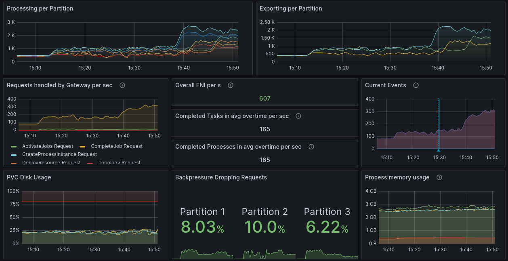


Only when we hit a certain threshold in RocksDb (it seems to be at least), the completion went up by a lot.


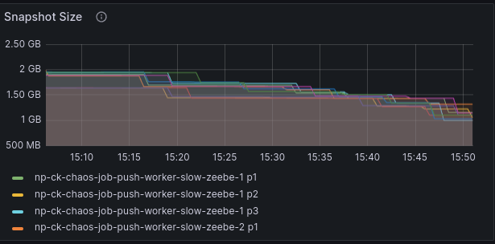

This is because the record processing latency was heavily reduced (likely the commit latency or iteration latency in RocksDb).

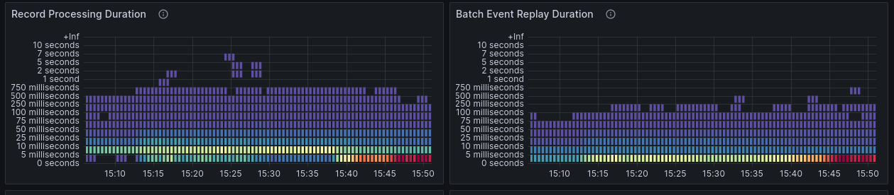


## Experiment with worker impact

We wanted to understand and experiment with the impact of a slow worker on different process instances. 

To see such an impact in our metrics we had to patch our current execution metrics, such that includes the BPMN processId, so we can differentiate between execution times of different processes.

See the related branch for more details [ck-latency-metrics](https://github.com/camunda/camunda/tree/ck-latency-metrics)


Furthermore, a new process model was added `slow-task.bpm` and new deployments to create such instances and work on them. The process model was similar to the benchmark model, only the job type has been changed.

### Expected

To verify was that whether a slow worker would impact other instances, this was uncertain territory we were hitting. 

To be honest we expected it would affect them.

### Actual


We started the benchmark (default configs for broker and gateway), with additional configurations:

 * benchmark starter with 75 PI/s rate
 * 3 benchmark worker (60 capacity) and completion delay of 50 ms
 * slow-task starter with 75 PI/s rate
 * 3 slow-worker (60 capacity) and a completion delay of 50 ms (at the begin)


We can see based on the metrics that the execution latency is the same for both process instances, and we are able to complete our 150 PI/s.

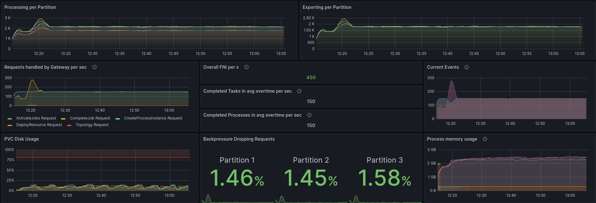 


We slowed now the worker for the type `slow-task` down to a completion delay of 2500ms.

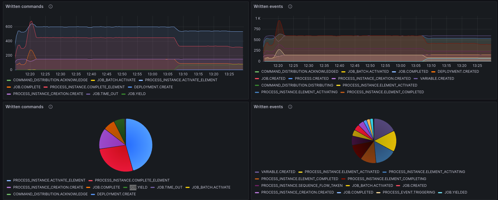

We can see that we start to get `Job.YIELD` commands from the gateway, and we can see that the process instance execution is slowed down.

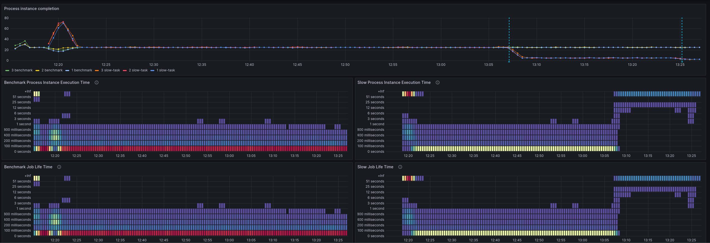

Interestingly that is only for the affected process instance, which we wanted to validate/verify. 


### Reasoning

Our first assumption was that both instance latencies would be impacted, because are writing YIELD commands, instead of being able to complete them. 


But another consequence comes into play. If fewer jobs are worked on, there are also fewer jobs completed, this means fewer process instances have to be continued (with batch processing until the end).

This means a load of yield underweights the normal load of job completions, with additional process instance continuation. That was an interesting insight for us.

## Result

Right now it seems that even if we have a slow worker it doesn't impact badly the general system, and only affects the corresponding process instance, not other instances.

What we should or need to investigate further what if the job completion delay is much larger than the timeout. This is something we might want to test soon.