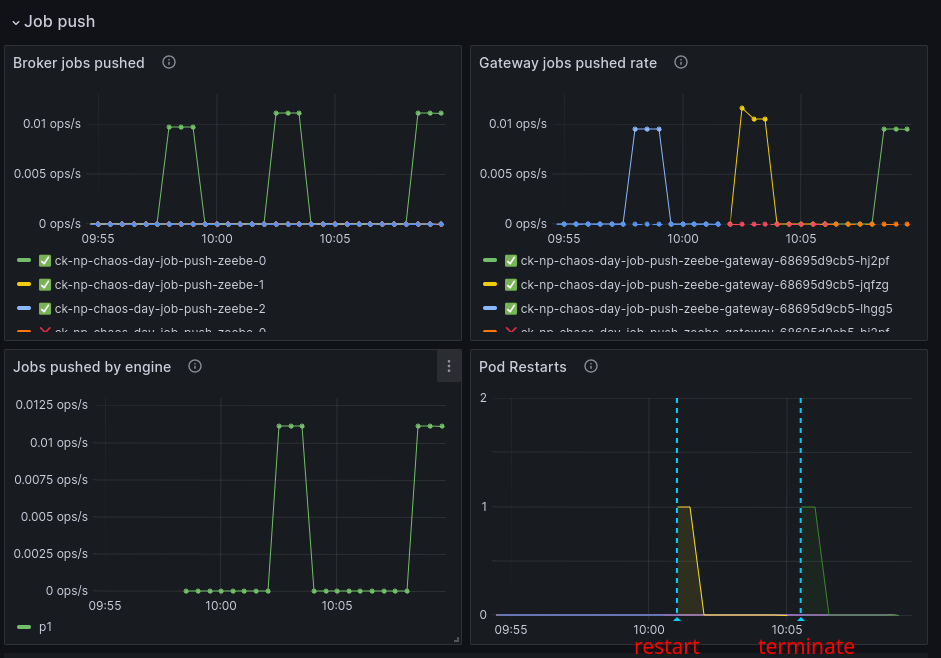
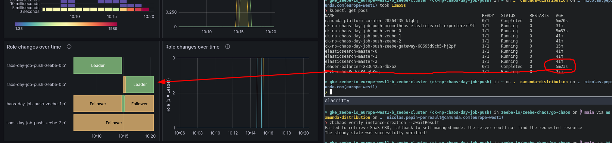
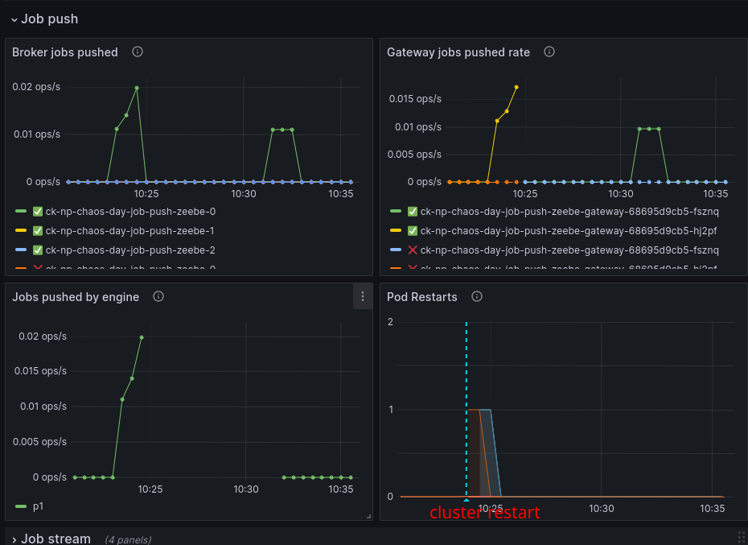

# Chaos Day Summary

In today's chaos day we experimented with job push resiliency.

The following experiments we have done today:

1. Job streams should be resilient to gateway restarts/crash
2. Job streams should be resilient to leadership changes/leader restarts
3. Job streams should be resilient to cluster restarts

**TL;DR;** All experiments succeeded and show-cased the resiliency even on components restarts. :rocket:

<!--truncate-->

To reduce the blast radius and to better verify that everything works as expected we use a trimmed version of our benchmark setup. This means: three brokers, one partition, replication factor three and one gateway. No starter deployed. We deployed one worker with a very high polling interval, to make sure that we rely on streaming.

## Gateway restarts

In our first experiment we wanted to verify that: Job streaming should be resilient to gateway restarts/crashes.

The experiment will look like the following:

* Verify steady state:
  * Cluster is healthy
  * When creating an instance, and start streaming we can retrieve and complete the corresponding job
* Chaos injection:
  * Restarting the gateway
* Verify steady state:
    * Cluster is healthy
    * When creating an instance, and start streaming we can retrieve and complete the corresponding job

### Expected

We expect that even after a gateway restart we can retrieve a job (the stream should be recreated) and can complete our new instance.

### Actual

We deployed the worker (with replica one), and configured it with a high polling interval `-Dapp.worker.pollingDelay=24h`.

To run any instances we need to deploy once a the benchmark process model
```
zbchaos deploy process
Failed to retrieve SaaS CRD, fallback to self-managed mode. the server could not find the requested resource
Deployed given process model , under key 2251799813685249!
```

#### Verify steady state

We verify the readiness and the instance creation.

```sh
$ zbchaos verify readiness
All Zeebe nodes are running.

$ zbchaos verify instance-creation --awaitResult --verbose
Flags: {1 LEADER -1  10  msg true 1 LEADER -1 2 LEADER -1 1701853048870 false false true false false 30 false -1 benchmark 30   1 1 benchmark-task}
Connecting to ck-np-chaos-day-job-push
Failed to retrieve SaaS CRD, fallback to self-managed mode. the server could not find the requested resource
Running experiment in self-managed environment.
Port forward to ck-np-chaos-day-job-push-zeebe-gateway-68695d9cb5-lhgg5
Successfully created port forwarding tunnel
We await the result of the process instance creation, thus we skip the partition id check.
Send create process instance command, with BPMN process ID 'benchmark' and version '-1' (-1 means latest) [variables: '', awaitResult: true]
Created process instance with key 2251799813685251 on partition 1, required partition 0.
The steady-state was successfully verified!
```

#### Injecting chaos

As next, we will restart the gateway.

```shell
$ zbchaos restart gateway --verbose
Flags: {1 LEADER -1  10  msg false 1 LEADER -1 2 LEADER -1 1701853221588 false false true false false 30 false -1 benchmark 30   1 1 benchmark-task}
Connecting to ck-np-chaos-day-job-push
Failed to retrieve SaaS CRD, fallback to self-managed mode. the server could not find the requested resource
Running experiment in self-managed environment.
Restarted ck-np-chaos-day-job-push-zeebe-gateway-68695d9cb5-lhgg5
```

#### Verify steady state

```shell
$ zbchaos verify readiness
Failed to retrieve SaaS CRD, fallback to self-managed mode. the server could not find the requested resource
All Zeebe nodes are running.
```

```shell
$ zbchaos verify instance-creation --awaitResult
Failed to retrieve SaaS CRD, fallback to self-managed mode. the server could not find the requested resource
The steady-state was successfully verified!
```


### Result 
The experiment succeeded. We were able to verify the steady state after the chaos injection. Furthermore, we observe in the metrics as well that the jobs have been pushed after the gateway restart. :white_check_mark:


### With termination

We wanted to verify the same with  terminating the gateway instead of a graceful shutdown (which is done within the restart command).

```shell
$ zbchaos terminate gateway --verbose
Flags: {1 LEADER -1  10  msg false 1 LEADER -1 2 LEADER -1 1701853482263 false false true false false 30 false -1 benchmark 30   1 1 benchmark-task}
Connecting to ck-np-chaos-day-job-push
Failed to retrieve SaaS CRD, fallback to self-managed mode. the server could not find the requested resource
Running experiment in self-managed environment.
Terminated ck-np-chaos-day-job-push-zeebe-gateway-68695d9cb5-jqfzg
```

Verifying the steady stated again showed no unexpected issues.

Out of interest we checked what is happening in worker:

```
09:05:44.047 [pool-5-thread-3] WARN  io.camunda.zeebe.client.job.worker - Failed to stream jobs of type 'benchmark-task' to worker 'benchmark-worker'
io.grpc.StatusRuntimeException: UNAVAILABLE: io exception
...
```

We see as expected several `UNAVAILABLE: io exception` and later the worker recovered.

Based on the metrics we can observe the same. Jobs are pushed to the workers even after restarting of the gateway.



## Leader restart

In this experiment we want to verify how resilient job push is on leader changes/restarts.

The verification of the steady-state is the same as above, so I will skip this description here.

### Expected

Workers shouldn't care about leader change, this should be handled fully by the gateway.

### Actual

#### Verify steady state

```
$ zbchaos verify readiness
Failed to retrieve SaaS CRD, fallback to self-managed mode. the server could not find the requested resource
All Zeebe nodes are running.
$ zbchaos verify instance-creation --awaitResult
Failed to retrieve SaaS CRD, fallback to self-managed mode. the server could not find the requested resource
The steady-state was successfully verified!
```

#### Inject chaos

```shell
$ zbchaos restart broker --partitionId 1 --role LEADER
Failed to retrieve SaaS CRD, fallback to self-managed mode. the server could not find the requested resource
Restarted ck-np-chaos-day-job-push-zeebe-0
```

#### Verify steady state

```shell
$ zbchaos verify readiness
Failed to retrieve SaaS CRD, fallback to self-managed mode. the server could not find the requested resource
All Zeebe nodes are running.
$ zbchaos verify instance-creation --awaitResult
Failed to retrieve SaaS CRD, fallback to self-managed mode. the server could not find the requested resource
The steady-state was successfully verified!
```

### Result 

We were able to verify that a leader restart doesn't cause issues and job push can handle such events.


We can see that the leader was changed, and also switched back shortly after.


This is caused by our leader-balancing cron job.


This also means we had two leader changes, and the push was even pushed by the restarted node.


## Complete cluster restart

In this experiment we wanted to verify whether job push can also handle a complete cluster restart.

### Expected

Job push can handle a cluster restart and a corresponding job is pushed to the worker afterwards.

### Actual

#### Verify steady state
```
❯ zbchaos verify readiness
Failed to retrieve SaaS CRD, fallback to self-managed mode. the server could not find the requested resource
All Zeebe nodes are running.
❯ zbchaos verify instance-creation --awaitResult
Failed to retrieve SaaS CRD, fallback to self-managed mode. the server could not find the requested resource
The steady-state was successfully verified!
```

#### Inject chaos

Right now `zbchaos` doesn't support to restart a complete cluster, so we had to fallback to `kubectl`. 

```sh
$ kubectl delete pod -l=app=camunda-platform
pod "ck-np-chaos-day-job-push-zeebe-0" deleted
pod "ck-np-chaos-day-job-push-zeebe-1" deleted
pod "ck-np-chaos-day-job-push-zeebe-2" deleted
pod "ck-np-chaos-day-job-push-zeebe-gateway-68695d9cb5-hj2pf" deleted
```

#### Verify steady state

```
$ zbchaos verify readiness
Failed to retrieve SaaS CRD, fallback to self-managed mode. the server could not find the requested resource
All Zeebe nodes are running.
$ zbchaos verify instance-creation --awaitResult
Failed to retrieve SaaS CRD, fallback to self-managed mode. the server could not find the requested resource
The steady-state was successfully verified!
```

### Result

Again we were able to show that job push is resilient, and can even handle a complete cluster restart.




## Found Bugs

* On restart (especially on cluster restart) it looks like that job push engine metrics are counted multiple times
* [We found a place where we should better handle the exception in pushing async.](https://github.com/camunda/zeebe/blob/a86decce9a46218798663e3466267a49adef506e/transport/src/main/java/io/camunda/zeebe/transport/stream/impl/RemoteStreamPusher.java#L55-L56C14)  
