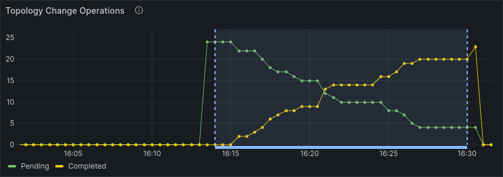
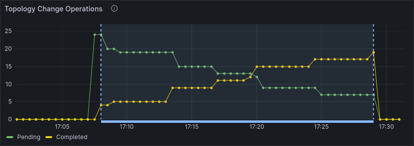

# Chaos Day Summary

We experimented with the first version of [dynamic scaling in Zeebe](https://docs.camunda.io/docs/next/self-managed/zeebe-deployment/operations/cluster-scaling/), adding or removing brokers for a running cluster.

Scaling up and down is a high-level operation that consists of many steps that need to be carried co-operatively by all brokers in the cluster.
For example, adding new brokers first adds them to the replication group of the assigned partitions and then removes some of the older brokers from the replication group.
Additionally, [priorities](https://docs.camunda.io/docs/next/self-managed/zeebe-deployment/configuration/priority-election/) need to be reconfigured to ensure that the cluster approaches balanced leadership eventually.

This orchestration over multiple steps ensures that all partitions are replicated by at least as many brokers as configured with the `replicationFactor`.
As always, when it comes to orchestrating distributed systems, there are many edge cases and failure modes to consider.

The goal of this experiment was to verify that the operation is resilient to broker restarts.
We can accept that operations take longer than usual to complete, but we need to make sure that the operation eventually succeeds with the expected cluster topology as result.

**TL;DR;** Both scaling up and down is resilient to broker restarts, with the only effect that the operation takes longer than usual to complete.

<!--truncate-->

## Scaling up should be resilient to broker restarts

We start with a cluster of 3 brokers, 6 partitions and replication factor 3.
If leadership is balanced, each broker should be leader for 2 partitions and follower for 4 partitions.
Using more partitions than brokers allows us to scale up to more brokers, distributing the partitions such that each broker has less work to do.

For this experiment, we introduce chaos by letting a random broker restart every 30 seconds.

### Expected

Even when brokers are restarting, the scale operation should eventually succeed.
The expected cluster topology after scaling up is 6 brokers, 6 partitions and replication factor 3, leading to 3 partitions for each broker instead of 6.

### Actual

#### Verify steady state

The current cluster topology queried with `zbchaos cluster status` shows 6 partitions with 3 replicas each, evenly distributed across the 3 brokers.

```json
{
  "Brokers": [
    {
      "Id": 1,
      "Partitions": [
        {
          "Id": 1,
        },
        {
          "Id": 2,
        },
        {
          "Id": 3,
        },
        {
          "Id": 4,
        },
        {
          "Id": 5,
        },
        {
          "Id": 6,
        }
      ]
    },
    {
      "Id": 2,
      ...
    },
    {
      "Id": 0,
      ...
    }
  ],
}
```
The above is an abbreviated version of the actual output, which contains more information.

All partitions are reported as healthy and leadership is balanced::

```bash
$ zbchaos topology
Node      |Partition 1         |Partition 2         |Partition 3         |Partition 4         |Partition 5         |Partition 6
0         |LEADER (HEALTHY)    |FOLLOWER (HEALTHY)  |FOLLOWER (HEALTHY)  |LEADER (HEALTHY)    |FOLLOWER (HEALTHY)  |FOLLOWER (HEALTHY)
1         |FOLLOWER (HEALTHY)  |LEADER (HEALTHY)    |FOLLOWER (HEALTHY)  |FOLLOWER (HEALTHY)  |LEADER (HEALTHY)    |FOLLOWER (HEALTHY)
2         |FOLLOWER (HEALTHY)  |FOLLOWER (HEALTHY)  |LEADER (HEALTHY)    |FOLLOWER (HEALTHY)  |FOLLOWER (HEALTHY)  |LEADER (HEALTHY)
```

#### Scaling up with broker restarts

We start the scaling with `zbchaos cluster scale --brokers 6` and restart a random broker every 30 seconds:

```bash
$ zbchaos cluster scale --brokers 6 & 
$ while true; do sleep 30; zbchaos restart broker --nodeId $(shuf -i 0-5 -n 1); done
```

After the scaling completed, we stop the restarting and let the cluste settle again for a few minutes.

### Result

The scale operation succeeds and the newly reported cluster topology shows us 6 partitions with 3 replicas each, evenly distributed across 6 instead of 3 brokers:

```json
{
  "Brokers": [
    {
      "Id": 1,
      "Partitions": [
        {
          "Id": 1,
        },
        {
          "Id": 2,
        },
        {
          "Id": 6,
        }
      ]
    },
    {
      "Id": 2,
      ...
    },
    {
      "Id": 3,
      ...
    },
    {
      "Id": 4,
      ...
    },
    {
      "Id": 5,
      ...
    },
    {
      "Id": 0,
      ...
    }
  ],
  "LastChange": {
    "Id": 14,
    "Status": "COMPLETED",
    "StartedAt": "2023-12-18T15:12:57.790824149Z",
    "CompletedAt": "2023-12-18T15:30:20.920657536Z"
  },
}
```

All partitions are reported as healthy and leadership is balanced:

```bash
$ zbchaos topology
Node      |Partition 1         |Partition 2         |Partition 3         |Partition 4         |Partition 5         |Partition 6
0         |LEADER (HEALTHY)    |                    |                    |                    |FOLLOWER (HEALTHY)  |FOLLOWER (HEALTHY)
1         |FOLLOWER (HEALTHY)  |LEADER (HEALTHY)    |                    |                    |                    |FOLLOWER (HEALTHY)
2         |FOLLOWER (HEALTHY)  |FOLLOWER (HEALTHY)  |LEADER (HEALTHY)    |                    |                    |
3         |                    |FOLLOWER (HEALTHY)  |FOLLOWER (HEALTHY)  |LEADER (HEALTHY)    |                    |
4         |                    |                    |FOLLOWER (HEALTHY)  |FOLLOWER (HEALTHY)  |LEADER (HEALTHY)    |
5         |                    |                    |                    |FOLLOWER (HEALTHY)  |FOLLOWER (HEALTHY)  |LEADER (HEALTHY)
```

The operation succeeded in about 17 minutes, longer than usual because of the restarts:



## Scaling down should be resilient to broker restarts

Exactly like scaling up, scaling down is also a high-level operation that consists of many steps that need to be carried out by all brokers in the cluster.
Before a broker can leave, another broker first needs to join the replication group to ensure that we maintain a replication factor of 3 at all times.

### Expected

Even when brokers are restarting, the scale operation should eventually succeed with the expected cluster topology as result.

### Actual

#### Verify steady state

We start with the cluster topology that we got as result of the previous experiment.
6 partitions with 3 replicas distributed over 6 brokers:

```json
{
  "Brokers": [
    {
      "Id": 1,
      "Partitions": [
        {
          "Id": 1,
        },
        {
          "Id": 2,
        },
        {
          "Id": 6,
        }
      ]
    },
    {
      "Id": 2,
      ...
    },
    {
      "Id": 3,
      ...
    },
    {
      "Id": 4,
      ...
    },
    {
      "Id": 5,
      ...
    },
    {
      "Id": 0,
      ...
    }
  ],
  "LastChange": {
    "Id": 14,
    "Status": "COMPLETED",
    "StartedAt": "2023-12-18T15:12:57.790824149Z",
    "CompletedAt": "2023-12-18T15:30:20.920657536Z"
  },
}
```

All partitions are reported as healthy and leadership is balanced:

```bash
$ zbchaos topology
Node      |Partition 1         |Partition 2         |Partition 3         |Partition 4         |Partition 5         |Partition 6
0         |LEADER (HEALTHY)    |                    |                    |                    |FOLLOWER (HEALTHY)  |FOLLOWER (HEALTHY)
1         |FOLLOWER (HEALTHY)  |LEADER (HEALTHY)    |                    |                    |                    |FOLLOWER (HEALTHY)
2         |FOLLOWER (HEALTHY)  |FOLLOWER (HEALTHY)  |LEADER (HEALTHY)    |                    |                    |
3         |                    |FOLLOWER (HEALTHY)  |FOLLOWER (HEALTHY)  |LEADER (HEALTHY)    |                    |
4         |                    |                    |FOLLOWER (HEALTHY)  |FOLLOWER (HEALTHY)  |LEADER (HEALTHY)    |
5         |                    |                    |                    |FOLLOWER (HEALTHY)  |FOLLOWER (HEALTHY)  |LEADER (HEALTHY)
```


#### Scaling down with broker restarts

We scale down with `zbchaos cluster scale --brokers 3` and restart a random broker every 30 seconds:

```bash
$ zbchaos cluster scale --brokers 3 &
$ while true; do sleep 30; zbchaos restart broker --nodeId $(shuf -i 0-5 -n 1); done
```

### Result

All 6 partitions with 3 replicas each are evenly distributed across 3 brokers, leading to 6 partitions for each broker again.

```json
{
  "Brokers": [
    {
      "Id": 1,
      "Partitions": [
        {
          "Id": 1,
        },
        {
          "Id": 2,
        },
        {
          "Id": 3,
        },
        {
          "Id": 4,
        },
        {
          "Id": 5,
        },
        {
          "Id": 6,
        }
      ]
    },
    {
      "Id": 2,
      ...
    },
    {
      "Id": 0,
      ...
    }
  ],
  "LastChange": {
    "Id": 16,
    "Status": "COMPLETED",
    "StartedAt": "2023-12-18T16:07:07.208363298Z",
    "CompletedAt": "2023-12-18T16:28:58.836369836Z"
  },
  "PendingChange": null
}
```

All partitions are healthy and leadership is distributed evenly:

```bash
$ zbchaos topology
Node      |Partition 1         |Partition 2         |Partition 3           |Partition 4         |Partition 5         |Partition 6
0         |LEADER (UNHEALTHY)  |FOLLOWER (HEALTHY)  |FOLLOWER (UNHEALTHY)  |LEADER (HEALTHY)    |FOLLOWER (HEALTHY)  |FOLLOWER (UNHEALTHY)
1         |FOLLOWER (HEALTHY)  |LEADER (HEALTHY)    |FOLLOWER (HEALTHY)    |FOLLOWER (HEALTHY)  |LEADER (UNHEALTHY)  |FOLLOWER (HEALTHY)
2         |FOLLOWER (HEALTHY)  |FOLLOWER (HEALTHY)  |LEADER (HEALTHY)      |FOLLOWER (HEALTHY)  |FOLLOWER (HEALTHY)  |LEADER (HEALTHY)
```

The operation completes in 21 minutes, longer than usual because of the restarts:
