# Chaos Day Summary

With Zeebe now supporting the addition and removal of brokers to a running cluster, we wanted to test three things:
1. Is there an impact on processing performance while scaling?
2. Is scaling resilient to high processing load?
3. Can scaling up improve processing performance?

**TL;DR;** Scaling up works even under high load and has low impact on processing performance. After scaling is complete, processing performance improves in both throughput and latency.

<!--truncate-->

## Impact of scaling on processing performance

Scaling up and down is an expensive operation where partition data is transferred between brokers, and leadership for partitions changes.
We wanted to test how much impact this has on regular processing performance.

To do this, we ran a benchmark with 3 brokers, 6 partitions and replication factor 3.

The brokers are limited to 1.35 CPUs and 4GiB RAM each. 
They run with additional safety checks that are usually disabled in production and that slightly decrease the baseline processing performance.
Each broker uses a small 32GiB SSD for storage, limiting them to a few thousand IOPS.

The processing load was 150 processes per second, with a large payload of 32KiB each.
Each process instance has a single service task:

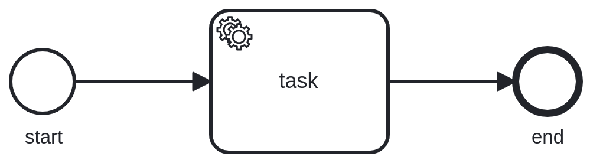

The processing load is generated by our own [benchmarking application](https://github.com/camunda/zeebe/tree/9e723b21b0e408fc2b97fd7d3f6b092af8e62dbe/benchmarks).

### Expected

When we scale up from 3 to 6 brokers, we expect a small impact on processing performance.
Request latency may increase slightly, some requests may time out and some will be rejected due to backpressure.
The overall throughput in terms of created and completed process instances as well as jobs may similarly decrease slightly.

### Actual

Following are screenshots of collected metrics.
The blue annotation marks the time where scaling occurred.

We see a short increase in process instance duration, meaning that some process instances were finished slightly slower than before.

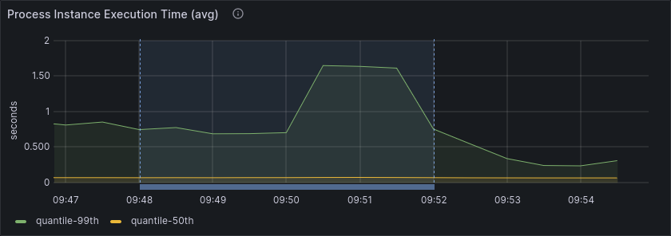

The throughput in terms of created and completed process instances and jobs remained very stable.

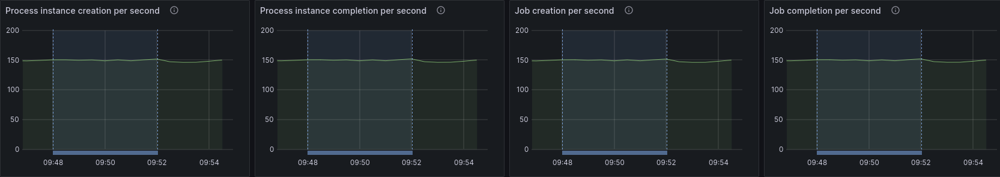

We see a small increase in requests timing out or getting rejected by backpressure.

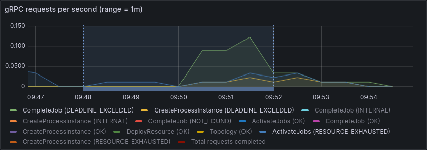

Overall, this matches our expectation and shows that scaling up has a small impact on processing performance.

## Scaling under load

Since scaling up is supposed to alleviate high processing load for brokers, it's important that it works even under high load.
For this test, we increased the load on the same cluster setup as before to 210 instead of 150 process instances per second.
This is roughly the maximum throughput that the 3 brokers with 6 partitions and replication factor 3 can handle.
We can see this from the relatively high backpressure, as well as high process instance duration.

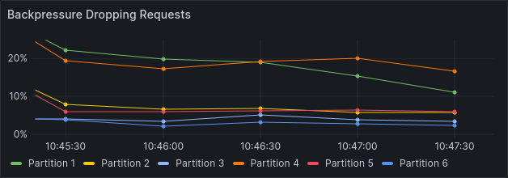

### Expected

We expect that scaling up to 6 brokers will still complete successfully, even under high load.
The time it takes until scaling is complete might be slightly higher.
The impact on processing performance, both in terms of throughput and latency, may be slightly larger than in the previous experiment.

### Actual

The process instance duration did not increase, and even decreased slightly.
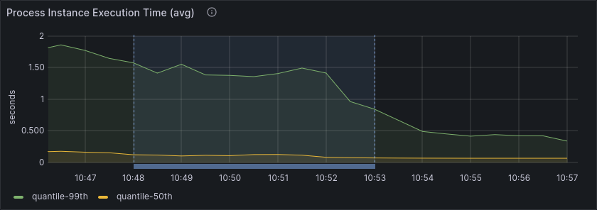

Similarly, the throughput in terms of created and completed process instances and jobs remained relatively stable.
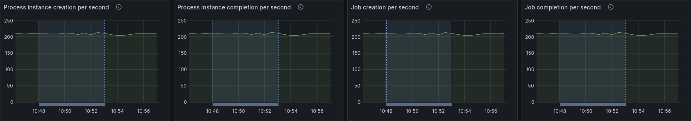

The number of failed requests increased slightly, but still well within an acceptable range.
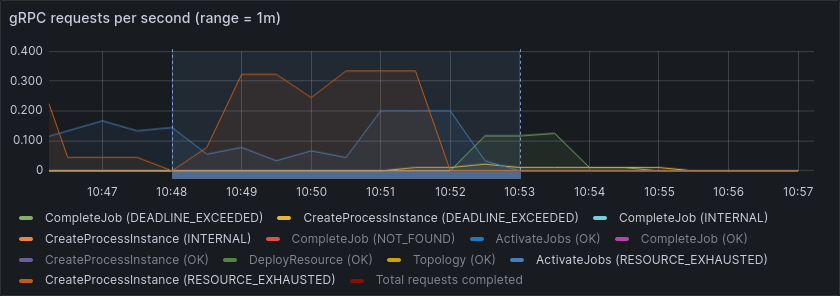

The scaling operation took 5 minutes, a good portion of which is waiting for the new brokers to get scheduled and start up.

Overall, this matches our expectation and shows that scaling can complete fast and with low impact on processing performance, even under high load.

## Scaling up to improve performance

The most obvious goal of scaling brokers is to unlock additional processing performance.
While vertical scaling is also a great option, this can hit limits imposed by your infrastructure provider.
For example, some machine types may offer great CPU performance but are severely limited in IOPS.
Additionally, vertical scaling is often more expensive than horizontal scaling.
It also comes with increased risk when a single machine fails because the remaining machines may already run at their limits and will then struggle to handle the additional load during failover.

To show how broker scaling can improve processing performance, we reused the same cluster setup as before.
We have 3 brokers, 6 partitions and replication factor 3.

The brokers are limited to 1.35 CPUs and 4GiB RAM each. 
They run with additional safety checks that are usually disabled in production and that slightly decrease the baseline processing performance.
Each broker uses a small 32GiB SSD for storage, limiting them to a few thousand IOPS.

We changed the processing load slightly to simulate a more realistic scenario.
The new process model consists of 10 tasks with two timers in-between, each delaying the process instance by 1 minute.

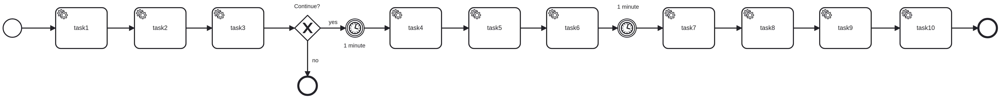

The processing load is generated by our own [benchmarking application](https://github.com/camunda/zeebe/tree/9e723b21b0e408fc2b97fd7d3f6b092af8e62dbe/benchmarks), initially starting 40 process instances per second.

This results in 400 jobs created and completed per second.

This stresses the 3 brokers and we see backpressure on all partitions.
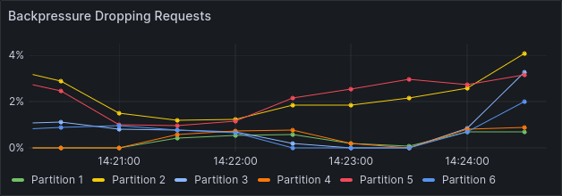

We also see a few jobs timing out, indicating that the cluster is unable to handle this load consistency:
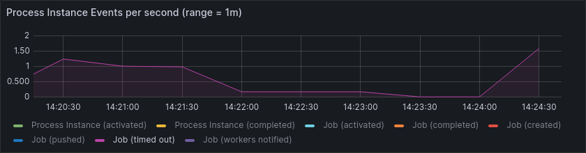

We also see that many jobs are active for much longer than 1 second, even though the workers could complete them immediately.
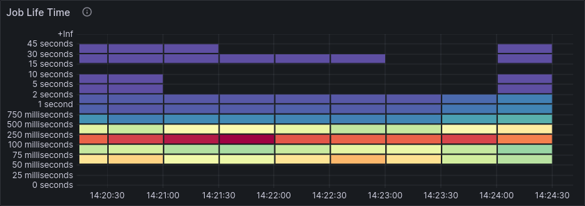

As hinted at before, much of this performance limit can be attributed to the limited IOPS of the small SSDs.
We see this in a very high commit and write latency, while the IOPS remain stable, right at the limit of what the SSDs can handle.

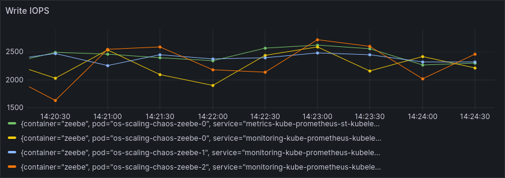
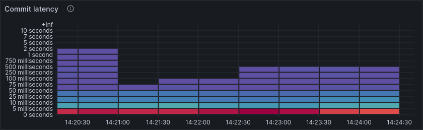
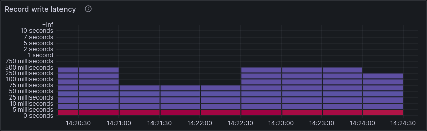

### Expected

When we scale up to 6 brokers, and thus distribute the partitions such that each broker is only leader for 1 instead of 2 partitions, we expect that processing performance improves.

As these things usually go, we don't expect a doubling in performance but aiming for a 1.5x improvement seems reasonable.

### Actual

Shortly after scaling up and after partition leadership has balanced, we see a significant improvement in backpressure.
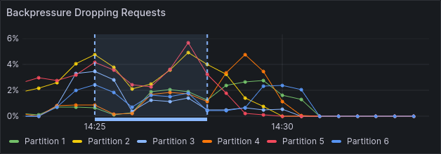

The job lifetime decreases dramatically, with most jobs now taking < 5ms from creation until completion.
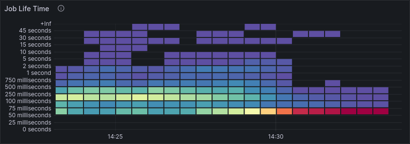

Overall processing latency improves similarly.
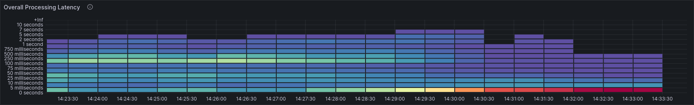

Much of this improvement can be attributed to the reduced IOPS.

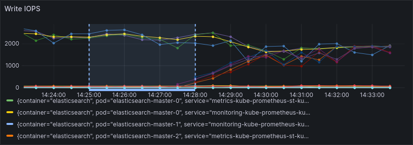

Commit and write latency improves accordingly.
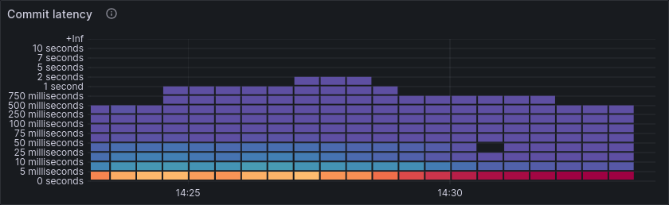
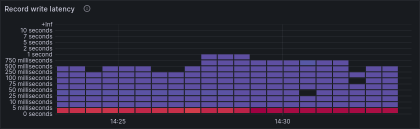

Another source for improved performance is reduced CPU load.
With 3 brokers being leader for 2 partitions each, they were hitting their CPU limits and got throttled by the underlying infrastructure.
With 6 brokers, each only being leader for 1 partition, the CPU load is reduced and brokers are no longer throttled.
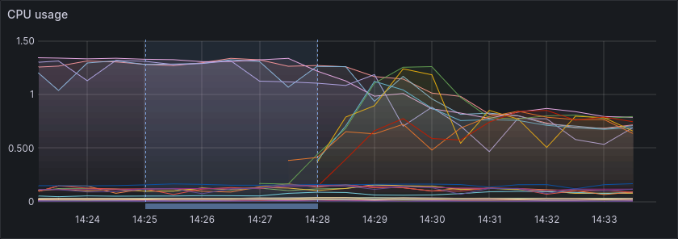

While this is already a success, we can push things further now.
We are able to increase the load from 40 to 65 process instances per second, resulting in 650 jobs created and completed per second.
This is a 1.6x improvement over the initial load while achieving similar backpressure.

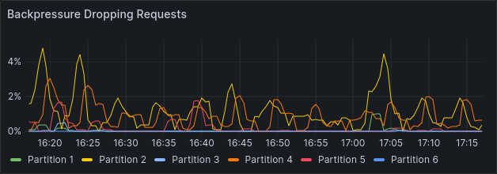

Job lifetime and overall processing latency is still better than before scaling up, even though load increased by 1.6x
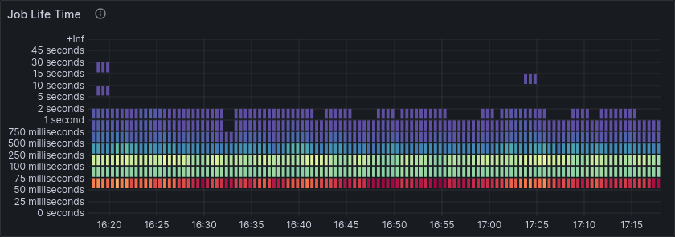
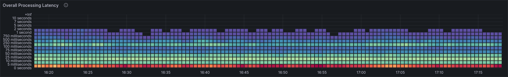

Overall, this shows that scaling up can improve processing performance significantly, especially when the initial cluster setup is resource limited and vertical scaling is not possible.