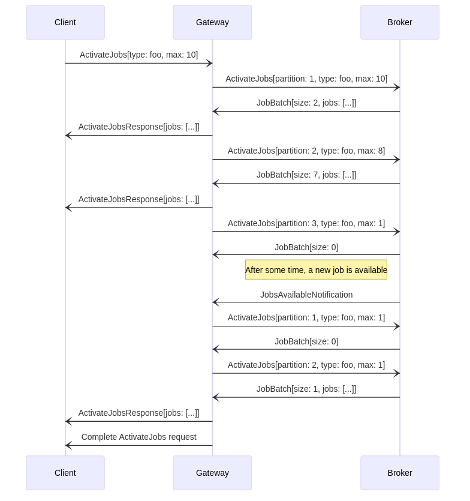
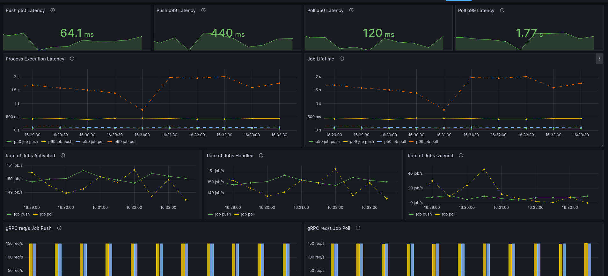
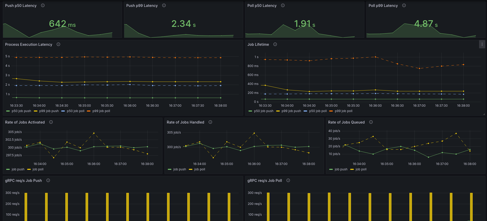

# Reducing the job activation delay

With the addition of end-to-end job streaming capabilities in Zeebe, we wanted to measure the improvements in job activation latency:

- How much is a single job activation latency reduced?
- How much is the activation latency reduced between each task of the same process instance?
- How much is the activation latency reduced on large clusters with a high broker and partition count?

Additionally, we wanted to guarantee that every component involved in streaming, including clients, would remain resilient in the face of load surges.

**TL;DR;** Job activation latency is greatly reduced, with task based workloads seeing up to 50% reduced overall execution latency. Completing a task now immediately triggers pushing out the next one, meaning the latency to activate the next task in a sequence is bounded by how much time it takes to process its completion in Zeebe. Activation latency is unaffected by how many partitions or brokers there in a cluster, as opposed to job polling, thus ensuring scalability of the system. Finally, reuse of gRPC's flow control mechanism ensure clients cannot be overloaded even in the face of load surges, without impacting other workloads in the cluster.

[Head over to the documentation to learn how to start using job push!](https://docs.camunda.io/docs/components/concepts/job-workers/#job-streaming)

<!--truncate-->

## Why job activation latency matters

Jobs are one of the fundamental building blocks of Zeebe, representing primarily all tasks (e.g. service, send, user), as well as some less obvious symbols (e.g. intermediate message throw event). In essence, they represent the actual unit of work in a process, the part users will implement, i.e. the actual application code. To reduce the likelihood of a job being worked on by multiple clients at the same time, it first goes through an activation process, where it is soft-locked for a specific amount of time. Soft-locked here means anyone can still interact with it - they can complete the job, fail it, etc. Only the activation is locked out, meaning no one else can activate the job until it's timed out.

This means that most workloads will consist mostly of job interactions: creation, activation, completion, etc. As such, it's critical to ensure clients receive jobs as fast as possible in order to make progress.

## Polling: a first implementation

Back in 2018, Zeebe introduced the `ActivateJobs` RPC for its gRPC clients, analogous to fetching and locking [external tasks in Camunda 7.x](https://docs.camunda.org/manual/7.20/user-guide/process-engine/external-tasks/). This endpoint allowed clients to activate fetch and activate a specific number of available jobs. In other words, it allowed them to _poll_ for jobs.

This was the first implementation to activate and work on jobs in Zeebe for multiple reason:

- It follows a simple request/response pattern
- Flow control is delegated to the client/user
- Most other approaches will build onto the building blocks used by polling
- You will likely implement polling anyway as a fallback for other approaches (e.g. pushing)

Grossly simplified, the implementation worked like this:

- A client initiates an `ActivateJobs` call by sending an initial request
- The gateway receives the request and validates it
- The gateway starts polling each partition synchronously one by one
- Whenever jobs are received from a partition, it forwards them to the client
- When all partitions are exhausted, or the maximum number of jobs have been activated, the request is closed

Already we can infer certain performance bottle necks based on the following:

- Every request - whether client to gateway, or gateway to broker - adds delay to the activation latency
- In the worst case scenario, we have to poll _every_ partition.
- The gateway does not know in advance which partitions have jobs available.
- Scaling out your clients may have adverse effects by sending out too many requests which all have to be processed independently
- [If you have a lot of jobs, you can run into major performance issues when accessing the set of available jobs](https://github.com/camunda/zeebe/issues/11813)

So if we have, say, 30 partitions, and each gateway-to-broker request takes 100ms, fetching the jobs on the last partition will take up to 3 seconds, even though the actual activation time on that partition was only 100ms.

Furthermore, if we have a sequence of tasks, fetching the next task in the sequence requires, in the worst case scenario, another complete round of polling through all the partitions, even though the task may already be available.

One would think a workaround to this issue would simply be to poll more often, but this can have an adverse impact: each polling request has to be processed by the brokers, and sending too many will simply flood your brokers and slow down all processing, further compounding the problem.

### Long polling: a second implementation

To simplify things, the Zeebe team introduced [long polling in 2019](https://github.com/camunda/zeebe/issues/2825). [Long polling](https://en.wikipedia.org/wiki/Push_technology#Long_polling) is a fairly common technique to emulate a push or streaming approach while maintaing the request-response pattern of polling. Essentially, if the server has nothing to send to the client, instead of completing the request it will hold it until content is available, or a timeout is reached.

In Zeebe, this means that if we did not reach the maximum number of jobs to activate after polling all partitions, the request is parked but not closed. Eventually when jobs are available, the brokers will make this information known to the gateways, who will then unpark the oldest request and start a new polling round.

This solved certain problems:

- We reduced the amount of requests sent by clients, thus reducing load on the cluster.
- In some cases, we reduced the latency when activating the next task in sequence.

However, there are still some issues:

- When receiving the notification we _still_ have to poll all partitions.
- If you have multiple gateways, all gateways will start polling if they have parked requests. Some of them may not get any jobs, but they will still have sent requests to brokers which still all have to be processed.
- In high load cases, you still need another client request/poll cycle to fetch the next task in a sequence.
- Scaling out your clients still add more load on the system, even if the poll less often

## Job push: third time's the charm

In order to solve these issues, the team decided to implement [a push-based approach to job activation](https://github.com/camunda/zeebe/issues/11231).

Essentially, we added a new `StreamActivatedJobs` RPC to our gRPC protocol, a so-called [server streaming RPC](https://grpc.io/docs/what-is-grpc/core-concepts/#server-streaming-rpc). In our case, this is meant to be a long-lived stream, such that the call is completed only if the client terminates it, or if the server is shutting down.

The stream itself has the following lifecycle:

- The client initiates the stream by sending a job activation request much like with the `ActivateJobs` RPC.
  - Since the stream is meant to be long lived, however, there is no upper bound on the number of jobs to activate.
- The gateway registers the new stream with all brokers in the cluster
  - Note that there is no direct connection between brokers and client; the gateway acts as a proxy for the client.
- When jobs are available for activation (e.g. on creation, on timeout, on backoff, etc.), the broker activates the job and pushes it to the gateway.
- The gateway forwards the job to the client.

[You can read more about the implementation as part of our docs.](https://docs.camunda.io/docs/components/concepts/job-workers/#how-it-works)

> Experienced readers will immediately spot that push-based approaches run the risk of overloading the client. Thanks to the built-in flow control facilities of gRPC, we can still ensure clients are resilient in the face of load surges. See [here for an explanation](https://docs.camunda.io/docs/components/concepts/job-workers/#backpressure).

This solved most, if not all, of the problems listed above:

- Brokers push jobs out immediately as they become available, removing the need for a gateway-to-broker request.
- Since the stream is long lived, there are almost no client requests required after the initial one.
- No need to poll every partition anymore.
- No thundering herd issues if you have many gateways all polling at the same time due to a notification.
- Scaling out your clients adds little to no load to the system, as idle clients simply do nothing.
- Even if you have a lot of jobs, in the average case, you never have to iterate over them and instead the broker pushes the job out on creation.

### Tests, results, and comparisons

In order to compare the advantages of pushing to polling, we three different experiments. 

> Note that all throughput measurements are in process instances executed per second, shortened to PI/s. Additionally, in the results shown below, dotted lines in graphs always refer to job polling measurements, and filled lines to job pushing.

#### Cluster specifications

Note that, unless specificed otherwise, we used the following clusters to run the tests: 3 brokers, 2 gateways, 3 partitions, replication factor 3.

##### Brokers

| Parameter | Value |
|-----------|-------|
| CPU request | 1350m |
| Memory request | 4Gi |
| CPU thread count | 3 |
| IO thread count | 3 |
| Disk type | [pd-ssd](https://cloud.google.com/compute/docs/disks#disk-types) |
| Disk size | 32Gi |

> Disk type, size, and vCPU count in GCP is used to determin your maximum IOPS.

##### Gateways

| Parameter | Value |
|-----------|-------|
| CPU request | 450m |
| Kubernetes memory request | 1Gi |
| Management thread count | 2 |

##### Workers

To simulate work, whenever workers receive an activated job, they will wait 50ms before completing it.

| Parameter | Value |
|-----------|-------|
| CPU request | 500m |
| Kubernetes memory request | 256Mi |
| Thread count | 10 |
| Max jobs active | 60 |

#### One task

As our baseline test, we ran a constant throughput of 150 PI/s of a single task process workload:

Since each job takes at least 50ms of work, the lower bound execution latency for this process is 50ms.

The results show a sharp decrease in both the p50 and p99 of the job lifetime (i.e. the time between creation and completion). Since this workload only consists of a single task, this is mirrored in the overall process execution latency. Overall, we see that switching to a push approach yields a p50 latency improvement of 50%, and a p99 improvement of 75%!

Additionally, we can see with job push that the Zeebe the p50 processing overhead is ~14ms, and the p99 ~390ms. For job polling, the p50 overhead is ~70ms, and the p99 overhead is ~1.7s.

#### Ten tasks

For our next test, we ran a constant throughput of 150 PI/s of a ten tasks sequence process:

Since each job takes at least 50ms of work, the lower bound execution latency for this process is 500ms.

The results show a sharp decrease in both the p50 and p99 of the job lifetime (i.e. the time between creation and completion). In this case, the process consists of several tasks, so the process execution latency is noticeably higher. But we can see that the p50 latency for job push is ~640ms. Overall, we see that switching to a push approach yields a p50 latency improvement of 30%, and a p99 improvement of 50%!

Additionally, we can see with job push that the Zeebe the p50 processing overhead is ~140ms, and the p99 ~1.8s. For job polling, the p50 overhead is ~1.4s, and the p99 overhead is ~4.3s.

#### Large cluster

In order to verify that the approach will scale along with the cluster size, we next compared polling and pushing with a cluster of 30 brokers and 30 partitions. Again, we tested with the single task process as above, and a constant throughput of 150 PI/s.

For job push, we see a greatly improved p99 - since each partition is doing less work than before with 3 partitions, we can achieve much more stable performance, with the p99 being quite close to the p50. 

For job poll however, we see the downside of having to poll each partition in turn: the p50 is worse than before, and even though the p99 is greatly improved, we can see a wave pattern where it will spike up to 3s, so a decrease compared to the smaller cluster.

#### Client backpressure & load surges

One of the downsides of switching to a push approach, unfortunately, is that the client is now at risk of receiving more work than it can safely handle.

Thankfully, HTTP/2 and gRPC both have mechanisms to ensure flow control for server streaming RPCs.

[You can find our tests results in a separate blog post](https://zeebe-io.github.io/zeebe-chaos/2023/11/30/Job-push-overloading).

## Further reading

You can read more about job push here:

- [Streaming job workers](https://docs.camunda.io/docs/components/concepts/job-workers/#job-streaming)
- [Job push for the Java client](https://docs.camunda.io/docs/apis-tools/java-client/job-worker/#job-streaming)
- [Job push for the Go client](https://docs.camunda.io/docs/apis-tools/go-client/job-worker/#job-streaming)
- [Job push for spring-zeebe](https://github.com/camunda-community-hub/spring-zeebe#enable-job-streaming)

Additionally, we've already written two other blog posts:

- [Client backpressure resilience](https://zeebe-io.github.io/zeebe-chaos/2023/11/30/Job-push-overloading)
- [Job stream fault tolerance](https://zeebe-io.github.io/zeebe-chaos/2023/12/06/Job-Push-resiliency)

