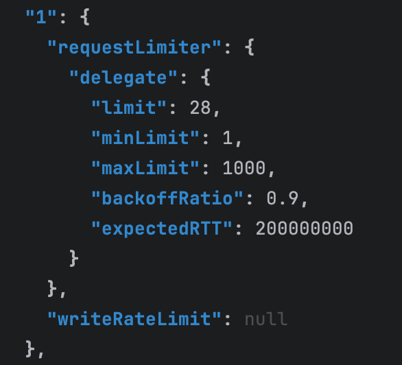

# Using flow control to handle bottleneck on exporting

Zeebe 8.6 introduces a new unified flow control mechanism that is able to limit user commands (by default it tries to achieve 200ms response times) and rate limit writes of new records in general (disabled by default).
Limiting the write rate is a new feature that can be used to prevent building up an excessive exporting backlog.
There are two ways to limit the write rate, either by setting a static limit or by enabling throttling that dynamically adjust the write rate based on the exporting backlog and rate.
In these experiments, we will test both ways of limiting the write rate and observe the effects on processing and exporting.

**TL;DR;**
Both setting a static write rate limit and enabling throttling of the write rate can be used to prevent building up an excessive exporting backlog.
For users, this will be seen as backpressure because processing speed is limited by the rate at which it can write processing results.

## Static write limit

We will construct a cluster under normal utilization and then artificially degrade the exporting process.
After this we will apply flow control settings to statically rate limit all writes.
The limit will be set slightly lower than the observed exporting rate.

For this we will use the flow control endpoint to temporarily configure the write rate limit.

To fetch the current configuration we can port forward to one of the zeebe pods and use the command:
```Shell
GET /actuator/flowControl
```



To configure the write rate limit we use the same endpoint, for example:

```
POST /actuator/flowControl
{
  "write": {
    "enabled": true,
    "limit": 400
  }
}
```

### Expected

When we start to degrade the exporting rate, we expect to see the exporting backlog to increase steadily.

Once a static write rate limit below the degraded exporting rate is applied, we expect fewer rates and slower processing.
The exporting backlog should decrease again until we eventually reach zero backlog again.
Backpressure should increase because processing has slowed down and some requests will be rejected by the write rate limit.

### Actual

After we artificially degrade the exporter performance, we see a constant increase in records not exported since the processing is still happening at the same rate.


After applying a static rate limit of 400 to be slightly lower than the observed 500-600 of the exporting rate, we see that the processing speed changes accordingly.


As expected we also see this reflected in backpressure that sees the user commands being rejected in a much higher portion.


We also observe that the backlog of records not exported starts to decrease at the rate of the difference between exported and written records.


These observations match our expectations and show that a static write rate limit can be used to prevent building up an excessive exporting backlog.

## Dynamic write rate throttling

Choosing a static write rate limit is not a full solution because we can't predict the actual exporting rates.
To address this, we can enable write rate throttling that will dynamically adjust the write rate based on the exporting backlog and rate.

To enable write rate throttling we can use the flow control endpoint again, for example:

```
POST /actuator/flowControl
{
  "write": {
    "enabled": true,
    "limit": 2500,
    "throttling": {
      "enabled": true,
      "acceptableBacklog": 100000,
      "minimumLimit": 100,
      "resolution": "15s"
    }
  }
}
```

### Expected

Similar to the first experiment, we expect to see the exporting backlog increase when we artificially degrade the exporting performance.
After enabling write rate throttling, we expect that the write rate is reduced significantly and eventually matches the exporting rate.
The reduced write rate should show up as backpressure.
Eventually, the exporting backlog settles at the configured acceptable backlog.

### Actual
Re-running the same setup, but using the throttling of writes with an acceptable backlog at 100,000  of not exported records, and a limit higher than our processing speed (so has to not impact the experience), we get the following results:


The orange underline metric displays when the throttled write rate is applied.


From the panels of the “Exporting per Partition” and “Number of records not exported”, we can observe that during the re-run of the experience our artificially degrading of the exporters only affected Exporters 2 and 3.
After we enable throttling, the backlog on these affected exporters starts to decrease as expected, later stabilizing on around 100,000 records.
This will drop back to 0 once we remove the artificial degrading of the exporters.


In the backpressure, we observe that this increases mostly on the affected partitions 2 and 3, and once the number of records not exported reaches the acceptable level this lowers slightly and stabilizes.


Finally, on the panel that shows the processing per partition, we also confirm the expectation that since one of the exporters was not affected by the artificial degrading of the exporter, some additional traffic gets re-routed to this partition, after the throttling gets applied.
On the affected partitions we see the processing decreasing slightly in line with the exporting on the same partitions.

Overall the observations match our expectations and show that write rate throttling succeeds and keeps exporting backlog limited.
