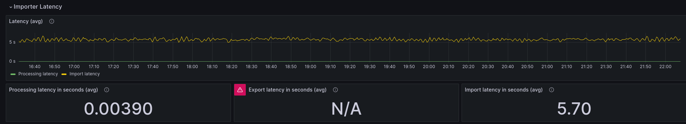
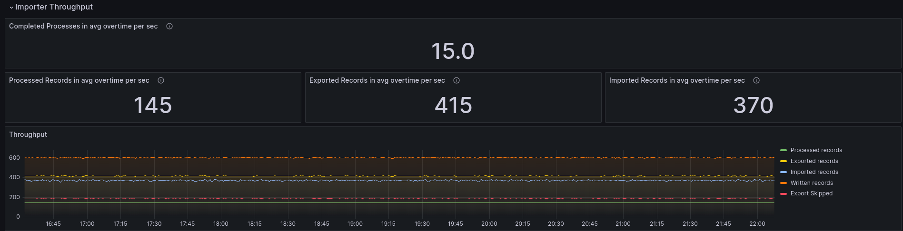
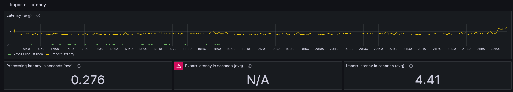
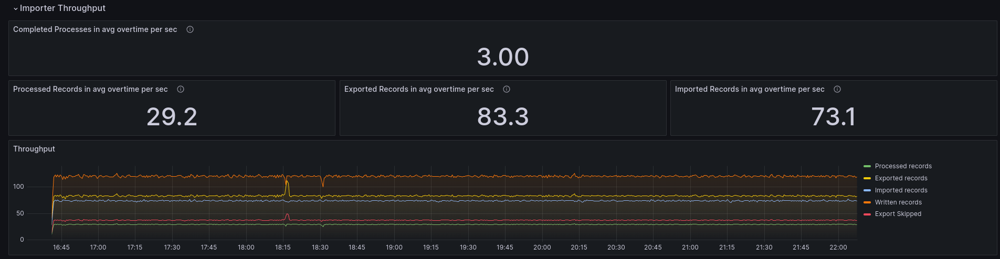

# Chaos Day Summary

:tada: Happy to announce that we are broadening the scope of our Chaos days, to look holistically on the whole Camunda Platform, starting today.
In the past Chaos days we had often a close look (or concentrated mostly) at the Zeebe performance and stability. 

Today, we will have a look at Operate import performance and how Zeebe processing throughput might affect (or not?) the throughput and latency of the Operate import. Is it really decoupled as we thought?

The import time is an important metric, as this represents the time until data from Zeebe processing is actually
visible to the User (excluding elasticsearch's indexing). It is measured from when the record is written to log, by the Zeebe processor, until Operate reads/imports it from Elasticsearch and coverts it into its own data model. We got much feedback (and experienced this on our own) that
Operate is often lagging behind or too slow, and of course we want to tackle and investigate this further.

The results from this Chaos day and related benchmarks should allow us to better understand how the current importing 
of Operate performs, and what its affects. Likely it will be a series of post to investigate this further. In general,
the data will give us some guidance and comparable numbers for the future to improve the importing time. See also related GitHub issue [#16912](https://github.com/camunda/camunda/issues/16912) which targets to improve such.

**TL;DR;** We have seen that Operate can be affected by the throughput of Zeebe. Surprisingly, Operate was faster to
import if Zeebe produces more data (with a higher throughput). One explanation of this is because Operate was then less
idle.

<!--truncate-->

## Chaos Experiment

As previously mentioned we will today look at the Operate's import latency and throughput. For that I have created a 
new Benchmark dashboard. That allows to see Zeebe and Operate performance together, at once. 

During building that dashboard I realized that we miss some detail metrics. For example the latency of writing and then exporting an record,
this is currently not measured. Furthermore, we have in Operate limited metrics, thus allows us only to see the average
latency, not p99 nor p90. This needs to be enhanced in the future.

We will run three benchmarks (base, high load and low load), and use again our [benchmark helm chart](https://github.com/zeebe-io/benchmark-helm) for such.
All defaults from the helm charts are used, if not other specified. The most important onces, which are statis over all benchmarks are listed below.

| Config | Value |
|-------|--------|
|Broker| 3|
|Partitions|3|
|Replication|3|
|Broker Mem|4G|
|Broker CPU| 1350m|
|Broker Disk|32g|
|Gateways|2|
|Gateway Mem|1G|
|Gateway CPU|450m|
|ES nodes| 3|
|ES CPU|2|
|ES Mem|6G|
|ES Disk|128g|

With the base we should see how the import performs normally. As base we will use the same configuration as we use in our weekly benchmarks, see
[here](https://github.com/camunda/camunda/blob/main/.github/workflows/zeebe-medic-benchmarks.yml#L78-L89).

We use the same applications that we use for our other benchmarks, code can be found [here](https://github.com/camunda/camunda/tree/main/zeebe/benchmarks/project)

The base looks like the following:

| Config  | Value     |
|---------|-----------|
| Starter | 5 PI/s    |
| Worker  | 1 Replica |
| Timer | 5  PI/s   |
| Publisher| 5   PI/s  |

The "Starter" deploys an process model with one task and creates instances in a rate of 5 process instance per second (PI/s). The "Worker" is handling such related tasks. The "Timer" deploys a process model with one timer catch event, and creates instances in a rate of 5 PI/s. The "Publisher" deploys a process model with a message catch event, and publishes messages in a rate of 5 per second.

Going out of the base configuration we are adjusting the rate to a higher value (multiplied by 10), and to a lower value (divided by 5). This means for the high load benchmark we will have a rate of 50 PI/s per application (~150 PI/s), and for the lower load we will have a rate of 1 PI/s per application (~3 PI/s). 

### Expected

With the base benchmark we will see how Operate is performance on a moderate load. As the importing of Operate is decoupled the higher load nor the lower load should have a significant impact of the importing time. It might be that due to higher load on Zeebe, and a slightly bigger backlog the import time might be a bit higher for Operate.

### Actual

#### Base

Helm install command

<pre>
helm install $(releaseName) $(chartPath) --render-subchart-notes \
 --set global.image.tag=ck-operate-benchmark-1ad8f375 \
 --set camunda-platform.zeebe.image.repository=gcr.io/zeebe-io/zeebe \
 --set camunda-platform.zeebe.image.tag=ck-operate-benchmark-1ad8f375 \
 --set camunda-platform.zeebeGateway.image.repository=gcr.io/zeebe-io/zeebe \
 --set camunda-platform.zeebeGateway.image.tag=ck-operate-benchmark-1ad8f375 \
 --set starter.rate=5 \
 --set worker.replicas=1 \
 --set timer.replicas=1 \
 --set timer.rate=5 \
 --set publisher.replicas=1 \
 --set publisher.rate=5 \
 --set camunda-platform.operate.enabled=true \
 --set camunda-platform.operate.image.repository=gcr.io/zeebe-io/operate \
 --set camunda-platform.operate.image.tag=ck-operate-benchmark \
 --set camunda-platform.elasticsearch.master.persistence.size=128Gi \
 --set camunda-platform.zeebe.retention.minimumAge=1d \
</pre>

With a moderate load (as described above) we can see how large the import delay already is.

The import latency from Operate is above 5 seconds.

As expected we can see that we complete 15 process instances per second. We process around 145 records per second, and export 415 records per second. Operate is only reading 370 records per second, because not all records are consumed by Operate. 

Here it might make sense to configure the exporter, to only export the important ones.

#### High load

Helm install command

<pre>
helm install $(releaseName) $(chartPath) --render-subchart-notes \
 --set global.image.tag=ck-operate-benchmark-1ad8f375 \
 --set camunda-platform.zeebe.image.repository=gcr.io/zeebe-io/zeebe \
 --set camunda-platform.zeebe.image.tag=ck-operate-benchmark-1ad8f375 \
 --set camunda-platform.zeebeGateway.image.repository=gcr.io/zeebe-io/zeebe \
 --set camunda-platform.zeebeGateway.image.tag=ck-operate-benchmark-1ad8f375 \
 --set starter.rate=50 \
 --set worker.replicas=3 \
 --set timer.replicas=1 \
 --set timer.rate=50 \
 --set publisher.replicas=1 \
 --set publisher.rate=50 \
 --set camunda-platform.operate.enabled=true \
 --set camunda-platform.operate.image.repository=gcr.io/zeebe-io/operate \
 --set camunda-platform.operate.image.tag=ck-operate-benchmark \
 --set camunda-platform.elasticsearch.master.persistence.size=128Gi \
 --set camunda-platform.zeebe.retention.minimumAge=1d \
</pre>

Looking at the high load benchmark, we can see something suprisingly. The Operate import latency has been decreased. From ~5.7 to 4.4 seconds, which is a 30% improvement. The Zeebe processing latency has been increased due to the higher load.

We can see that Zeebe is not able to handle ~150 instances, this can have multiple causes, to few workers or other configurations, but this is irrelevant for today's benchmark.

A huge amount of records (3158) are imported by Operate per second, with the same configuration as for the base benchmark. It looks like there is still room (we might investigate this further next time).

#### Low load

Helm install command

<pre>
helm install $(releaseName) $(chartPath) --render-subchart-notes \
 --set global.image.tag=ck-operate-benchmark-1ad8f375 \
 --set camunda-platform.zeebe.image.repository=gcr.io/zeebe-io/zeebe \
 --set camunda-platform.zeebe.image.tag=ck-operate-benchmark-1ad8f375 \
 --set camunda-platform.zeebeGateway.image.repository=gcr.io/zeebe-io/zeebe \
 --set camunda-platform.zeebeGateway.image.tag=ck-operate-benchmark-1ad8f375 \
 --set starter.rate=1 \
 --set worker.replicas=1 \
 --set timer.replicas=1 \
 --set timer.rate=1 \
 --set publisher.replicas=1 \
 --set publisher.rate=1 \
 --set camunda-platform.operate.enabled=true \
 --set camunda-platform.operate.image.repository=gcr.io/zeebe-io/operate \
 --set camunda-platform.operate.image.tag=ck-operate-benchmark \
 --set camunda-platform.elasticsearch.master.persistence.size=128Gi \
 --set camunda-platform.zeebe.retention.minimumAge=1d \
</pre>

Unexpected or even counterintuitive is that on a lower load the import time went up again or is similar to the base benchmark ~5.7 seconds to import a record.

Zeebe is reaching the 3 PI/s and exporting again a bit more than Operate is importing, as describe before likely to some filters.

### Result

We were not able to prove that Zeebe throughput doesn't affect Operate import time. What we have seen is that higher throughput on Zeebe side positive affects Operates import time (import delay decreases from 5.7 seconds to 4.4 seconds). This was not just a short outlier, it was shown howe long period of time.

It is likely related to how Zeebe exporting and Operate importing works together. As Zeebe exporting collects several data before it is sending it to Elasticsearch. Either if a certain time is due or a certain amount is reached. Operate might be idle from time to time and "sleep" and wake up every certain seconds to import again.

We have to investigate this further to understand all the details, but I think this as already an interesting learning.

## Next

In the following I listed some potential improvements and investigations we might want to do next:

* We need better metrics in Operate, e.g. histograms to have p99, p90 for import latency
* We need the measure the export latency, to better understand and compare how long the import time really is
* Investigate whether we can better configure exporting and importing, to reduce delays?
* Can we filter more records and this affects positively the importing?

