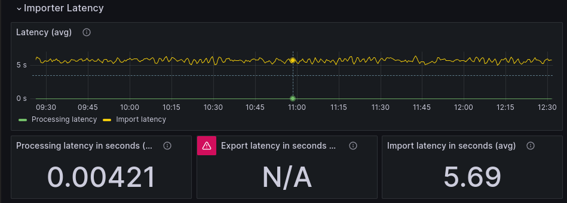
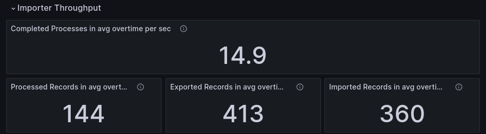
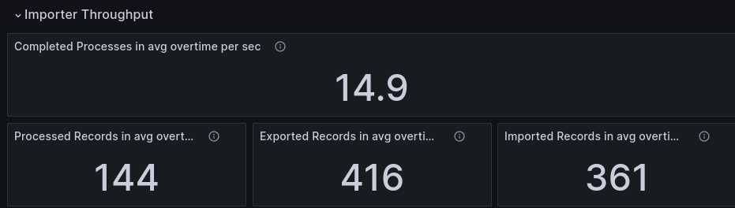
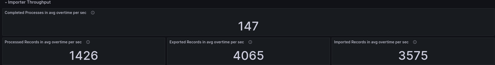
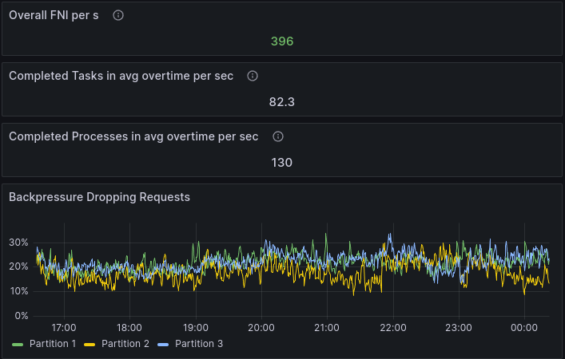
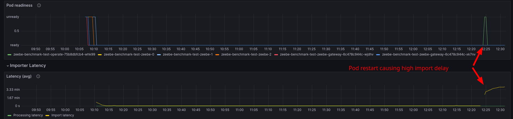

# Chaos Day Summary

[In our last Chaos Day](../2024-08-16-Operate-load-handling/index.md) we experimented with Operate and different load (Zeebe throughput). We observed that higher load caused a lower latency in Operate. The conclusion was that it might be related to Zeebe's exporting, which is effected by a higher load.

In today's chaos day we want to verify how different export and import configurations can effect the importing latency. 

**TL;DR;** We were able to decrease the import latency by ~35% (from 5.7 to 3.7 seconds), by simply reducing the `bulk.delay` configuration. This worked on load and even higher load, whereas on higher load we were even able to improve Zeebe's throughput by ~13%.

<!--truncate-->

## Background 

_In the following I want to shortly explain a bit more of the background of the exporting and importing into Operate. If you are already aware feel free to jump to the [next section](#chaos-experiment)._

---

To understand how the importing of Operate is affected and works, we first have to take a look at Zeebe.

Zeebe exports data to Elasticsearch via it's Elasticsearch Exporter. The exporter collects data before sending it to Elasticsearch in bulk requests. The amount of data, which is collected in the exporter, is configurable and per default set to 1000 records per batch/bulk. Additionally, there is an memory limit which is taken into account that is set to 10 MB. When the bulk request is reaching that size, the request is sent as well. To cover cases of low load, there is a delay option, which is per default set to 5 seconds. This means, every 5 seconds the bulk request is sent, even if it is not full.

This explains also the results from [our last Chaos Day](../2024-08-16-Operate-load-handling/index.md), where the import latency was around 5 seconds on lower load. 

In the following we have written down the sequence of steps (or lifecycle?) of a command, and it's resulting events, until it is visible to the user in Operate. This should allow us to better understand how the import latency is affected, and what we might want to tune and experiment further.

```
User Command is sent to Gateway 
-->Gateway sents Command to right Broker
---->Broker processes command and produces events
------>Events are exported by Broker to ES (worst case: 5s flush) 
-------->ES refreshes after one second
---------->Operate import processing/rewriting data
------------>ES refreshes after one second
-------------->Operate can query the data -> User can see the data 
```

This means we might have the following minimum delay: 
```
delay = 2 seconds (due to ES refresh)
      + (5 seconds from exporter on low load)
      + network delay 
      + processing delay 
      + Exporter and Operate data un/marshaling/processing
```

Today, we will experiment with the Elasticsearch exporter configurations to improve the import latency.

## Chaos Experiment

As we have seen [before](../2024-08-16-Operate-load-handling) high load affects the importing latency positively. The thesis is that this is due to the export flush delay, which is mostly affecting the exporting on lower load.

Today we want to prove the following: 

> **Hypothesis**
> 
> When we set the exporting/flush delay to a lower value (fex. 1 second), we are improving the import latency for lower load scenarios without affecting the system negatively.

We can define the following `unknowns`, that we want to explore further as well:

 * It is not clear how lower flush delay affects the system on higher load. 
 * It is not clear how smaller values (under 1 seconds) for the flush delay affects the system, no matter of high or low load.

### Expected

1. When we set the exporting/flush delay to a lower value (fex. 1 second), we are improving the import latency for lower load scenarios without affecting the system negatively.
2. When we set the exporting/flush delay to a lower value (fex. 1 second), we are improving the import latency for higher load scenarios, **but decreasing the import throughput**
3. When we set the exporting/flush delay to a small value (under 1 second), we are affecting the import throughput negatively

### Actual

As always we set a base installation up to compare against. The load is moderate to low which we can already use for our next experiment. Furthermore, we can compare the data from the [last chaos day](../2024-08-16-Operate-load-handling).

<details>
<summary>Base: Helm install command</summary>
<pre>
helm install $(releaseName) $(chartPath) --render-subchart-notes \
 --set global.image.tag=ck-operate-benchmark-1ad8f375 \
 --set camunda-platform.zeebe.image.repository=gcr.io/zeebe-io/zeebe \
 --set camunda-platform.zeebe.image.tag=ck-operate-benchmark-1ad8f375 \
 --set camunda-platform.zeebeGateway.image.repository=gcr.io/zeebe-io/zeebe \
 --set camunda-platform.zeebeGateway.image.tag=ck-operate-benchmark-1ad8f375 \
 --set starter.rate=5 \
 --set worker.replicas=1 \
 --set timer.replicas=1 \
 --set timer.rate=5 \
 --set publisher.replicas=1 \
 --set publisher.rate=5 \
 --set camunda-platform.operate.enabled=true \
 --set camunda-platform.operate.image.repository=gcr.io/zeebe-io/operate \
 --set camunda-platform.operate.image.tag=ck-operate-benchmark \
 --set camunda-platform.elasticsearch.master.persistence.size=128Gi \
 --set camunda-platform.zeebe.retention.minimumAge=1d \
</pre>
</details>

We see similar results as on the [last Chaos day](../2024-08-16-Operate-load-handling/index.md#base).




We are able to import around 360 records per second, while Zeebe exports 413. Be aware that some are ignored by Operate.
A record has on average a delay of 5.69 seconds from written by Zeebe to imported by Operate (and written into the
end Elasticsearch index).

#### First experiment: Lower flush delay

> When we set the exporting/flush delay to a lower value (fex. 1 second), we are improving the import latency for lower load scenarios without affecting the system negatively.

To reduce the exporter flush delay we use the following configuration:

```yaml
exporters:
  elasticsearch:
    args:
      bulk:
        delay: 1
```

This can be set in our [benchmark-helm](https://github.com/zeebe-io/benchmark-helm) directly via: `--set zeebe.broker.exporters.elasticsearch.args.bulk.delay=1`

<details>
<summary>Lower flush delay: Helm install command</summary>
<pre>
helm install $(releaseName) $(chartPath) --render-subchart-notes \
 --set global.image.tag=ck-operate-benchmark-1ad8f375 \
 --set camunda-platform.zeebe.image.repository=gcr.io/zeebe-io/zeebe \
 --set camunda-platform.zeebe.image.tag=ck-operate-benchmark-1ad8f375 \
 --set camunda-platform.zeebeGateway.image.repository=gcr.io/zeebe-io/zeebe \
 --set camunda-platform.zeebeGateway.image.tag=ck-operate-benchmark-1ad8f375 \
 --set starter.rate=5 \
 --set worker.replicas=1 \
 --set timer.replicas=1 \
 --set timer.rate=5 \
 --set publisher.replicas=1 \
 --set publisher.rate=5 \
 --set camunda-platform.operate.enabled=true \
 --set camunda-platform.operate.image.repository=gcr.io/zeebe-io/operate \
 --set camunda-platform.operate.image.tag=ck-operate-benchmark \
 --set camunda-platform.elasticsearch.master.persistence.size=128Gi \
 --set camunda-platform.zeebe.retention.minimumAge=1d \
 --set zeebe.config.zeebe.broker.exporters.elasticsearch.args.bulk.delay=1
</pre>
</details>




With setting the `bulk.delay` to one second, we were able to reduce the import latency by ~2 seconds, from 5.69 to 3.68 seconds.
That is a 35% decrease, while other factors are stay the same. We can observe that the throughput stays the same (while of course the load is rather moderate-to-low).

This proved our first hypothesis from above. :white_check_mark:

#### Second Experiment: Lower delay with higher load

> When we set the exporting/flush delay to a lower value (fex. 1 second), we are improving the import latency for higher load scenarios, **but decreasing the import throughput**

Similar to the first experiment we set the delay to one second, and increase the load in the same way as we did
[here](../2024-08-16-Operate-load-handling/index.md#high-load) before.

<details>
<summary>Lower flush delay with high load: Helm install command</summary>
<pre>
helm install $(releaseName) $(chartPath) --render-subchart-notes \
 --set global.image.tag=ck-operate-benchmark-1ad8f375 \
 --set camunda-platform.zeebe.image.repository=gcr.io/zeebe-io/zeebe \
 --set camunda-platform.zeebe.image.tag=ck-operate-benchmark-1ad8f375 \
 --set camunda-platform.zeebeGateway.image.repository=gcr.io/zeebe-io/zeebe \
 --set camunda-platform.zeebeGateway.image.tag=ck-operate-benchmark-1ad8f375 \
 --set starter.rate=50 \
 --set worker.replicas=1 \
 --set timer.replicas=1 \
 --set timer.rate=50 \
 --set publisher.replicas=1 \
 --set publisher.rate=50 \
 --set camunda-platform.operate.enabled=true \
 --set camunda-platform.operate.image.repository=gcr.io/zeebe-io/operate \
 --set camunda-platform.operate.image.tag=ck-operate-benchmark \
 --set camunda-platform.elasticsearch.master.persistence.size=128Gi \
 --set camunda-platform.zeebe.retention.minimumAge=1d \
 --set zeebe.config.zeebe.broker.exporters.elasticsearch.args.bulk.delay=1
</pre>
</details>




We can see that the latency has been increased a bit, versus the lower load benchmark, but it has improved compared to the
benchmark [the last chaos day](../2024-08-16-Operate-load-handling/index.md#high-load). :i: Interesting factor is that it seems that the throughput from Zeebe has changed as well, that in consequence increased the import throughput.

Looking into it further, we can see that the job and process instance creation and completion has changed by ~13-18 percent. Before we had around 130 process instance completion per second.



In the recent benchmark we almost reach our target load (150 PI/s) with 147 process instance completions per second.


The reason seem to be the different backpressure, which has been decrease from ~20 % to 5-10%. This might be because our backpressure strategy has recently changed and now takes exporting into account. See also [related chaos day about this topic](../2024-07-25-Using-flow-control-to-handle-bottlenecked-exporting/index.md).

##### Additional finding

A interesting additional observation finding has been done. When the Operate import fails or restarts (that can easily happen with preemptive nodes), then the importer backlog can be significant. This is especially an issue on higher constant load.



In our benchmark after failing import it took ~20 minutes until the backlog was processed and the import latency was back to normal.


This shows that Operate, especially the importer is quite sensitive to restarts. This is likely to be changed and improved when
Operates importing mechanism is moved into Zeebe as separate exporter, see [related GH issue](https://github.com/camunda/camunda/issues/16912).

On lower load, the impact of an importer restart is negligible, as we can see below.


#### Third experiment

> When we set the exporting/flush delay to a small value (under 1 second), we are affecting the import throughput negatively

We were not able to set the `bulk.delay` to a smaller value then 1 second, as the configuration only accepts longs. The values seem to be expected to be seconds. When setting it to zero, no improvement has been observed (versus one second).

## Potential improvements

* Allow to configure `bulk.delay` in non-second format (be able to specify the format)
* Importing is highly affected by pod restarts, can cause issues on higher load, due to growing backlog. Making import idempotent, and scaling importers would help.


