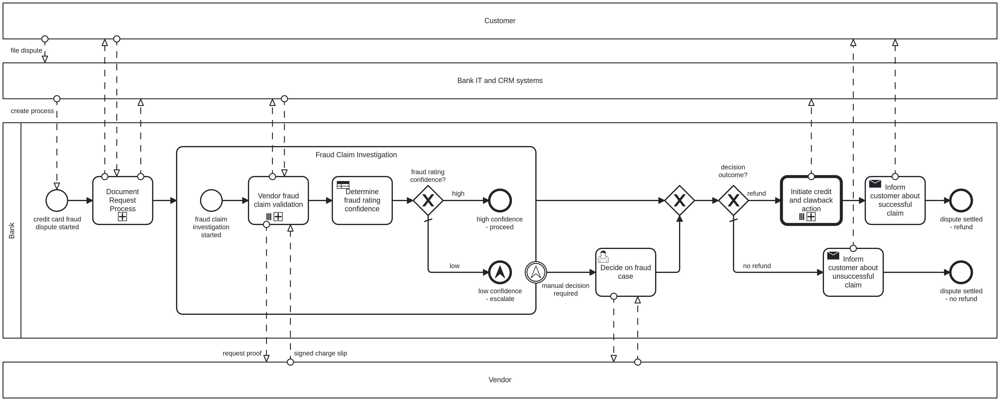

# Chaos Day Summary

Our first goal is to further improve and make the benchmarks more 
realistic, by using a process model that covers the average process 
orchestration use case and a payload that reflects the reality. 

The second goal is to use these benchmarks to derive new minimal viable 
cluster configuration that can handle at least 40 process instances per 
second, while maintaining low backpressure and low latency.

The third goal is to scale out minimal viable cluster configuration 
resources linearly and see if the performance scales accordingly.

**TL;DR;**

We used a realistic process model to benchmark our system and derived a new 
cluster configuration based on previous requirements. 

When we scale this base configuration linearly we see that the performance
increases significantly more than linearly, while maintaining low 
backpressure and low latency.

## Chaos Experiment

### Expected

We do expect that we can find a cluster configuration that can handle at 40 
tasks second to be significantly reduced in resources in relation to our 
smaller clusters ([G3-S HA Plan](https://accounts.cloud.dev.ultrawombat.com/consoleadmin/clusterplans/0af08654-28ec-413a-8dcf-c5938e828ddd)) since 
these can process 50-70 tasks per second. 

We also expect that we can scale this base configuration linearly, and that 
the processing tasks rate to grow initially a bit faster than linearly due to 
the lower relative overhead, and if we keep expanding further to flatten due 
to the partition count being a bottleneck.

### Actual

#### Benchmarking a realistic process model

In our previous benchmarks we used a simple process model with a single 
task with several decision symbols. For the newer benchmarks we wanted to 
increase significantly the number of symbols and service tasks used as well 
to make the load more configurable.

For this realistic benchmark, we tried to use a situation closer to a real 
world scenario, where a bank customer complaint dispute handling process is
handled by several service tasks. Additionally, fraud claim 
investigation part of the process is unfolded in multiple instances. This 
can be configured in our instance payload by how many disputes we send to 
scale up or down the number of multi instances in the fraud claim 
investigation, which enables to scale the load of each process instance.

Finally, in deploying our benchmark we can define the number of instances 
started per second. After choosing a uniform payload for all tests we can 
start benchmarking or different cluster configurations where we measure the 
performance by how many process instances are completed per second, while 
maintaining low backpressure (bellow 10%) as to preserve user experience. 

#### Minimal Viable Requirements for our Cluster

For our minimal viable cluster configuration we determined though several 
metrics on users and our own experience that we need to be able to handle 
at least 40 process instances per second, or 3.5 million tasks per day.

Other metrics that we want to preserve and keep track are the backpressure 
to preserve user experience, guarantee that exporting speed can keep up 
with the processing speed, write to import latency which tells us how long 
it takes for a record to be written to being imported by our other 
apps such as the operator.

#### Reverse Engineering the Cluster Configuration

For our new configurations the only resources that we are going to change 
are the ones relevant to the factors described above. These are the 
resources allocated to our zeebe-brokers, gateway and elasticSearch.

Our starting point in resources was the configuration for our [G3-S HA Plan](https://accounts.cloud.dev.ultrawombat.com/consoleadmin/clusterplans/0af08654-28ec-413a-8dcf-c5938e828ddd) 
as this already had the capability to significantly outperform the current 
goal of 40 tasks per second (close to 50-70 in reality). 

The next step was to deploy our realistic benchmark, with a payload of 5 
costumer disputes per instance and start 2 instances per second, this 
generated approximately 40 tasks per second.

After this we reduced the resources iteratively until we saw any increase 
in backpressure, given that no there was no backlog of records, and no 
significant increase in the write to import latency.

The results for our new cluster are specified bellow in the tables, where 
our starting cluster configuration is the G3-S HA Plan and the new 
configuration cluster is the G3 - BasePackage HA.

| G3-S HA                | CPU Limit | Memory Limit in GB |
|------------------------|-----------|--------------------|
| operate                | 2         | 2                  |
| operate.elasticsearch  | 6         | 6                  |
| optimize               | 2         | 2                  |
| tasklist               | 2         | 2                  |
| zeebe.broker           | 2.88      | 12                 |
| zeebe.gateway          | 0.9       | 0.8                |
| zeebeAnalytics         | 0.4       | 0.45               |
| connectorBridge        | 0.4       | 0.512              |
| **TOTAL**              | **16.58** | **25.762**         |
[Cluster Plan](https://accounts.cloud.dev.ultrawombat.com/consoleadmin/clusterplans/0af08654-28ec-413a-8dcf-c5938e828ddd)

| G3 - BasePackage HA   | CPU Limit | Memory Limit in GB |
|-----------------------|-----------|--------------------|
| operate               | 1         | 1                  |
| operate.elasticsearch | 3         | 4.5                |
| optimize              | 1         | 1.6                |
| tasklist              | 1         | 1                  |
| zeebe.broker          | 1.5       | 4.5                |
| zeebe.gateway         | 0.6       | 1                  |
| zeebeAnalytics        | 0.2       | 0.3                |
| connectorBridge       | 0.4       | 1                  |
| **TOTAL**             | **8.7**   | **14.9**           |
[Cluster Plan](https://accounts.cloud.dev.ultrawombat.com/consoleadmin/clusterplans/9b8b444a-636e-48cf-be83-2387a0d11aba)

##### Reduction in Resources for our Minimal Viable Cluster

|                       |   CPU Reduction (%) |   Memory Reduction (%) |
|:----------------------|--------------------:|-----------------------:|
| zeebe.broker          |             47.92   |                   62.5 |
| zeebe.gateway         |             33.33   |                  -25.0 |
| operate.elasticsearch |             50.00   |                   25.0 |

Total cluster reduction: 

|                       | G3-S HA | G3 - BasePackage HA | Reduction (%) |
|:----------------------|--------:|--------------------:|--------------:|
| CPU Limits            |   16.58 |                 8.7 |            48 |
| Memory Limits         |  25.762 |                14.9 |            42 |

The process of reducing the hardware requirements was donne initially by 
scaling down the resources of the zeebe-broker, gateway and elasticSearch. 
The other components were left untouched, as they had no impact in our key 
metrics, and were scaled down later in separate experiences to maintain 
user experience.

#### Scaling out the Cluster

Now for the scaling procedure we intend to see if we can linearly increase 
the allocated resources and having a corresponding performance increase, 
while keeping the backpressure low, low latency, and user experience.

For this we started with the G3 - BasePackage HA configuration and 
incremented the load again until we saw any increase in backpressure, 
capture our key metrics and repeated the process for the cluster 
configuration resources respectively multiplied by 2x, 3x, and 4x.

This means that the resources allocated for our clusters were:

|               |   Base 1x |   Base 2x |   Base 3x |   Base 4x |
|:--------------|----------:|----------:|----------:|----------:|
| CPU Limits    |       8.7 |      17.4 |      26.1 |      34.8 |
| Memory Limits |      14.9 |      29.8 |      44.7 |      59.6 |

The results in the table bellow show the performance of our several cluster 
configurations:

|                          | Base 1x | Base 2x | Base 3x | Base 4x |
|:-------------------------|--------:|--------:|--------:|--------:|
| Process Instances/s      |       2 |       6 |       9 |      20 |
| Tasks/s                  |      40 |     108 |     160 |     360 |
| Average Backpressure     |      0% |      5% |      9% |      2% |
| Write-to-Import Latency  |    2.8s |      9s |      3s |  2.5min |
| Write-to-Process Latency |    40ms |   200ms |   240ms |    15ms |
| Records Processed        |     750 |    2100 |    3700 |    6750 |
| Records Exported         |     700 |    1900 |    3200 |    5700 |

This first observations is that the performance scales particularly well by 
just adding more resources to the cluster, particularly for a linear 
increase of the resources the performance as measured by tasks completed 
increases slightly more than linearly. This might be due to the fact that 
for a 2x of the resources the application overhead of the system is 
reduced in proportion to the resources added.

This a very good result as it means that we can scale our system linearly 
(at least initially) to handle the expected increase in loads.

Importantly, the backpressure is kept low, and the write-to-import latency 
only increases significantly at the last 4x configuration when kept at this 
max rate. This might imply that a 4x configuration the amount records 
generated starts to be too much for either elasticSearch or our web apps 
that import these records to handle. Some further investigation could be 
done here to investigate the bottleneck.

Another metric also relevant but not shown in this table is the backlog of 
records not exported, which kept at almost null through all the experiments 
conducted.

### Bugs found

During the initial tests, we had several OOM errors in the gateways pods. 
After some investigation, we found that this was exclusive to the Camunda 8.
6.0 version, which consumes more memory in the gateway than the previous versions. This 
explains why the gateway memory limits were the only resource that was 
increased in the new reduced cluster configuration. 

