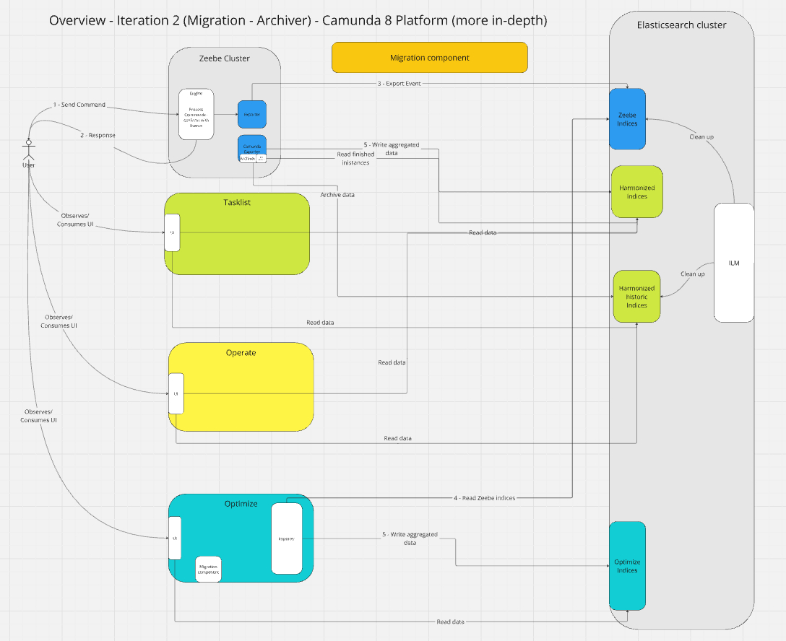
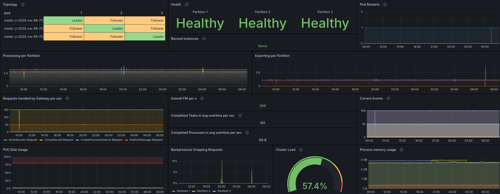
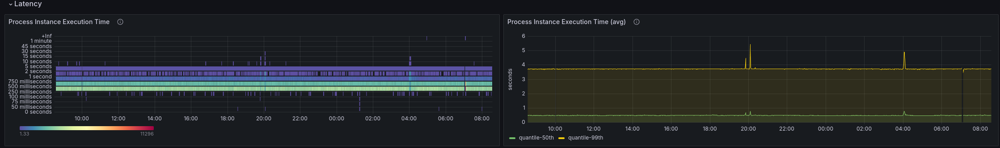
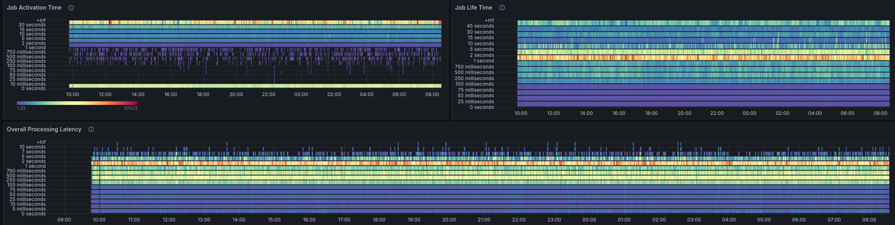
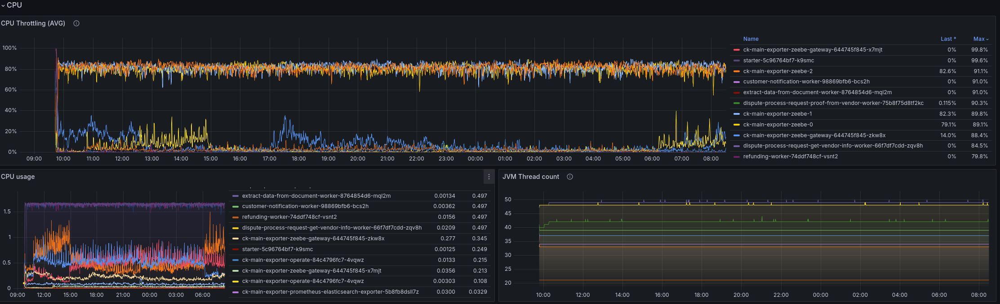
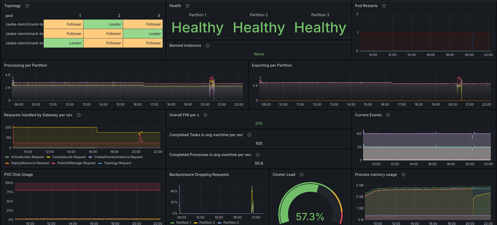
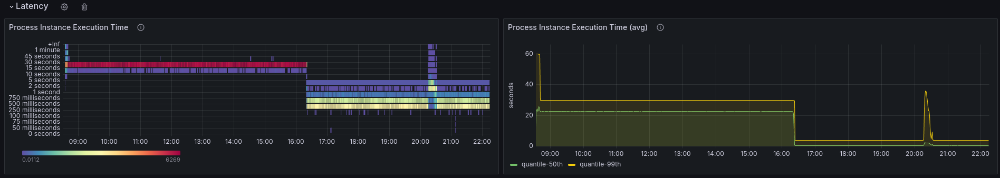
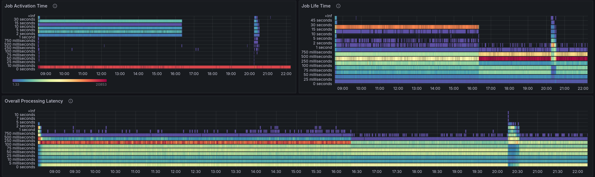
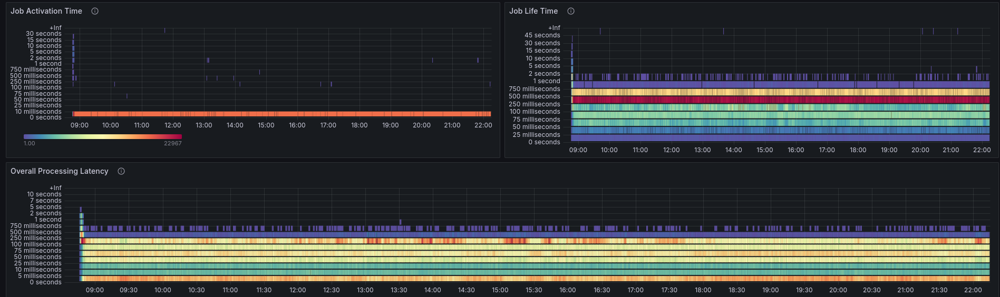

# Chaos Day Summary

In our [last Chaos day](../2024-10-24-Camunda-Exporter-MVP/index.md) we experimented with the Camunda Exporter MVP. After our MVP we continued with Iteration 2, where we migrated the Archiver deployments and added a new Migration component (allows us to harmonize indices).

Additionally, [some fixes and improvements](https://github.com/zeebe-io/benchmark-helm/pull/202) have been done to the realistic benchmarks that should allow us to better compare the general performance with a realistic good performing benchmark.

Actually, this is what we want to explore and experiment with today.

* Does the Camunda Exporter (since the last benchmark) impact performance of the overall system? 
  * If so how? 
* How can we potentially mitigate this?

**TL;DR;** Today's, results showed that enabling the Camunda Exporter causes a 25% processing throughput drop. We identified the CPU as a bottleneck. It seems to be mitigated by either adjusting the CPU requests or removing the ES exporter. With these results, we are equipped to make further investigations and decisions.  

<!--truncate-->

## Benchmarks

As in the [last Chaos day](../2024-10-24-Camunda-Exporter-MVP/index.md) we use the new realistic benchmarks, that contain a much more complex process model and workload.
We recently found some smaller issues in our benchmarks, related to [CPU throttling](https://github.com/zeebe-io/benchmark-helm/pull/204) and [undersized workers](https://github.com/zeebe-io/benchmark-helm/pull/202), these issues have been fixed. This allowed us to reach a much better workload/throughput on our weekly benchmarks, which we take here as a base for our comparison.

The newest benchmark helm charts have been updated to the first [Camunda Platform alpha1](https://github.com/zeebe-io/benchmark-helm/releases/tag/zeebe-benchmark-0.3.8), which includes the Camunda Exporter.

Today we run the following benchmarks

 * Use Camunda Exporter, with disabled Importer in our benchmark
 * Use Camunda Exporter, with disabled Importer and disabled ES exporter
 * Use Camunda Exporter, with disabled Importer and higher CPU on brokers

### Benchmark: Base

As we can see we can have a healthy cluster with a stable load where we reach to complete ~50 process instances, with that ~100 tasks, per second. All of this with a low backpressure. 

### Benchmark: Camunda Exporter

When running our benchmarks with the Camunda Exporter the first thing we can observe is that the backpressure is much higher and the throughput went down by ~25-30%. We are now able to complete ~36 process instances, meaning 72 tasks, per second.

#### Latency

Looking at the processing latency we can observe a significant increase

##### Base

##### Camunda Exporter

The process instance execution p99 has been increased from ~4s to +60s, the p50 went from ~0,5s to ~3,7s.

#### CPU

Investing this, we can look at the CPU. On our base Benchmark, we have CPU throttling at around 20%.

When comparing this with the Camunda Exporter benchmark, we can see that the CPU throttling went up to 80%. The benchmark is close to its limits.

### Benchmark: Without ES exporter

As we have seen the Camunda Exporter, causes the Brokers to consume a lot more CPU. This is kind of  expected as there is much more running now in our system.

As an additional experiment, we want to run the Benchmarks with the Camunda Exporter, without the Elasticsearch exporter. The hypothesis is that we can reduce the resource consumption and use it for the Camunda Exporter. The Elasticsearch exporter is with 8.7, only necessary for Optimize.

After setting up the benchmark we can observe that the throughput went back to normal.

#### Latency

The latency is reduced, and we can also observe that it seems to drop over time as well.

#### CPU

The CPU throttling is dropping at some point, which explains the other drop of latency. 

### Benchmark: More CPU

As we're migrating logic from the actual Importer deployment to the Camunda Exporter, we can get rid of such extra deployment and bound resources. Arguably we can use these free resources and assign them to the brokers.

When we look at the Camunda Exporter benchmark, the Operate deployment itself doesn't use many resources and likely don't need the assigned ones.

This change allows us to bring the throughput as well back to normal.

#### Latency

The latency is similar to our base benchmark.

#### CPU

The CPU throttling has been reduced to almost zero. Interesting is that we don't use much more CPU resources (just slightly more, before ~1350m now ~1450 CPU). Increasing our requests by a little, allowed us to remove the CPU throttling. This is something we likely want to investigate further. 

### Results

As we have seen, introducing (or enabling) the Camunda Exporter, can or will increase our processing latency and reduce our potential processing throughput. This obviously depends on the cluster load.

We were able to pinpoint the problem due to limited resources, to be specific CPU is the bottleneck.

This is expected, as running the Camunda Exporter means we are running more logic inside the Zeebe system. 

We can mitigate this with:

* reducing load from the system, via disabling the additional ES exporter
* give the system more resources
