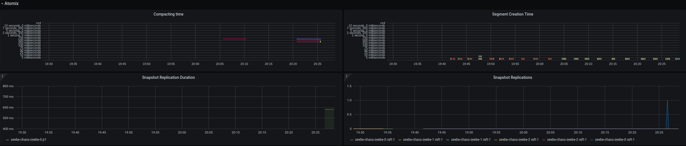
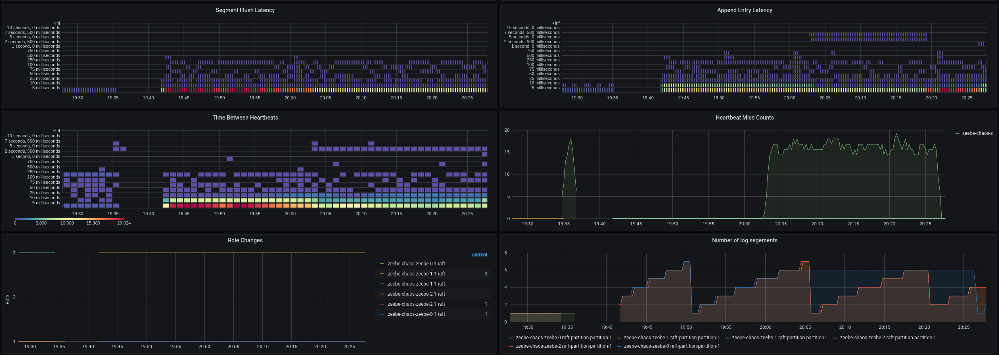

# Chaos Day Summary

Happy new year :tada: This time I wanted verify the following hypothesis "Disconnecting Leader and one Follower should not make cluster disruptive" ([#45](https://github.com/zeebe-io/zeebe-chaos/issues/45)).
But in order to do that we need to extract the Leader and Follower node for a partition from the Topology. Luckily in December we got an external contribution which allows us to print `zbctl status` as json.
This gives us now more possibilities since we can extract values much better out.

## Preparation

Before we start with the experiment I wanted to extract the right node id's for the follower's and leader from the `zbctl status` output via `jq`. If we have that we can use this for other use cases.

I stored the `zbctl` json output in a file, to make the lines a bit more readable and that I can focus on the jq stuff. The tested output looks like this:

```shell script
$ cat test.json 
{
  "brokers": [
    {
      "nodeId": 1,
      "host": "zeebe-chaos-zeebe-1.zeebe-chaos-zeebe.zeebe-chaos.svc.cluster.local",
      "port": 26501,
      "partitions": [
        {
          "partitionId": 1,
          "role": "LEADER",
          "health": "HEALTHY"
        },
        {
          "partitionId": 2,
          "role": "FOLLOWER",
          "health": "HEALTHY"
        },
        {
          "partitionId": 3,
          "role": "LEADER",
          "health": "HEALTHY"
        },
        {
          "partitionId": 4,
          "role": "LEADER",
          "health": "HEALTHY"
        }
      ],
      "version": "0.27.0-SNAPSHOT"
    },
    {
      "nodeId": 2,
      "host": "zeebe-chaos-zeebe-2.zeebe-chaos-zeebe.zeebe-chaos.svc.cluster.local",
      "port": 26501,
      "partitions": [
        {
          "partitionId": 1,
          "role": "FOLLOWER",
          "health": "HEALTHY"
        },
        {
          "partitionId": 2,
          "role": "LEADER",
          "health": "HEALTHY"
        },
        {
          "partitionId": 3,
          "role": "FOLLOWER",
          "health": "HEALTHY"
        },
        {
          "partitionId": 4,
          "role": "FOLLOWER",
          "health": "HEALTHY"
        }
      ],
      "version": "0.27.0-SNAPSHOT"
    },
    {
      "nodeId": 0,
      "host": "zeebe-chaos-zeebe-0.zeebe-chaos-zeebe.zeebe-chaos.svc.cluster.local",
      "port": 26501,
      "partitions": [
        {
          "partitionId": 1,
          "role": "FOLLOWER",
          "health": "HEALTHY"
        },
        {
          "partitionId": 2,
          "role": "FOLLOWER",
          "health": "HEALTHY"
        },
        {
          "partitionId": 3,
          "role": "FOLLOWER",
          "health": "HEALTHY"
        },
        {
          "partitionId": 4,
          "role": "FOLLOWER",
          "health": "HEALTHY"
        }
      ],
      "version": "0.27.0-SNAPSHOT"
    }
  ],
  "clusterSize": 3,
  "partitionsCount": 4,
  "replicationFactor": 3,
  "gatewayVersion": "0.27.0-SNAPSHOT"
}
```

I had a really hard time to find the correct expression, but here is it:

```shell script
$ cat test.json | jq ".brokers[]|select(.partitions[]| select(.partitionId == 3) and .role == \"LEADER\")"
```

You may ask why there are multiple selects. I tried it previous with one and the issue is that it then works like an cartesian-product. It takes broker objects which take part of the partition 3 and it will put also broker objects which are leader for an partition into the output. This is obviously not that what I want.
The current expression filters brokers for partitions which have partitionId and the leader role. This [gist comment](https://gist.github.com/olih/f7437fb6962fb3ee9fe95bda8d2c8fa4#gistcomment-3257810) helped me here.


Examples:

```shell script
$ cat test.json | jq ".brokers[]|select(.partitions[]| select(.partitionId == 3) and .role == \"LEADER\")|.nodeId"
1
$ cat test.json | jq ".brokers[]|select(.partitions[]| select(.partitionId == 2) and .role == \"LEADER\")|.nodeId"
2
```

Later I realized that this doesn't work for followers, since you can have multiple ones, BUT also this can be solved. [Just put it in an array and get the first entry](
https://stackoverflow.com/questions/38500363/get-the-first-or-nth-element-in-a-jq-json-parsing).

```shell script
jq "[.brokers[]|select(.partitions[]| select(.partitionId == $partition) and .role == \"$state\")][0].nodeId
```

### Script

I was able to replace the old utility:

```shell script
function getIndexOfPodForPartitionInState()
{
  partition="$1"
  state="$2"
  pod=$(getGateway)
  namespace=$(getNamespace)

  # To print the topology in the journal
  until topology="$(kubectl exec "$pod" -n "$namespace" -- zbctl status --insecure)"
  do
    true;
  done


  # For cluster size 3 and replication factor 3
  # we know the following partition matrix
  # partition \ node  0    1     2
  #     1             L    F     F
  #     2             F    L     F
  #     3             F    F     L
  #    etc.
  # This means broker 1, 2 or 3 participates on partition 3
  # BE AWARE the topology above is just an example and the leader can every node participating node.

  index=$(($(echo "$topology" \
    | grep "Partition $partition" \
    | grep -n "$state" -m 1 \
    | sed 's/\([0-9]*\).*/\1/') - 1))
  echo "$index"
}
```

With this:

```shell script
function getIndexOfPodForPartitionInState()
{
  partition="$1"
  state="$2"
  pod=$(getGateway)
  namespace=$(getNamespace)

  # To print the topology in the journal
  until topology="$(kubectl exec "$pod" -n "$namespace" -- zbctl status --insecure -o json)"
  do
    true;
  done

  index=$(echo "$topology" | jq "[.brokers[]|select(.partitions[]| select(.partitionId == $partition) and .role == \"$state\")][0].nodeId")
  echo "$index"
}
```

The previous function worked only with homogeneous clusters, which means where the partitions are equally distributed. This caused issues on experiments on Production L clusters, where partitions are heterogeneous distributed, see related issue [zeebe-io/zeebe-cluster-testbench#154](/testbehttps://github.com/zeebe-io/zeebe-cluster-testbench/issues/154). With this new utility we can create some new experiments also for Production - L clusters.

I wrote a new script based on the [older disconnect/connect gateway scripts](https://github.com/zeebe-io/zeebe-chaos/blob/master/chaos-experiments/scripts/disconnect-standalone-gateway.sh), where we disconnect the gateway with the brokers. The new one disconnects an leader for an partition with the follower and vice-versa.

Disconnect Leader-Follower:

```shell script
#!/bin/bash
set -exuo pipefail

source utils.sh

partition=1
namespace=$(getNamespace)
gateway=$(getGateway)

# determine leader for partition
index=$(getIndexOfPodForPartitionInState "$partition" "LEADER")
leader=$(getBroker "$index")
leaderIp=$(kubectl get pod "$leader" -n "$namespace" --template="{{.status.podIP}}")

index=$(getIndexOfPodForPartitionInState "$partition" "FOLLOWER")
follower=$(getBroker "$index")
followerIp=$(kubectl get pod "$follower" -n "$namespace" --template="{{.status.podIP}}")

# To print the topology in the journal
retryUntilSuccess kubectl exec "$gateway" -n "$namespace" -- zbctl status --insecure

# we put all into one function because we need to make sure that even after preemption the 
# dependency is installed
function disconnect() {
 toChangedPod="$1"
 targetIp="$2"

 # update to have access to ip
 kubectl exec -n "$namespace" "$toChangedPod" -- apt update
 kubectl exec -n "$namespace" "$toChangedPod" -- apt install -y iproute2
 kubectl exec "$toChangedPod" -n "$namespace" -- ip route add unreachable "$targetIp"

}

retryUntilSuccess disconnect "$leader" "$followerIp"
retryUntilSuccess disconnect "$follower" "$leaderIp" 
```

### Resources

 * https://stackoverflow.com/questions/18592173/select-objects-based-on-value-of-variable-in-object-using-jq
 * https://unix.stackexchange.com/questions/404699/using-multiple-wildcards-in-jq-to-select-objects-in-a-json-file
 * https://stedolan.github.io/jq/manual/#Builtinoperatorsandfunctions
 * https://stackoverflow.com/questions/33057420/jq-select-multiple-conditions
 * https://github.com/stedolan/jq/issues/319
 * https://unix.stackexchange.com/questions/491669/jq-get-attribute-of-nested-object
 * https://stackoverflow.com/questions/27562424/jq-nested-object-extract-top-level-id-and-lift-a-value-from-internal-object
 * _false track_ https://stackoverflow.com/questions/28615174/jq-filter-on-sub-object-value
 * final key: https://gist.github.com/olih/f7437fb6962fb3ee9fe95bda8d2c8fa4#gistcomment-3257810

## Chaos Experiment

We want to disconnect a leader and a follower from a specific partition.

### Hypothesis 

We expect that even if the leader and the follower can't talk with each other the follower is not able to disrupt the cluster and no new election is started, such that he becomes the leader.
On reconnect we expect that the follower keeps up again and is eventually is on the same page with the other follower and leader.

### Actual

We deployed a cluster with one partition for simplicity. We run the above posted script to disconnect one leader with a follower and a the same follower with the leader.

#### Disconnect

After running the disconnect script we see in general no disruption. The processing is still continuing.


We can see that the followers misses a lot of heartbeats, which is expected.


This is also visible in the logs:

```shell script
2021-01-07 20:22:28.320 CET
zeebe-chaos-zeebe-0
RaftServer{raft-partition-partition-1}{role=FOLLOWER} - No heartbeat from null in the last PT2.98S (calculated from last 2980 ms), sending poll requests
2021-01-07 20:22:28.321 CET
zeebe-chaos-zeebe-0
RaftServer{raft-partition-partition-1}{role=FOLLOWER} - Poll request to 1 failed: io.netty.channel.AbstractChannel$AnnotatedConnectException: connect(..) failed: No route to host: zeebe-chaos-zeebe-1.zeebe-chaos-zeebe.zeebe-chaos.svc.cluster.local/10.0.0.7:26502
2021-01-07 20:22:28.625 CET
zeebe-chaos-zeebe-1
RaftServer{raft-partition-partition-1} - AppendRequest{term=1, leader=1, prevLogIndex=2643199, prevLogTerm=1, entries=0, checksums=0, commitIndex=2755920} to 0 failed: java.util.concurrent.CompletionException: io.netty.channel.AbstractChannel$AnnotatedConnectException: connect(..) failed: No route to host: zeebe-chaos-zeebe-0.zeebe-chaos-zeebe.zeebe-chaos.svc.cluster.local/10.0.7.13:26502
2021-01-07 20:22:28.977 CET
zeebe-chaos-zeebe-1
RaftServer{raft-partition-partition-1} - AppendRequest{term=1, leader=1, prevLogIndex=2643199, prevLogTerm=1, entries=0, checksums=0, commitIndex=2756276} to 0 failed: java.util.concurrent.CompletionException: io.netty.channel.AbstractChannel$AnnotatedConnectException: connect(..) failed: No route to host: zeebe-chaos-zeebe-0.zeebe-chaos-zeebe.zeebe-chaos.svc.cluster.local/10.0.7.13:26502
2021-01-07 20:22:29.382 CET
zeebe-chaos-zeebe-1
RaftServer{raft-partition-partition-1} - AppendRequest{term=1, leader=1, prevLogIndex=2643199, prevLogTerm=1, entries=0, checksums=0, commitIndex=2756571} to 0 failed: java.util.concurrent.CompletionException: io.netty.channel.AbstractChannel$AnnotatedConnectException: connect(..) failed: No route to host: zeebe-chaos-zeebe-0.zeebe-chaos-zeebe.zeebe-chaos.svc.cluster.local/10.0.7.13:26502
```

The follower is failing  to send poll requests to Broker-1, which is the leader. I assume we don't see that the follower sends the other follower poll requests because our log level is to high. 
Furthermore we can see that the leader is not able to send append requests. We have a panel where we can see how many entries the follower lags behind.


Interesting that the java heap of the follower is growing.


But after some time GC steps in and it goes back to normal.


#### Connect

After running the connect script we can see in the log that almost immediately a snapshot is send to the follower.

```shell script
D 2021-01-07T19:26:24.042908Z zeebe-chaos-zeebe-0 Consume snapshot snapshotChunk 000333.log of snapshot 2643199-1-1610047230637-3215713-3214967  zeebe-chaos-zeebe-0
D 2021-01-07T19:26:24.045690Z zeebe-chaos-zeebe-0 Consume snapshot snapshotChunk 000334.sst of snapshot 2643199-1-1610047230637-3215713-3214967  zeebe-chaos-zeebe-0
D 2021-01-07T19:26:24.052229Z zeebe-chaos-zeebe-0 Consume snapshot snapshotChunk 000335.log of snapshot 2643199-1-1610047230637-3215713-3214967  zeebe-chaos-zeebe-0
D 2021-01-07T19:26:24.068270Z zeebe-chaos-zeebe-0 Consume snapshot snapshotChunk 000336.sst of snapshot 2643199-1-1610047230637-3215713-3214967  zeebe-chaos-zeebe-0
D 2021-01-07T19:26:24.076135Z zeebe-chaos-zeebe-0 Consume snapshot snapshotChunk CURRENT of snapshot 2643199-1-1610047230637-3215713-3214967  zeebe-chaos-zeebe-0
D 2021-01-07T19:26:24.081880Z zeebe-chaos-zeebe-0 Consume snapshot snapshotChunk MANIFEST-000003 of snapshot 2643199-1-1610047230637-3215713-3214967  zeebe-chaos-zeebe-0
D 2021-01-07T19:26:24.089900Z zeebe-chaos-zeebe-0 Consume snapshot snapshotChunk OPTIONS-000090 of snapshot 2643199-1-1610047230637-3215713-3214967  zeebe-chaos-zeebe-0
``` 

This is also visible in the metrics



We see a healed raft.



What I was wondering is why the metric which shows the lag of the follower is not really recovering.


Even after almost 12 hours it is still showing ~4K


## Result

As we can see the experiment was successful, we were able to verify our hypothesis. The new extraction of the leader and follower from the topology gives us new possibilities for new chaos experiments.
I think we can also experiment a bit more with disconnecting different nodes, to see how the cluster behaves.

## New Issues

 * Metric: Follower lag doesn't recover

## Participants

  * @zelldon
